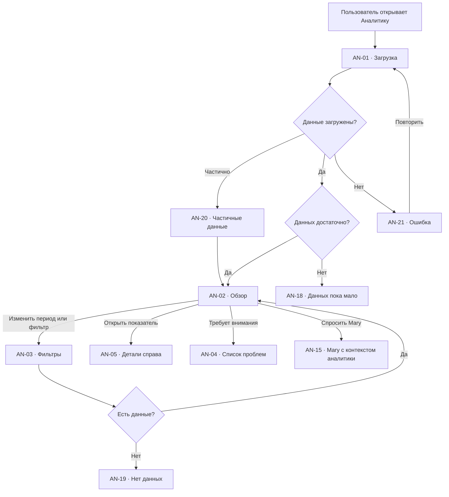
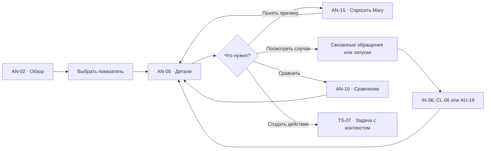
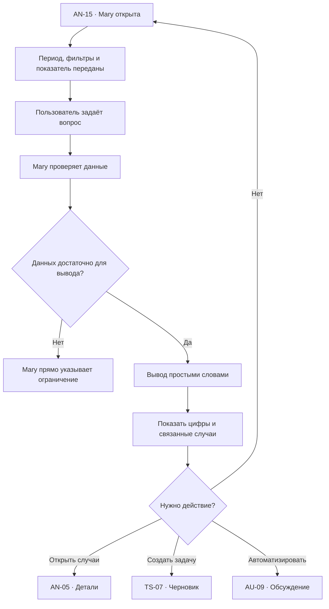

# Аналитика: user flow

## 1. Роль раздела

`Аналитика` помогает собственнику бизнеса ответить на три вопроса:

1. Что сейчас происходит?
2. Где нужна помощь?
3. Что можно улучшить?

Это не декоративный dashboard и не набор графиков ради отчётности. Каждый
показатель должен приводить к понятному объяснению, конкретным обращениям или
следующему действию.

## 2. Основная модель

Экран строится в три уровня:

1. **Краткий обзор** — несколько ключевых показателей за выбранный период.
2. **Требует внимания** — реальные проблемы, на которые можно повлиять.
3. **Подробности** — обращения, команда, каналы, клиенты и автоматизации.

Нажатие на показатель открывает правую контекстную панель. Отдельные страницы
отчётов не нужны в первом релизе.

Mary доступна на любом уровне и получает текущий период, фильтры, выбранный
показатель и связанные данные.

## 3. Принципы

- сначала вывод, затем цифра и график;
- не больше `4–5` ключевых показателей одновременно;
- все показатели имеют понятное определение;
- изменение сравнивается с сопоставимым периодом;
- среднее не используется без медианы или распределения, если выбросы важны;
- каждый сигнал можно раскрыть до исходных данных;
- неполные данные обозначаются явно;
- сотрудник не оценивается по одной цифре;
- Mary объясняет, но не придумывает причины без данных;
- экспорт вторичен по отношению к пониманию и действию.

## 4. Список экранов и состояний

| ID | Экран или состояние |
| --- | --- |
| `AN-01` | Загрузка аналитики |
| `AN-02` | Обзор |
| `AN-03` | Период и фильтры |
| `AN-04` | Требует внимания |
| `AN-05` | Детали показателя справа |
| `AN-06` | Обращения и результаты |
| `AN-07` | Скорость первого ответа |
| `AN-08` | Обращения без ответа |
| `AN-09` | Каналы |
| `AN-10` | Команда |
| `AN-11` | Детали сотрудника |
| `AN-12` | Работа Mary и AI-агентов |
| `AN-13` | Результаты автоматизаций |
| `AN-14` | Клиенты и повторные обращения |
| `AN-15` | Mary объясняет показатель |
| `AN-16` | Сравнение периодов |
| `AN-17` | Экспорт отчёта |
| `AN-18` | Данных пока недостаточно |
| `AN-19` | По фильтру нет данных |
| `AN-20` | Данные загружены частично |
| `AN-21` | Ошибка загрузки |
| `AN-22` | Недостаточно прав |
| `AN-23` | Данные устарели |
| `AN-24` | Сохранённый обзор |

## 5. Структура обзора

### Верхняя панель

- заголовок `Аналитика`;
- выбранный период;
- сравнение;
- фильтры;
- время последнего обновления;
- `Спросить Mary`;
- меню `…`: сохранить обзор, экспортировать.

### Краткий вывод Mary

Одна компактная строка:

> За неделю обращений стало на 14% больше, но команда отвечает быстрее. Сейчас
> требуют внимания 8 клиентов без ответа.

Вывод:

- содержит только подтверждённые данные;
- не заменяет показатели;
- раскрывается через `Почему?`;
- обновляется при смене периода или фильтра.

### Ключевые показатели

По умолчанию:

- новые обращения;
- решённые обращения;
- без ответа сейчас;
- медиана первого ответа;
- доля обращений, где помогла Mary.

Для карточки:

- название;
- значение;
- изменение;
- короткий контекст;
- доступное определение;
- действие `Открыть`.

## 6. Определения показателей

| Показатель | Как считаем |
| --- | --- |
| Новые обращения | Уникальные обращения, созданные в периоде |
| Решено | Обращения, переведённые в `Решено` в периоде |
| Без ответа сейчас | Открытые обращения, где последнее сообщение от клиента |
| Первый ответ | Время от первого сообщения клиента до первого содержательного ответа |
| Медиана ответа | Значение, быстрее которого обработана половина ответов |
| Среднее ответа | Среднее время с явной отметкой влияния выбросов |
| Качество | Доля проверенных ответов без критической ошибки |
| Mary помогла | Mary анализировала, готовила черновик или выполняла шаг |
| Успех автоматизации | Запуск завершился ожидаемым результатом без ошибки |
| Повторное обращение | Новый вопрос того же клиента по той же теме в заданном окне |

Сообщения не выдаются за обращения. Автоматический служебный ответ не считается
содержательным первым ответом.

## 7. Главный flow

## 8. Требует внимания

`AN-04` находится сразу после ключевых показателей.

Показывает только сигналы, по которым есть действие:

- клиенты без ответа;
- превышено целевое время;
- обращение много раз передавалось;
- сотруднику нужна помощь из-за нагрузки;
- автоматизация остановилась;
- канал отключён;
- резко выросла тема обращений;
- источник знаний устарел.

### Карточка сигнала

- что произошло;
- сколько случаев;
- почему это важно;
- кто или что затронуто;
- рекомендуемое действие;
- `Открыть случаи`;
- `Обсудить с Mary`.

Сигнал можно:

- отметить просмотренным;
- отложить;
- передать ответственному;
- превратить в задачу;
- обсудить автоматизацию.

Скрытие сигнала не изменяет исходные данные.

## 9. Детали показателя справа

`AN-05` сохраняет обзор и открывает:

- название;
- определение;
- значение;
- сравнение;
- небольшой график;
- разбиение;
- связанные случаи;
- возможные причины;
- действие.

### Пример

Для `Медиана первого ответа`:

- текущая медиана;
- среднее;
- лучший и худший диапазон;
- распределение по каналам;
- распределение по времени суток;
- обращения с самым долгим ожиданием;
- `Спросить Mary, почему изменилось`.

Панель закрывается без сброса периода, фильтров и scroll position.

## 10. Flow детализации

## 11. Обращения и результаты

`AN-06` показывает:

- новые;
- решённые;
- открытые;
- без ответа;
- повторно открытые;
- переданные сотруднику;
- созданные задачи;
- темы обращений.

### График

- одно главное сравнение;
- возможность переключить `количество` и `доля`;
- tooltips доступны с клавиатуры;
- таблица данных доступна как альтернатива.

### Детализация

Каждый сегмент открывает список обращений с:

- клиентом;
- каналом;
- темой;
- исполнителем;
- временем ожидания;
- результатом.

## 12. Обращения без ответа

`AN-08` — не просто число, а рабочий список.

Показывает:

- клиент;
- канал;
- первое или последнее сообщение;
- сколько ждёт;
- кто должен ответить;
- причина задержки, если известна;
- SLA;
- следующее действие.

Действия:

- `Открыть обращение`;
- `Передать`;
- `Создать задачу`;
- `Попросить Mary подготовить ответ`.

Список сортируется от самого долгого ожидания.

## 13. Скорость первого ответа

`AN-07` показывает:

- медиану;
- среднее;
- 75-й и 90-й перцентиль;
- количество ответов;
- долю ответов в целевое время;
- распределение по каналам;
- распределение по времени суток;
- обращения-выбросы.

Не используем рейтинг `быстрее → медленнее` без контекста сложности, канала и
рабочего времени.

Mary может объяснить:

- где возникло ожидание;
- связано ли оно с нагрузкой;
- есть ли канал с проблемой;
- повторяется ли тема;
- поможет ли автоматизация.

## 14. Каналы

`AN-09` показывает для каждого канала:

- обращения;
- долю;
- медиану ответа;
- без ответа;
- решено;
- качество;
- состояние подключения.

Нажатие на канал применяет его как фильтр ко всему обзору.

Если канал отключён, данные до отключения остаются видимыми, а период без данных
обозначается.

## 15. Команда

`AN-10` отвечает не на вопрос `Кто лучший?`, а:

- хватает ли команде ресурсов;
- где нужна помощь;
- как распределена нагрузка;
- где проседает скорость или качество;
- сколько обращений передано AI-агентом;
- сколько решений потребовало руководителя.

### Строка сотрудника

- сотрудник;
- роль;
- обработано;
- активная нагрузка;
- медиана ответа;
- качество;
- сложные или переданные случаи;
- доступность данных.

### Защита от ложных выводов

- минимум случаев для вывода;
- сравнение только сопоставимых периодов;
- отдельно рабочие и нерабочие часы;
- объяснение состава обращений;
- отсутствие публичной игровой таблицы мест.

## 16. Детали сотрудника

`AN-11` открывается справа и показывает:

- текущую нагрузку;
- динамику;
- распределение по каналам;
- сложные обращения;
- качество;
- обращения, где помогла Mary;
- случаи передачи;
- часы в системе только при наличии прав.

Действия:

- `Открыть активные обращения`;
- `Перераспределить с Mary`;
- `Создать задачу`;
- `Открыть команду`.

Изменение назначения выполняется не внутри аналитики, а через Mary с
подтверждением.

## 17. Работа Mary и AI-агентов

`AN-12` показывает:

- сколько обращений Mary проанализировала;
- сколько черновиков подготовила;
- сколько ответов подтверждено без изменений;
- сколько потребовало исправления;
- сколько случаев передано сотруднику;
- причины передачи;
- оценку качества;
- экономию времени как оценку с методикой.

Не используем формулировку `Mary решила`, если сотрудник подтвердил или завершил
действие.

## 18. Результаты автоматизаций

`AN-13` показывает:

- процесс;
- запуски;
- успешные результаты;
- остановки;
- участие сотрудника;
- подтверждения;
- среднее время;
- оценку сэкономленного времени;
- влияние на обращения.

### Детализация

Из процесса можно открыть:

- схему `AU-06`;
- историю запусков `AU-18`;
- проблемный запуск `AU-19`;
- связанные обращения `IN-06`.

Ошибка не скрывается внутри общего процента успешности.

## 19. Клиенты и повторные обращения

`AN-14` показывает:

- новых клиентов;
- вернувшихся клиентов;
- повторные обращения по той же теме;
- клиентов с несколькими незавершёнными вопросами;
- частые причины контакта;
- каналы первого контакта.

Не показываем выручку или LTV, если платформа не получила подтверждённые данные
о заказах и оплатах.

## 20. Mary объясняет аналитику

### Примеры вопросов

- `Почему ответы стали медленнее?`;
- `Какие клиенты ждут дольше всего?`;
- `Где команде нужна помощь?`;
- `Какие вопросы повторяются?`;
- `Что Mary уже делает сама?`;
- `Какая автоматизация чаще ошибается?`;
- `Сравни эту неделю с прошлой`;
- `Собери короткий отчёт для руководителя`.

### Формат ответа

Mary разделяет:

- факт;
- вероятное объяснение;
- ограничение данных;
- связанные случаи;
- предлагаемое действие.

Вероятное объяснение всегда обозначается как предположение.

## 21. Сравнение периодов

`AN-16` поддерживает:

- предыдущий равный период;
- тот же период прошлой недели;
- тот же период прошлого месяца;
- выбранный вручную сопоставимый период.

Сравнение учитывает:

- длину периода;
- рабочие дни;
- неполный текущий день;
- отключённые каналы;
- изменение состава команды.

Если периоды несопоставимы, Mary объясняет причину и предлагает корректный
вариант.

## 22. Период и фильтры

### Быстрые периоды

- сегодня;
- вчера;
- 7 дней;
- 30 дней;
- этот месяц;
- прошлый месяц;
- с начала года;
- диапазон.

### Фильтры

- канал;
- команда;
- сотрудник;
- AI-агент;
- тема;
- статус;
- автоматизация;
- клиент;
- рабочие часы.

### Поведение

- период и фильтры применяются ко всему обзору;
- панель показывает активные условия;
- URL или внутреннее состояние можно сохранить;
- возврат из связанного раздела восстанавливает обзор;
- несохранённый фильтр не меняет командные настройки.

## 23. Сохранённый обзор

`AN-24` хранит:

- название;
- период или правило периода;
- фильтры;
- выбранные показатели;
- порядок блоков;
- получателей, если настроена отправка.

Создание и изменение сохранённого обзора происходит через Mary:

> Показывай мне каждую неделю обращения без ответа, нагрузку команды и ошибки
> автоматизаций.

Mary показывает резюме перед сохранением или отправкой.

## 24. Экспорт

`AN-17` предлагает:

- PDF для чтения;
- CSV для данных;
- ссылку на сохранённый обзор.

Перед экспортом показываются:

- период;
- фильтры;
- состав данных;
- персональные данные;
- уровень доступа.

Экспорт не должен включать сообщения клиентов или контакты без явного выбора и
достаточных прав.

## 25. Актуальность и качество данных

На экране всегда видно:

- когда обновлены данные;
- какие каналы учтены;
- есть ли задержка;
- есть ли неполный период.

### `AN-20` Частичные данные

- какие источники загружены;
- каких данных не хватает;
- на какие показатели это влияет;
- доступные показатели остаются видимыми.

### `AN-23` Данные устарели

- время последнего успешного обновления;
- затронутые разделы;
- `Обновить`;
- `Проверить интеграцию`;
- запрет на категоричный вывод Mary.

## 26. Связь с другими разделами

| Откуда | Действие | Куда | Контекст |
| --- | --- | --- | --- |
| `AN-08` | Открыть обращение | `IN-06` | `conversationId` |
| `AN-11` | Открыть сотрудника | `TM-06` | `memberId`, период |
| `AN-13` | Открыть процесс | `AU-06` | `automationId`, период |
| `AN-13` | Открыть запуск | `AU-19` | `runId` |
| `AN-14` | Открыть клиента | `CL-06` | `clientId` |
| `AN-04` | Создать задачу | `TS-07` | Сигнал и случаи |
| `AN-04` | Обсудить автоматизацию | `AU-09` | Повторяющиеся случаи |
| `AN-20` | Проверить источник | `IG-06` | Интеграция |
| `AN-15` | Открыть знания | `KB-06` | Использованные правила |
| Любой экран | Спросить Mary | `GL-03` | Период, фильтры, показатель |

## 27. Пустые и системные состояния

### `AN-18` Данных пока недостаточно

- почему данных мало;
- минимальный период или количество случаев;
- какие данные уже собираются;
- `Открыть обращения`;
- `Подключить канал`.

### `AN-19` По фильтру нет данных

- активные условия;
- `Сбросить фильтры`;
- `Изменить период`;
- не показывать нулевые графики как реальные результаты.

### `AN-21` Ошибка загрузки

- доступные блоки остаются видимыми;
- ошибочный блок имеет собственное состояние;
- `Повторить`;
- `Сообщить о проблеме`.

### `AN-22` Недостаточно прав

- скрываются персональные детали;
- агрегированные данные могут остаться доступными;
- объяснение ограничения;
- `Запросить доступ`.

## 28. Переходы и анимации

- показатель → правая панель `180–240 ms`;
- смена периода обновляет значения без скачка высоты;
- старые значения остаются до загрузки новых с явным состоянием;
- график не анимируется с нуля при каждом фильтре;
- Mary открывается рядом с выбранным показателем;
- возврат сохраняет период, фильтры, панель и scroll position;
- при `prefers-reduced-motion` значения меняются без анимации.

## 29. Адаптивность

### Desktop

- краткий вывод;
- до пяти показателей;
- две колонки подробностей;
- правая панель;
- Mary как плавающее окно.

### Tablet

- показатели в две колонки;
- подробности в одну колонку;
- панель открывается как sheet;
- таблицы получают компактное представление.

### Mobile

- краткий вывод и `Требует внимания` идут первыми;
- показатели располагаются списком;
- графики имеют табличную альтернативу;
- детализация открывается full-screen;
- Mary открывается full-screen;
- фильтры открываются bottom sheet.

## 30. Доступность

- графики имеют текстовое резюме и таблицу;
- tooltip доступен с клавиатуры;
- рост и падение не кодируются только цветом;
- числа имеют доступные названия;
- определения показателей доступны по кнопке;
- выбранный фильтр озвучивается;
- панель управляет фокусом;
- после закрытия фокус возвращается к показателю;
- сложные таблицы имеют заголовки строк и колонок.

## 31. Приоритет реализации

### P0

- `AN-01`, `AN-02`, `AN-03`, `AN-04`, `AN-05`;
- обращения и результаты;
- без ответа;
- скорость первого ответа;
- каналы;
- команда;
- работа Mary;
- период и фильтры;
- loading, partial, empty, error.

### P1

- автоматизации;
- клиенты и повторные обращения;
- сравнение периодов;
- сохранённые обзоры;
- объяснение Mary;
- экспорт PDF и CSV.

### P2

- отправка регулярных обзоров;
- настраиваемый состав показателей;
- расширенные прогнозы;
- отраслевые ориентиры при наличии надёжных данных.

## 32. Критерии готовности

- обзор отвечает, что происходит и где нужна помощь;
- каждый показатель имеет определение;
- показатель раскрывается до исходных случаев;
- обращения без ответа ведут к рабочему действию;
- команда не превращается в публичный рейтинг;
- работа Mary и сотрудника учитывается раздельно;
- неполные и устаревшие данные обозначены;
- Mary отделяет факт от предположения;
- фильтры применяются ко всему обзору;
- переходы к обращению, клиенту, сотруднику и автоматизации сохраняют контекст;
- desktop, tablet, mobile и клавиатура поддерживают одну аналитическую логику.
