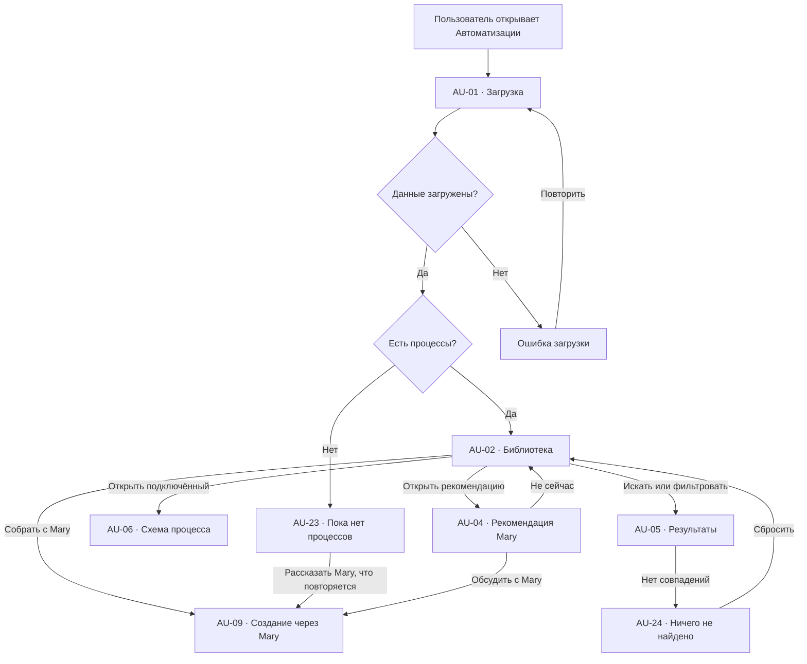
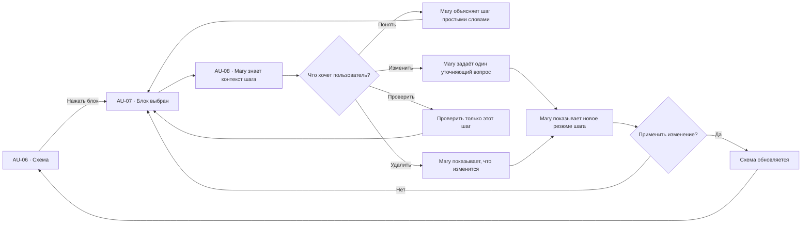
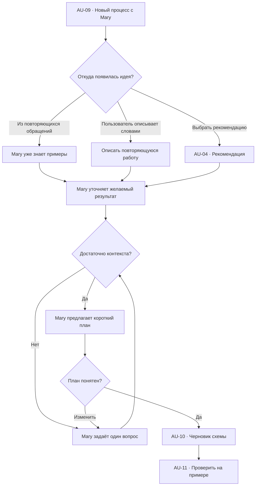
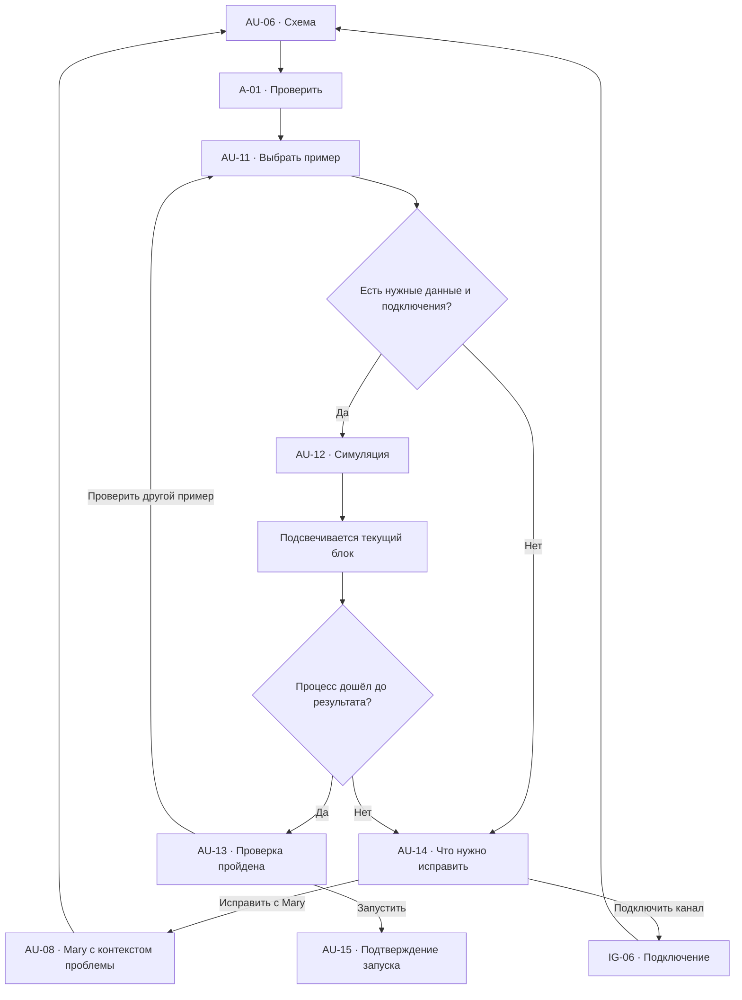
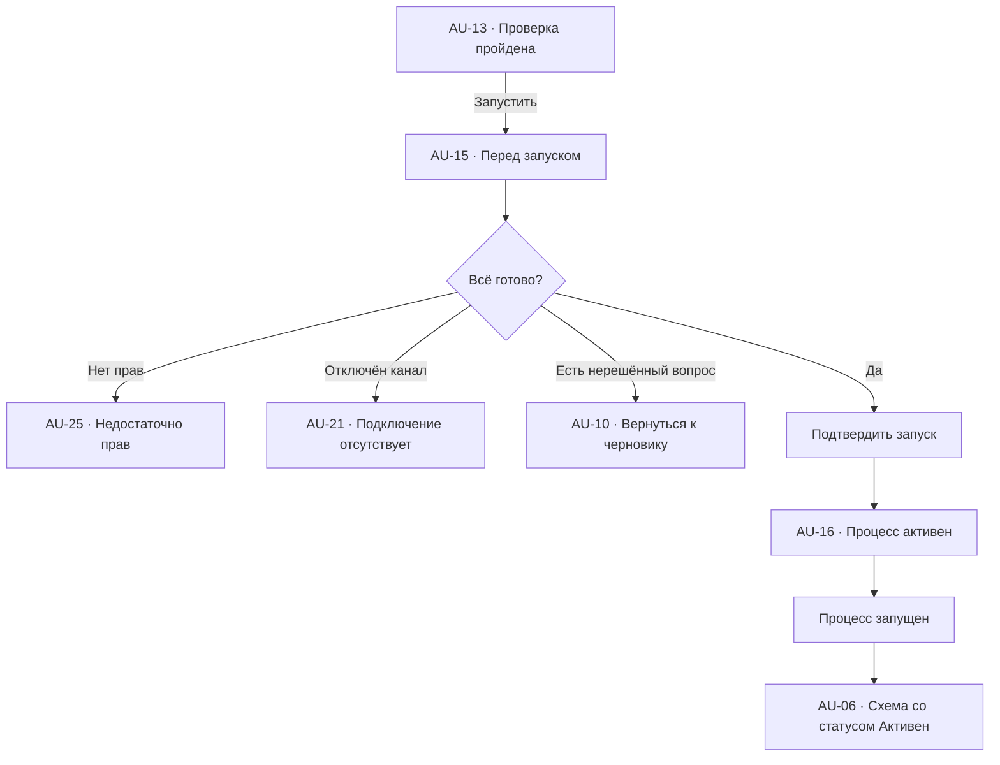
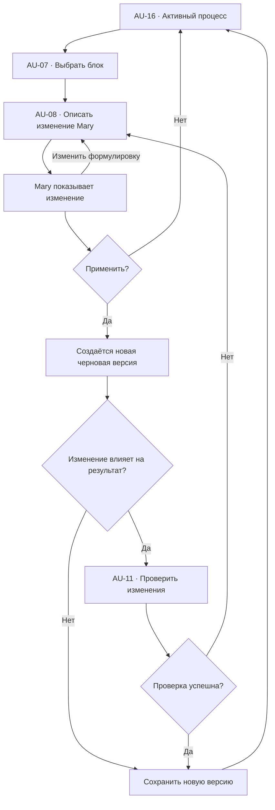
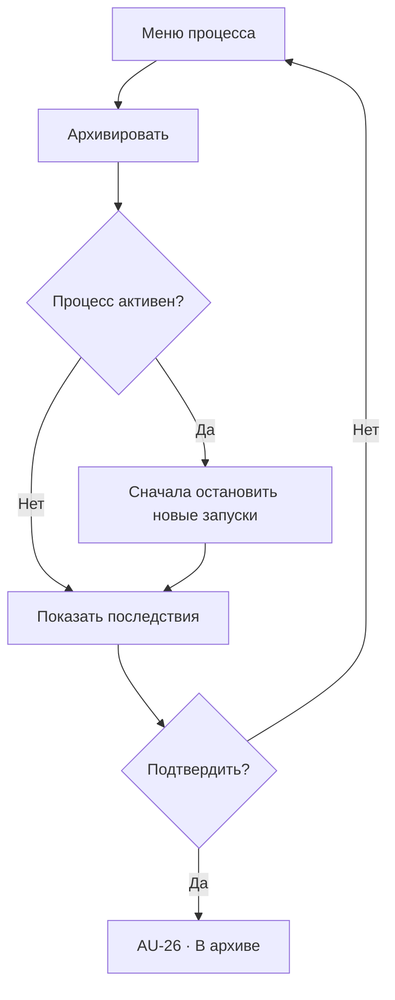
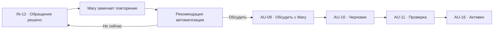

# Автоматизации: user flow

## 1. Роль раздела

`Автоматизации` — раздел, где пользователь видит повторяющиеся процессы, которые
Mary уже выполняет или может взять на себя.

Интерфейс рассчитан на собственника небольшого бизнеса, а не на специалиста по
автоматизации. Пользователю не нужно знать, что такое триггер, условие, API или
workflow.

В интерфейсе используются понятные формулировки:

- `Когда это происходит`;
- `Что делает Mary`;
- `Когда нужен сотрудник`;
- `Что получится в результате`;
- `Проверить на примере`;
- `Запустить процесс`.

Техническая конфигурация скрыта. Пользователь описывает изменение Mary обычными
словами, проверяет её резюме и подтверждает результат.

## 2. Основная модель

Раздел имеет два уровня:

1. **Библиотека процессов** — подключённые, рекомендуемые и приостановленные
   процессы.
2. **Схема процесса** — визуальное объяснение пути от события до результата.

Схема не является профессиональным редактором workflow. Она помогает понять:

- что запускает процесс;
- какие шаги выполнит Mary;
- где принимается решение;
- когда подключается сотрудник;
- где требуется подтверждение;
- чем процесс заканчивается.

## 3. Принципы взаимодействия

- Mary — основной способ создания и изменения процесса.
- Схема показывает логику, но не перегружает пользователя настройками.
- Нажатие на блок выбирает его и открывает Mary с контекстом этого шага.
- Mary задаёт один понятный вопрос за раз.
- Перед изменением Mary показывает краткое резюме.
- Проверка не отправляет сообщения и не меняет реальные данные.
- Запуск всегда отделён от сохранения черновика.
- Опасные действия требуют отдельного подтверждения.
- У процесса всегда видны владелец, статус и последнее важное событие.

## 4. Список экранов и состояний

| ID | Экран или состояние |
| --- | --- |
| `AU-01` | Загрузка библиотеки |
| `AU-02` | Библиотека процессов |
| `AU-03` | Подключённые процессы |
| `AU-04` | Рекомендации Mary |
| `AU-05` | Поиск и фильтры |
| `AU-06` | Схема процесса |
| `AU-07` | Выбранный блок |
| `AU-08` | Mary изменяет выбранный блок |
| `AU-09` | Создание процесса через Mary |
| `AU-10` | Черновик нового процесса |
| `AU-11` | Проверка: выбор примера |
| `AU-12` | Проверка выполняется |
| `AU-13` | Проверка пройдена |
| `AU-14` | При проверке найдена проблема |
| `AU-15` | Подтверждение запуска |
| `AU-16` | Процесс активен |
| `AU-17` | Процесс приостановлен |
| `AU-18` | История запусков |
| `AU-19` | Детали отдельного запуска |
| `AU-20` | Ошибка выполнения |
| `AU-21` | Интеграция отключена |
| `AU-22` | История версий |
| `AU-23` | Пустая библиотека |
| `AU-24` | Ничего не найдено |
| `AU-25` | Недостаточно прав |
| `AU-26` | Архив процесса |

## 5. Статусы процесса

| Статус | Что означает | Основное действие |
| --- | --- | --- |
| Черновик | Процесс ещё собирается | Продолжить с Mary |
| Нужно проверить | Логика готова, но не проверена | Проверить на примере |
| Готов к запуску | Проверка успешна | Запустить |
| Активен | Новые события обрабатываются | Открыть результаты |
| Нужна помощь | Процесс остановился на вопросе | Разобраться с Mary |
| На паузе | Новые события не принимаются | Возобновить |
| Ошибка | Один или несколько запусков не завершились | Исправить с Mary |
| Отключён канал | Не работает нужная интеграция | Подключить канал |
| В архиве | Процесс скрыт из активной библиотеки | Восстановить |

Статус всегда отображается текстом и иконкой. Цвет используется только как
дополнительный сигнал.

## 6. Библиотека процессов

### Верхняя часть

- заголовок `Автоматизации`;
- пояснение `Mary выполняет повторяющиеся процессы, а вы подтверждаете важные
  действия`;
- основная кнопка `Собрать с Mary`;
- поиск;
- фильтры.

### Вкладки

- `Все`;
- `Подключённые`;
- `Рекомендуемые`;
- `На паузе`;
- `Нужна помощь`.

### Подключённый процесс

Карточка или строка показывает:

- понятное название: `Запись клиентов`;
- одно предложение о результате;
- статус;
- кто выполняет: Mary, AI-агент или сотрудник;
- количество обработанных случаев;
- последнее событие;
- основное действие.

Не показываем техническое число блоков, webhooks, версии модели или внутренние
идентификаторы.

### Рекомендация Mary

Рекомендация содержит:

- какую повторяющуюся работу заметила Mary;
- сколько похожих случаев найдено;
- какую часть можно поручить Mary;
- что останется под контролем сотрудника;
- ожидаемую пользу;
- действие `Обсудить с Mary`.

## 7. Flow библиотеки

## 8. Схема процесса

### Композиция

Desktop-экран состоит из:

1. компактной верхней панели;
2. широкого свободного холста;
3. контекстного окна Mary, которое появляется при выборе блока;
4. сворачиваемой панели результата проверки.

### Верхняя панель

- назад в библиотеку;
- название процесса;
- статус;
- `Проверить`;
- `Запустить`, `Поставить на паузу` или `Возобновить`;
- меню `…`: история версий, дублировать, архивировать.

### Холст

Визуальный стиль соответствует выбранному референсу:

- белый свободный холст;
- компактные округлённые блоки;
- видимые входы и выходы;
- тонкие тёмные соединения;
- плавные ответвления;
- минимум служебного текста;
- масштабирование и перемещение без технической панели.

## 9. Типы блоков

### Начало

Семантический цвет: charcoal.

Показывает:

- маленькую метку `Старт`;
- подпись `Когда`;
- событие: `Пришло сообщение от клиента`;
- короткое пояснение;
- меню `…`.

### Действие Mary или AI-агента

Семантический цвет: blue.

Показывает:

- подпись `Mary`;
- действие: `Понять, новый это клиент или постоянный`;
- короткий ожидаемый результат;
- назначенного агента;
- меню `…`.

### Вопрос или решение

Семантический цвет: soft neutral gray.

Показывает простой вопрос:

- `Есть свободные окна?`;
- `Оплата прошла?`;
- `Нужно подтверждение сотрудника?`.

Выходы подписаны маленькими тёмными pill-метками `Да` и `Нет` прямо на линиях.

### Действие сотрудника

Семантический цвет: orange.

Показывает:

- подпись `Сотрудник`;
- понятное действие;
- роль или имя ответственного;
- срок реакции, если он важен;
- меню `…`.

### Подтверждение

Семантический цвет: neutral с явной иконкой подтверждения.

Показывает:

- что подготовила Mary;
- кто должен проверить;
- что произойдёт после подтверждения.

### Результат

Показывает конечный результат:

- `Клиент записан`;
- `Ответ отправлен`;
- `Задача создана`;
- `Обращение передано сотруднику`.

## 10. Нажатие на блок

### Визуальное состояние выбранного блока

- чуть более выраженная рамка;
- соседние связи остаются видимыми;
- остальные блоки не размываются и не исчезают;
- фокус клавиатуры совпадает с визуальным выбором;
- Mary открывается сбоку, не перекрывая выбранный блок.

### Быстрые вопросы Mary

- `Что делает этот шаг?`;
- `Измени условие`;
- `Кто здесь отвечает?`;
- `Добавь подтверждение`;
- `Проверь на примере`;
- `Удали этот шаг`.

## 11. Создание процесса через Mary

Пользователь не начинает с пустого холста и не перетаскивает технические блоки.

### Вопросы Mary

Mary уточняет только бизнес-смысл:

- `Когда должен начинаться этот процесс?`;
- `Какой результат вы хотите получить?`;
- `Что Mary может сделать сама?`;
- `Когда обязательно позвать сотрудника?`;
- `Что нельзя делать без подтверждения?`;
- `Кому передать обращение, если Mary не уверена?`.

Mary не спрашивает про:

- тип узла;
- webhook;
- JSON;
- переменные;
- системный prompt;
- HTTP-метод;
- техническую схему данных.

## 12. Черновик процесса

`AU-10` показывает:

- название;
- цель;
- понятную схему;
- необходимые каналы и источники знаний;
- действия, которые Mary выполнит сама;
- точки участия сотрудника;
- действия, требующие подтверждения;
- нерешённые вопросы.

Если данных не хватает, соответствующий блок помечается текстом `Нужно уточнить`,
а Mary предлагает конкретный вопрос.

## 13. Что делает «Проверить»

`Проверить` запускает безопасную симуляцию.

Во время проверки система:

1. берёт выбранный пример обращения или тестовый текст;
2. проходит по схеме шаг за шагом;
3. показывает, какие данные Mary нашла;
4. показывает, какое решение принято в каждом вопросе;
5. создаёт preview результата;
6. отмечает отсутствующие данные, права и подключения.

Проверка **не**:

- отправляет сообщение клиенту;
- меняет карточку клиента;
- создаёт реальную задачу;
- бронирует время;
- списывает деньги;
- уведомляет сотрудника;
- учитывается как реальный запуск.

### Выбор примера

`AU-11` предлагает:

- недавнее реальное обращение в режиме read-only;
- один из примеров Mary;
- собственный тестовый текст;
- тестовый файл или ссылку.

Перед использованием реального обращения показывается, какие данные будут
прочитаны.

## 14. Flow проверки

### Анимация проверки

- активный блок получает спокойную обводку;
- соединение до следующего блока проявляется за `160–220 ms`;
- пройденный блок получает текстовый статус `Пройден`;
- проблемный блок получает иконку и подпись причины;
- схема не прыгает и не меняет масштаб;
- при `prefers-reduced-motion` меняются только статусы без движения.

## 15. Результат проверки

### Успешная проверка

Показываем:

- `Процесс прошёл проверку`;
- использованный пример;
- путь по схеме;
- preview ответа, задачи или записи;
- действия, которые потребуют подтверждения;
- основную кнопку `Запустить`;
- вторичную кнопку `Проверить другой пример`.

### Найдена проблема

Показываем:

- на каком шаге остановилась проверка;
- что именно не получилось;
- почему это важно;
- что Mary предлагает изменить;
- действие `Исправить с Mary`.

Пример:

> Mary не сможет проверить свободное время: календарь ещё не подключён.

Основное действие:

`Подключить календарь`.

## 16. Что делает «Запустить»

`Запустить` переводит проверенный черновик в активное состояние.

Перед запуском `AU-15` показывает:

- когда процесс начнёт работать;
- какие новые обращения попадут в него;
- что Mary сможет делать автоматически;
- где потребуется подтверждение;
- кто получит обращение при проблеме;
- какие каналы и источники используются.

### Подтверждение

Основная кнопка:

`Запустить процесс`.

Вторичная:

`Вернуться к схеме`.

Если есть опасное действие, пользователь подтверждает его отдельно:

- автоматическая отправка сообщений;
- изменение заказа;
- возврат денег;
- удаление данных;
- массовое действие;
- обращение к внешней системе.

После запуска старые обращения не обрабатываются автоматически, если пользователь
явно не выбрал это.

## 17. Flow запуска

## 18. Активный процесс

На схеме активного процесса видны:

- статус `Активен`;
- время последнего запуска;
- результат последнего запуска;
- количество обработанных случаев;
- количество случаев, где понадобился сотрудник;
- действие `Открыть историю`;
- действие `Поставить на паузу`.

Метрики вторичны. Главный вопрос экрана:

`Процесс работает так, как вы ожидаете?`

Mary может кратко объяснить:

- что происходило за выбранный период;
- где чаще всего подключается сотрудник;
- какие шаги стоит улучшить;
- были ли ошибки.

## 19. Пауза и возобновление

### Поставить на паузу

Перед паузой система объясняет:

- новые события не будут запускать процесс;
- уже начатые случаи можно завершить или остановить;
- данные и история сохранятся.

Пользователь выбирает:

- `Завершить уже начатые`;
- `Остановить всё сейчас`.

### Возобновить

Перед возобновлением система проверяет:

- подключения;
- права;
- актуальность источников;
- наличие ответственного сотрудника.

Если схема изменилась после последней проверки, сначала предлагается
`Проверить изменения`.

## 20. История запусков

`AU-18` открывается как нижняя или правая панель, сохраняя схему.

### Список

- дата и время;
- клиент или обращение;
- результат;
- кто участвовал;
- длительность;
- статус;
- причина остановки, если была.

### Детали запуска

`AU-19` показывает:

- входное событие;
- пройденный путь по схеме;
- данные, которые использовала Mary;
- подготовленные действия;
- подтверждения сотрудника;
- итог;
- связанные сущности.

Из деталей можно открыть:

- обращение `IN-06`;
- клиента `CL-06`;
- задачу `TS-06`;
- источник знаний `KB-06`.

## 21. Ошибка выполнения

`AU-20` не показывает технический stack trace.

Показываем:

- что не завершилось;
- на каком понятном шаге;
- какие реальные действия уже успели произойти;
- что не было выполнено;
- затронут ли клиент;
- безопасное следующее действие.

Основные действия:

- `Разобраться с Mary`;
- `Повторить с этого шага`;
- `Передать сотруднику`;
- `Поставить процесс на паузу`.

Повтор недоступен, если может продублировать оплату, сообщение или заказ. В этом
случае Mary объясняет риск и предлагает безопасный вариант.

## 22. Изменение активного процесса

Текущие запуски заканчиваются по старой версии. Новые события используют новую
версию только после подтверждения.

## 23. История версий

`AU-22` показывает:

- номер версии;
- дату;
- автора изменения;
- краткое описание обычными словами;
- статус: текущая, черновик, предыдущая;
- результат проверки.

Действия:

- открыть версию;
- сравнить с текущей;
- восстановить как новый черновик.

Восстановление не перезаписывает историю.

## 24. Архивирование

Архив сохраняет схему, версии, историю запусков и связи с обращениями.

## 25. Связь с повторяющимися обращениями

Mary переносит в обсуждение:

- обезличенные примеры;
- частоту обращений;
- текущие ответы сотрудников;
- нужные источники знаний;
- случаи, где требуется человек.

## 26. Связь с другими разделами

| Откуда | Действие | Куда | Передаваемый контекст |
| --- | --- | --- | --- |
| `IN-12` | Автоматизировать похожие обращения | `AU-09` | Обращения и ответы |
| `CH-09` | Собрать автоматизацию | `AU-09` | История разговора |
| `AU-06` | Открыть пример обращения | `IN-06` | `conversationId` |
| `AU-18` | Открыть клиента | `CL-06` | `clientId` |
| `AU-18` | Открыть созданную задачу | `TS-06` | `taskId` |
| `AU-08` | Назначить сотрудника | `TM-06` | Роль и нагрузка |
| `AU-14` | Подключить канал | `IG-06` | Требуемая интеграция |
| `AU-08` | Добавить правило | `KB-06` | Источник знаний |
| `AU-16` | Посмотреть результат | `AN-06` | `automationId` и период |
| Любой экран | Спросить Mary | `GL-03` | Процесс, блок или запуск |

## 27. Глобальное окно Mary

Mary открывается:

- без выбранного блока — с контекстом всего процесса;
- с выбранным блоком — с контекстом конкретного шага;
- из ошибки — с контекстом неуспешного запуска;
- из истории — с контекстом выбранного случая.

В заголовке окна всегда явно указано:

- `Mary · Процесс «Запись клиентов»`;
- `Mary · Шаг «Проверить свободное время»`;
- `Mary · Запуск от 26 июля, 14:32`.

Окно не перекрывает выбранный блок и не сбрасывает позицию или масштаб холста.

## 28. Поиск и фильтры

### Поиск

Ищет по:

- названию;
- описанию результата;
- каналу;
- сотруднику;
- типу обращения.

### Фильтры

- статус;
- канал;
- кто выполняет;
- требуется подтверждение;
- были ошибки;
- создано Mary;
- дата последнего запуска.

### Пустой результат

`AU-24` показывает:

- `По таким условиям процессов нет`;
- активные фильтры;
- `Сбросить фильтры`;
- `Спросить Mary`.

## 29. Пустые и системные состояния

### `AU-23` Пока нет процессов

- объяснение без технических терминов;
- примеры полезных процессов для бизнеса;
- `Рассказать Mary, что повторяется`;
- рекомендации появляются только при наличии реальных данных.

### Ошибка загрузки

- сохраняется навигация;
- показывается понятная причина, если она известна;
- `Повторить`;
- `Сообщить о проблеме`.

### `AU-21` Интеграция отключена

- какой канал нужен;
- для какого шага;
- что процесс пока не сможет сделать;
- `Подключить`;
- `Изменить процесс с Mary`.

### `AU-25` Недостаточно прав

- какое действие недоступно;
- кто может его подтвердить;
- `Запросить доступ`;
- `Вернуться к схеме`.

## 30. Переходы и анимации

- библиотека → схема: shared transition названия и статуса `180–240 ms`;
- выбор блока: рамка и появление Mary `160–220 ms`;
- изменение схемы: блоки мягко занимают новые позиции, без резких скачков;
- проверка: последовательная смена статуса блоков;
- панель истории: slide-in справа или снизу;
- подтверждение запуска: modal с фокусом на заголовке;
- toast запуска не перекрывает действия;
- возврат в библиотеку сохраняет вкладку, поиск, фильтры и scroll position;
- все необязательные движения отключаются при `prefers-reduced-motion`.

## 31. Адаптивность

### Desktop

- полный свободный холст;
- Mary открывается справа;
- история запусков — правая или нижняя панель;
- zoom и pan доступны мышью, trackpad и клавиатурой.

### Tablet

- Mary открывается как sheet до `45%` ширины;
- панель истории заменяет Mary;
- верхние действия собираются в меню;
- блоки остаются в пространственной схеме.

### Mobile

- библиотека — список;
- схема открывается full-screen;
- по умолчанию показывается обзор всего пути;
- выбранный блок открывается как bottom sheet;
- Mary занимает full-screen поверх схемы;
- есть отдельный доступный список шагов как альтернатива сложному холсту;
- после закрытия возвращается выбранный блок и масштаб.

## 32. Доступность

- холст имеет альтернативное представление как упорядоченный список шагов;
- каждый блок доступен через Tab;
- связи и ветвления озвучиваются текстом;
- `Да` и `Нет` не определяются только положением;
- выбранный блок имеет `aria-current`;
- pan и zoom не обязательны для доступа к шагам;
- проверку можно остановить с клавиатуры;
- modal запуска удерживает фокус;
- после закрытия фокус возвращается к исходной кнопке;
- статусы не передаются только цветом;
- у всех иконок есть доступные названия.

## 33. Приоритет реализации

### P0

- `AU-01`, `AU-02`, `AU-03`, `AU-04`, `AU-06`, `AU-07`, `AU-08`;
- схема с пятью основными типами блоков;
- выбор блока и разговор с Mary;
- создание через Mary;
- безопасная проверка;
- подтверждение запуска;
- активный и приостановленный процесс;
- ошибки загрузки и отключённая интеграция.

### P1

- история запусков;
- детали запуска;
- изменение активного процесса;
- история версий;
- рекомендации из повторяющихся обращений;
- расширенные фильтры.

### P2

- сравнение версий;
- массовые действия;
- совместное редактирование;
- расширенные метрики;
- шаблоны для отраслей.

## 34. Критерии готовности

- пользователь понимает назначение процесса без знания workflow;
- новый процесс можно собрать только через разговор с Mary;
- нажатие на блок открывает Mary с правильным контекстом;
- схема сохраняет семантические типы и визуальные связи;
- `Проверить` никогда не выполняет реальные действия;
- `Запустить` показывает последствия и точки подтверждения;
- активный процесс можно безопасно поставить на паузу;
- ошибка объясняет, что произошло с реальными данными;
- история запуска связана с обращением, клиентом и задачей;
- отключённая интеграция имеет понятный путь восстановления;
- возврат сохраняет библиотеку и состояние холста;
- desktop, tablet, mobile и клавиатура поддерживают одну бизнес-логику.
