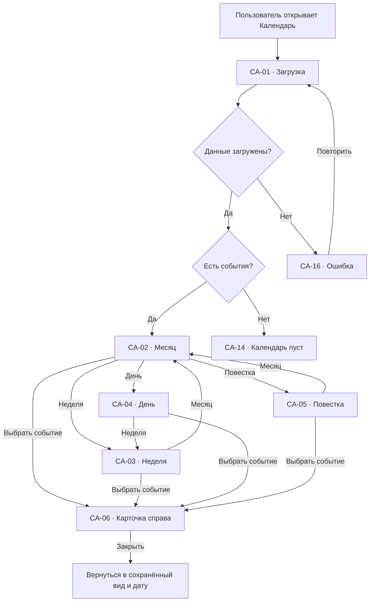
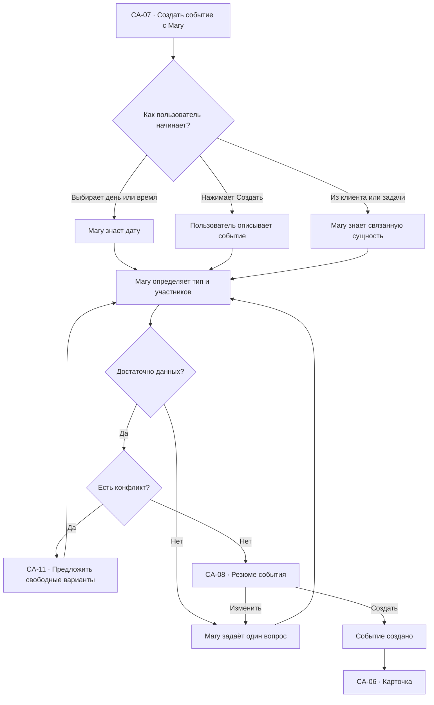
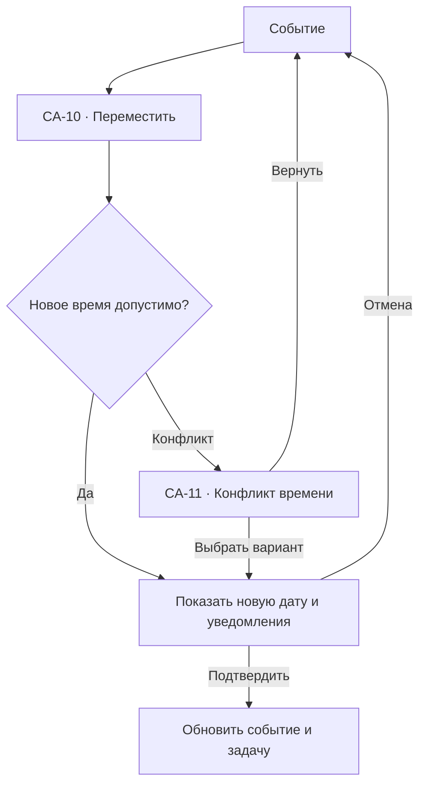
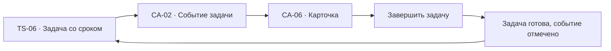

# Календарь: user flow

## 1. Роль раздела

`Календарь` показывает во времени:

- сроки задач;
- встречи с клиентами;
- записи клиентов;
- напоминания;
- действия автоматизаций;
- командные события.

Это не отдельная система планирования. Календарь является временным
представлением тех же задач, клиентов, обращений и процессов.

## 2. Основная модель

Пользователь может переключаться между:

- `Месяц`;
- `Неделя`;
- `День`;
- `Повестка`.

Нажатие на событие открывает правую контекстную панель. Отдельной страницы
события нет.

Создание и изменение происходят через Mary. Быстрые безопасные действия:

- отметить задачу выполненной;
- перейти к текущей дате;
- открыть клиента;
- открыть обращение;
- принять приглашение;
- закрыть напоминание.

## 3. Список экранов и состояний

| ID | Экран или состояние |
| --- | --- |
| `CA-01` | Загрузка календаря |
| `CA-02` | Календарь: месяц |
| `CA-03` | Календарь: неделя |
| `CA-04` | Календарь: день |
| `CA-05` | Повестка |
| `CA-06` | Карточка события справа |
| `CA-07` | Создание события через Mary |
| `CA-08` | Подтверждение события |
| `CA-09` | Изменение даты через Mary |
| `CA-10` | Перенос drag-and-drop |
| `CA-11` | Конфликт времени |
| `CA-12` | Событие автоматизации |
| `CA-13` | Внешний календарь отключён |
| `CA-14` | Календарь пуст |
| `CA-15` | Нет событий по фильтру |
| `CA-16` | Ошибка загрузки |
| `CA-17` | Недостаточно прав |
| `CA-18` | Событие изменено другим пользователем |
| `CA-19` | Повторяющееся событие |
| `CA-20` | Удаление или отмена |

## 4. Типы событий

| Тип | Пример | Источник |
| --- | --- | --- |
| Срок задачи | `Ответить Даниеле` | Задача |
| Встреча | `Созвон с Вероникой` | Пользователь или Mary |
| Запись клиента | `Стрижка · Анна · 14:30` | Автоматизация записи |
| Напоминание | `Проверить оплату` | Задача или обращение |
| Действие процесса | `Отправить follow-up` | Автоматизация |
| Командное событие | `Разбор обращений` | Команда |

Тип определяется не только цветом: используется иконка и текстовая подпись.

## 5. Месяц

`CA-02` предназначен для обзора:

- текущий месяц;
- сегодня;
- дни недели;
- события;
- количество скрытых событий;
- просроченные задачи;
- свободные и занятые дни.

В ячейке дня показывается не больше `3` событий. Остальные открываются через
`Ещё N`.

Событие отображает:

- время, если оно задано;
- короткое название;
- тип;
- клиента или сотрудника, если это важно.

## 6. Неделя и день

### Неделя

- временная сетка;
- события без времени отдельной строкой;
- загрузка сотрудников при фильтре команды;
- текущая линия времени;
- свободные окна.

### День

- подробная повестка;
- задачи без точного времени;
- встречи;
- записи;
- буферы между событиями;
- действия Mary на сегодня.

## 7. Повестка

`CA-05` — доступное линейное представление:

- сегодня;
- завтра;
- эта неделя;
- позже;
- просрочено.

Повестка является основной мобильной версией и альтернативой сетке для
клавиатуры и screen reader.

## 8. Главный flow

## 9. Карточка события справа

### Общие данные

- название;
- дата и время;
- тип;
- статус;
- ответственный;
- источник события;
- основное действие;
- меню `…`.

### Связи

- задача;
- клиент;
- обращение;
- заказ;
- автоматизация;
- внешний календарь.

### Действия

- `Изменить с Mary`;
- `Открыть задачу`;
- `Открыть клиента`;
- `Открыть обращение`;
- `Завершить`;
- `Перенести`;
- `Отменить`;
- `Удалить`.

Набор действий зависит от типа события и прав.

## 10. Создание события через Mary

### Что уточняет Mary

- что должно произойти;
- дата;
- точное время или срок до конца дня;
- длительность;
- участники;
- клиент;
- напоминание;
- повторение;
- связь с задачей.

Mary не показывает форму с обязательным заполнением всех полей, если может
понять данные из фразы.

## 11. Подтверждение события

`CA-08` показывает:

- название;
- дату и время;
- часовой пояс, если участники в разных зонах;
- длительность;
- участников;
- клиента и задачу;
- напоминание;
- внешний календарь;
- уведомления, которые будут отправлены.

Основная кнопка:

`Создать событие`.

Вторичная:

`Изменить с Mary`.

## 12. Перенос события

### Через Mary

Пользователь говорит:

- `Перенеси на завтра после обеда`;
- `Поставь после созвона с Вероникой`;
- `Найди свободное время на этой неделе`;
- `Сдвинь все записи на час`.

Mary показывает затронутые события и просит подтверждение.

### Через drag-and-drop

Drag-and-drop не применяет изменение мгновенно, если:

- есть клиент;
- будут отправлены уведомления;
- событие создано автоматизацией;
- меняется срок задачи;
- затрагивается другой сотрудник.

## 13. Конфликт времени

`CA-11` показывает:

- какие события пересекаются;
- кто занят;
- можно ли работать параллельно;
- ближайшие свободные варианты;
- что предлагает Mary.

Действия:

- `Выбрать вариант`;
- `Оставить как есть`;
- `Спросить Mary`;
- `Создать несмотря на конфликт`, если есть права.

## 14. Срок задачи в календаре

Изменение даты обновляет одну сущность и сразу отражается в обоих разделах.

## 15. Событие автоматизации

`CA-12` показывает запланированное действие процесса:

- процесс;
- действие;
- клиент;
- когда оно будет выполнено;
- требуется ли подтверждение;
- что произойдёт при ошибке.

Доступны:

- `Открыть процесс`;
- `Изменить с Mary`;
- `Пропустить один раз`;
- `Поставить процесс на паузу`.

Изменение одного события не переписывает весь процесс без явного выбора.

## 16. Повторяющееся событие

При изменении `CA-19` пользователь выбирает:

- только это событие;
- это и следующие;
- всю серию.

Mary объясняет последствия обычными словами и показывает количество
затронутых событий.

Для записей клиентов массовое изменение требует подтверждения уведомлений.

## 17. Удаление и отмена

`Удалить` и `Отменить` имеют разный смысл:

- `Отменить` сохраняет событие и причину, уведомляет участников;
- `Удалить` убирает событие из календаря;
- связанная задача не удаляется автоматически;
- событие автоматизации удаляется только на один запуск, если не выбран процесс.

Перед действием `CA-20` показывает последствия и получателей уведомления.

## 18. Внешние календари

### Подключён

Показываем источник:

- Google Calendar;
- Outlook;
- другой подключённый календарь.

Изменения синхронизируются и имеют состояние:

- синхронизировано;
- обновляется;
- конфликт;
- ошибка.

### `CA-13` Отключён

- какой календарь нужен;
- какие события не синхронизируются;
- что продолжит работать внутри Mary;
- `Подключить`;
- `Продолжить без синхронизации`.

## 19. Фильтры

- мои события;
- команда;
- сотрудник;
- клиент;
- тип;
- задачи;
- встречи;
- записи;
- автоматизации;
- просрочено;
- источник календаря.

Фильтры сохраняются при переключении видов.

## 20. Связь с другими разделами

| Откуда | Действие | Куда | Контекст |
| --- | --- | --- | --- |
| `TS-06` | Открыть в календаре | `CA-06` | `taskId` |
| `CL-06` | Запланировать | `CA-07` | `clientId` |
| `IN-06` | Напомнить | `CA-07` | Обращение и клиент |
| `AU-06` | Открыть расписание | `CA-12` | `automationId` |
| `CA-06` | Открыть задачу | `TS-06` | `taskId` |
| `CA-06` | Открыть клиента | `CL-06` | `clientId` |
| `CA-06` | Открыть обращение | `IN-06` | `conversationId` |
| `CA-12` | Открыть процесс | `AU-06` | `automationId` |
| `CA-13` | Подключить календарь | `IG-06` | Провайдер |
| Любой экран | Спросить Mary | `GL-03` | Вид, дата, событие |

## 21. Пустые и системные состояния

### `CA-14` Календарь пуст

- `На этот период ничего не запланировано`;
- `Создать с Mary`;
- `Открыть задачи`;
- текущая дата и навигация остаются видимыми.

### `CA-15` Нет событий по фильтру

- активные фильтры;
- `Сбросить`;
- `Показать все события`.

### `CA-16` Ошибка загрузки

- календарная сетка может оставаться read-only;
- `Повторить`;
- несохранённые изменения не теряются.

### `CA-17` Недостаточно прав

- какое изменение недоступно;
- кому принадлежит событие;
- `Запросить доступ`.

### `CA-18` Событие изменено другим пользователем

- старая и новая дата;
- автор изменения;
- `Принять обновление`;
- `Обсудить с Mary`.

## 22. Переходы и анимации

- месяц ↔ неделя ↔ день: общий фокус на выбранной дате;
- событие → правая панель `180–240 ms`;
- перенос: событие следует за указателем, но изменение подтверждается отдельно;
- изменение даты обновляет задачу без визуального дублирования;
- переход `Сегодня` мягко фокусирует дату;
- возврат сохраняет вид, дату, фильтры и scroll position;
- при `prefers-reduced-motion` виды меняются без пространственной анимации.

## 23. Адаптивность

### Desktop

- месяц, неделя и день;
- карточка справа;
- Mary как плавающее окно;
- drag-and-drop и клавиатурные действия.

### Tablet

- неделя сокращается до рабочих дней или `3 дня`;
- карточка открывается как sheet;
- повестка доступна рядом с сеткой.

### Mobile

- повестка по умолчанию;
- месяц используется для выбора даты;
- день открывается full-screen;
- карточка события full-screen;
- Mary full-screen;
- drag-and-drop заменён действием `Перенести`.

## 24. Доступность

- повестка предоставляет полную альтернативу сетке;
- дни и события имеют доступные названия;
- текущая дата не определяется только фоном;
- перенос доступен без drag-and-drop;
- конфликт времени озвучивается текстом;
- карточка управляет фокусом;
- после закрытия фокус возвращается к событию;
- часовой пояс указан текстом;
- тип события не определяется только цветом.

## 25. Приоритет реализации

### P0

- `CA-01`, `CA-02`, `CA-03`, `CA-05`, `CA-06`, `CA-07`, `CA-08`;
- месяц, неделя и повестка;
- карточка справа;
- создание и изменение через Mary;
- связь с задачами;
- перенос с подтверждением;
- empty, error, disconnected calendar.

### P1

- день;
- конфликты;
- повторяющиеся события;
- события автоматизации;
- внешняя синхронизация.

### P2

- несколько внешних календарей;
- расширенная доступность команды;
- бронирование ресурсов;
- массовый перенос.

## 26. Критерии готовности

- календарь показывает те же задачи, а не их копии;
- отдельной страницы события нет;
- карточка сохраняет выбранную дату и вид;
- создание и изменение происходят через Mary;
- перенос объясняет последствия до применения;
- конфликт времени предлагает понятные варианты;
- событие автоматизации не изменяет весь процесс случайно;
- внешний календарь имеет понятное состояние синхронизации;
- месяц, неделя, день и повестка используют одну сущность;
- desktop, tablet, mobile и клавиатура поддерживают одинаковую логику.
