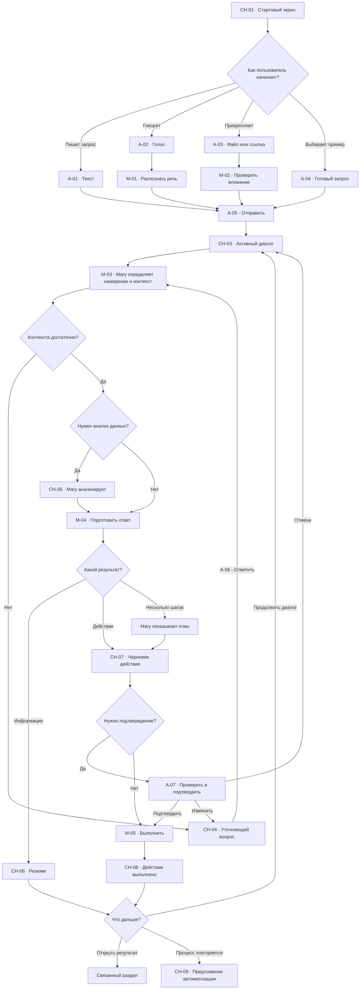
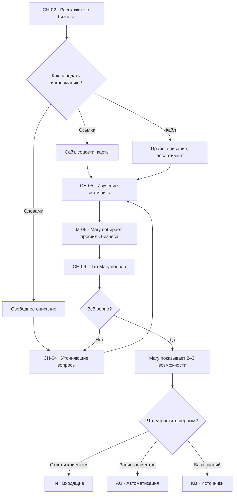
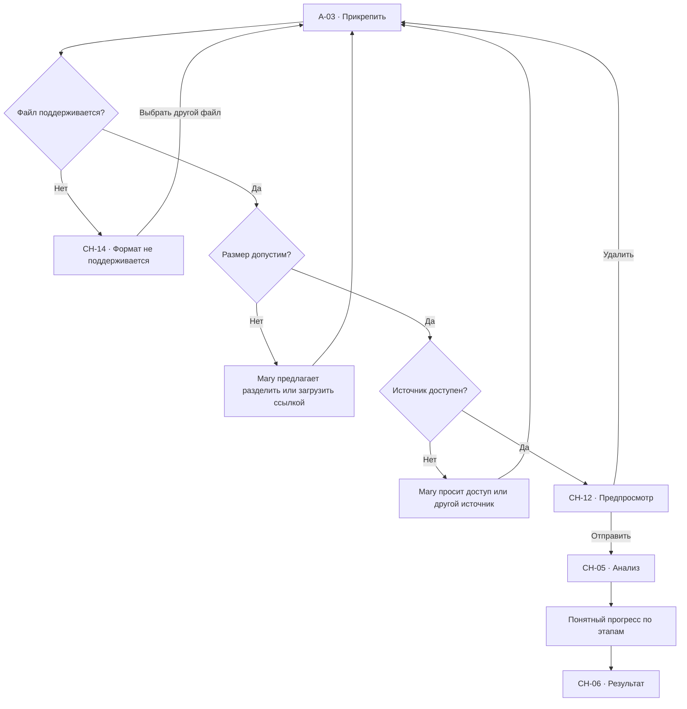
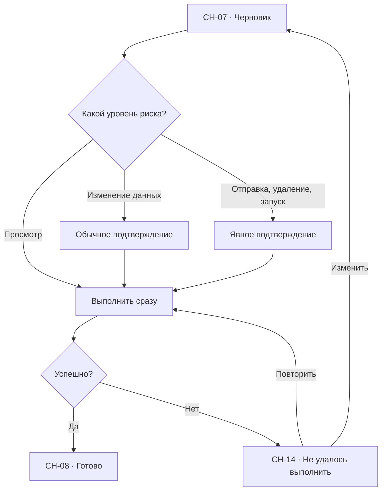
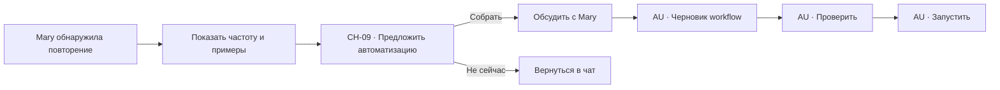

# Чат с Mary: user flow

## 1. Роль раздела

`Чат` — полноэкранное пространство для длительной работы с Mary:

- первичное знакомство с бизнесом;
- исследование проблемы;
- анализ ссылки, файла или переписки;
- подготовка ответа клиенту;
- создание задач и клиентов;
- сборка автоматизаций;
- подключение источников знаний.

Глобальная кнопка `Спросить Mary` открывает компактное окно поверх текущей
страницы. Это другой режим интерфейса, но история диалогов и контекст общие.

## 2. Цели пользователя

- объяснить задачу обычными словами;
- быстро передать Mary контекст;
- понять, что Mary нашла и поняла;
- проверить действие перед выполнением;
- получить результат в нужном разделе;
- продолжить работу без изучения технических настроек.

## 3. Список экранов

| ID | Экран или состояние |
| --- | --- |
| `CH-01` | Стартовый экран чата |
| `CH-02` | Первичное знакомство с бизнесом |
| `CH-03` | Активный диалог |
| `CH-04` | Mary задаёт уточняющий вопрос |
| `CH-05` | Анализ ссылки, файла или данных |
| `CH-06` | Результат анализа и краткое резюме |
| `CH-07` | Черновик действия требует подтверждения |
| `CH-08` | Действие выполнено |
| `CH-09` | Mary предлагает автоматизацию |
| `CH-10` | История чатов |
| `CH-11` | Новый чат |
| `CH-12` | Просмотр вложения |
| `CH-13` | Контекстная панель сущности |
| `CH-14` | Ошибка отправки или анализа |
| `CH-15` | Нет соединения |
| `CH-16` | Недостаточно прав для действия |
| `CH-17` | Остановленная генерация |

## 4. Анатомия полноэкранного чата

### Левая навигация

- `Чат` выбран;
- остальные разделы доступны без потери сохранённой истории;
- профиль пользователя находится внизу.

### Верхняя панель

- название текущего диалога;
- история;
- новый чат;
- экспорт или копирование — в меню `…`, а не отдельной группой иконок;
- на стартовом экране история может быть скрыта до появления первого диалога.

### Центральная колонка

- сообщения пользователя;
- ответы Mary;
- интерактивные результаты;
- резюме;
- подтверждения;
- рекомендации;
- поле ввода закреплено снизу.

Оптимальная ширина читаемой колонки: `760–860 px`.

### Правая контекстная панель

Появляется только когда диалог связан с сущностью:

- клиент;
- обращение;
- заказ;
- задача;
- автоматизация;
- источник знаний.

Панель показывает только актуальный контекст. Она не заменяет страницу раздела.

## 5. Стартовый экран

### Приветствие

- Mary кратко объясняет пользу;
- основная формулировка: `Чем я могу помочь?`;
- поле ввода — главный элемент;
- пользователь может печатать, говорить, прикреплять файл или ссылку.

### Режимы старта

- `С чего начать?`;
- `Что ты умеешь?`;
- `Знаю, что нужно`.

### Примеры запросов

- `Я первый раз здесь — с чего мне начать?`;
- `Разбери мой бизнес и предложи, что упростить первым`;
- `Помоги обработать жалобу клиента`;
- `Собери процесс записи клиентов`;
- `Проанализируй эту таблицу`.

Примеры вставляют текст в поле или сразу отправляют его, если действие очевидно.

## 6. Главный flow чата

## 7. Первичное знакомство с бизнесом

## 8. Работа со ссылкой или файлом

### Поддерживаемые входы

- URL;
- PDF;
- DOCX;
- XLSX или CSV;
- изображение;
- текстовый файл;
- экспорт переписки.

### Flow

Mary сообщает не технический процент, а текущий этап:

- `Читаю материалы`;
- `Собираю главное`;
- `Сверяю с данными компании`;
- `Готовлю рекомендации`.

## 9. Уточняющие вопросы

Mary задаёт один вопрос за раз, если ответ влияет на следующий шаг.

### Форматы

- свободный ответ;
- выбор из `2–4` вариантов;
- подтверждение `Да / Нет`;
- дата и время;
- сотрудник;
- клиент;
- файл или ссылка.

### Правила

- объяснять, зачем нужен ответ;
- сохранять уже полученные данные;
- не спрашивать то, что можно найти в подключённых источниках;
- давать вариант `Не знаю — предложи сама`;
- позволять вернуться к предыдущему ответу.

## 10. Результаты Mary

### Информационный результат

- краткий вывод;
- источники;
- что Mary поняла;
- что остаётся неизвестным;
- следующие действия.

### Черновик

- текст или изменения;
- статус `Не выполнено`;
- объяснение последствий;
- `Подтвердить`;
- `Изменить`;
- `Отмена`.

### Выполненное действие

- что изменилось;
- где это находится;
- кто ответственный;
- срок;
- ссылка `Открыть`.

### Несколько результатов

Mary группирует их по смыслу, а не создаёт множество одинаковых карточек.

## 11. Flow подтверждения действия

### Всегда подтверждаются

- отправка ответа клиенту;
- запуск автоматизации;
- удаление или объединение данных;
- массовое изменение;
- передача обращения;
- подключение внешнего сервиса;
- действие с оплатой.

## 12. Предложение автоматизации

Mary предлагает автоматизацию только при наличии подтверждённого повторения.

## 13. Правая контекстная панель

### Когда показывается

- Mary нашла клиента;
- анализируется обращение;
- найден заказ;
- создаётся задача;
- обсуждается автоматизация;
- используется источник знаний.

### Содержимое

- название сущности;
- ключевые данные;
- состояние;
- источник;
- последнее обновление;
- действие `Открыть в разделе`.

### Переходы

| Контекст | Целевой раздел |
| --- | --- |
| Клиент | `CL-06` |
| Обращение | `IN-06` |
| Заказ | `CL-06`, блок заказов |
| Задача | `TS-06` |
| Автоматизация | `AU-06` |
| Источник знаний | `KB-06` |

## 14. История и новый чат

### История `CH-10`

- поиск по названию и содержимому;
- недавние диалоги;
- закреплённые;
- связанные сущности;
- архив.

### Новый чат `CH-11`

- создаёт чистый диалог;
- текущий чат сохраняется автоматически;
- вложения, не отправленные пользователем, требуют подтверждения перед закрытием;
- новый чат не очищает профиль бизнеса и подключённые знания.

## 15. Системные состояния

| Экран | Содержание | Выход |
| --- | --- | --- |
| `CH-14` | Ошибка отправки или выполнения | Повторить, изменить, отменить |
| `CH-15` | Нет соединения | Повторить автоматически, работать с черновиком |
| `CH-16` | Недостаточно прав | Запросить доступ, выбрать безопасное действие |
| `CH-17` | Генерация остановлена | Продолжить, изменить запрос |

### Частные случаи

- ссылка требует авторизации;
- файл повреждён;
- источник противоречит другому источнику;
- Mary не уверена в клиенте;
- найдено несколько клиентов;
- действие уже выполнено другим сотрудником;
- интеграция отключена;
- лимит файла превышен.

Mary не скрывает неопределённость и не выполняет рискованное действие по догадке.

## 16. Основные переходы

| Откуда | Действие | Куда | Контекст |
| --- | --- | --- | --- |
| `CH-01` | Отправить запрос | `CH-03` | Текст, голос, файл |
| `CH-03` | Ответить на вопрос | `CH-04` или `даCH-05` | История диалога |
| `CH-05` | Анализ завершён | `CH-06` | Источники и выводы |
| `CH-06` | Подготовить действие | `CH-07` | Резюме |
| `CH-07` | Подтвердить | `CH-08` | Черновик |
| `CH-08` | Открыть клиента | `CL-06` | `clientId` |
| `CH-08` | Открыть обращение | `IN-06` | `conversationId` |
| `CH-08` | Открыть задачу | `TS-06` | `taskId` |
| `CH-09` | Собрать автоматизацию | `AU-06` | `automationDraftId` |
| `CH-06` | Добавить источник | `KB-06` | `sourceDraftId` |

## 17. Переходы и анимации

| Изменение | Поведение |
| --- | --- |
| Отправка сообщения | Сообщение появляется сразу |
| Ответ Mary | Потоковый текст без скачка layout |
| Уточняющий вариант | `120 ms`, фон и border |
| Контекстная панель | `240 ms`, справа |
| История чатов | `180 ms`, слева |
| Подтверждение | `180 ms`, modal opacity + scale |
| `⌘K` или новый чат | Без декоративной анимации |

`prefers-reduced-motion` отключает движение панелей и scale.

## 18. Адаптивность

### Desktop

- центральная колонка и правая контекстная панель;
- composer закреплён снизу;
- длинные результаты ограничены по ширине.

### Tablet

- контекстная панель перекрывает чат;
- история открывается отдельной панелью;
- composer учитывает экранную клавиатуру.

### Mobile

- чат занимает весь экран;
- контекст открывается full-screen sheet;
- подтверждение и просмотр вложения — full-screen;
- быстрые действия горизонтально прокручиваются;
- кнопка назад возвращает к предыдущему слою.

## 19. Доступность

- сообщения имеют семантическую последовательность;
- потоковый ответ объявляется screen reader без повторения всего текста;
- `Enter` отправляет, `Shift+Enter` создаёт новую строку;
- `Escape` останавливает генерацию или закрывает верхний слой;
- все быстрые действия доступны с клавиатуры;
- фокус возвращается в composer;
- вложения имеют имя, тип и размер;
- состояния не зависят только от цвета.

## 20. Приоритет реализации

### P0

- `CH-01`, `CH-03`, `CH-04`, `CH-05`, `CH-06`, `CH-07`, `CH-08`;
- текст, файл, ссылка;
- потоковый ответ;
- подтверждение;
- контекстная панель;
- переходы в клиенты, обращения, задачи и автоматизации.

### P1

- `CH-02`, `CH-09`, `CH-10`, `CH-11`, `CH-12`;
- голос;
- история;
- onboarding бизнеса;
- работа с несколькими источниками.

### P2

- закреплённые чаты;
- совместный доступ;
- экспорт;
- шаблоны запросов команды.

## 21. Критерии готовности

- пользователь может начать без обучения;
- Mary объясняет, что поняла и чего не хватает;
- одно уточнение задаётся за раз;
- вложения имеют preview и ошибочные состояния;
- рискованные действия всегда подтверждаются;
- результат открывается в связанном разделе;
- full-page чат и плавающее окно Mary не конфликтуют;
- история сохраняется автоматически;
- нет тупиковых состояний;
- desktop, tablet, mobile и клавиатура поддерживают одинаковую логику.
