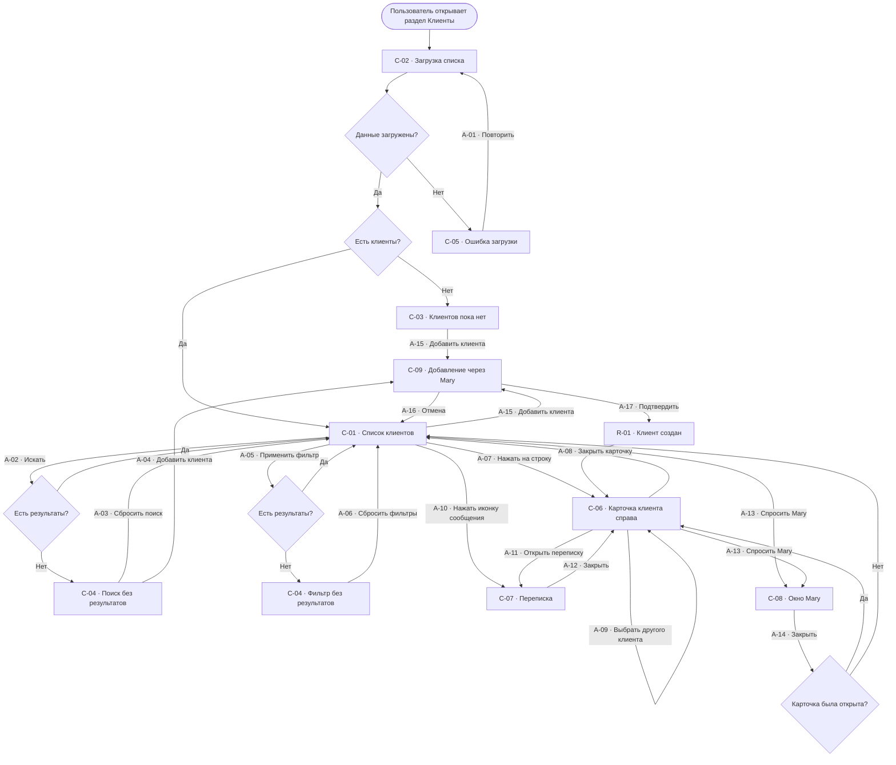
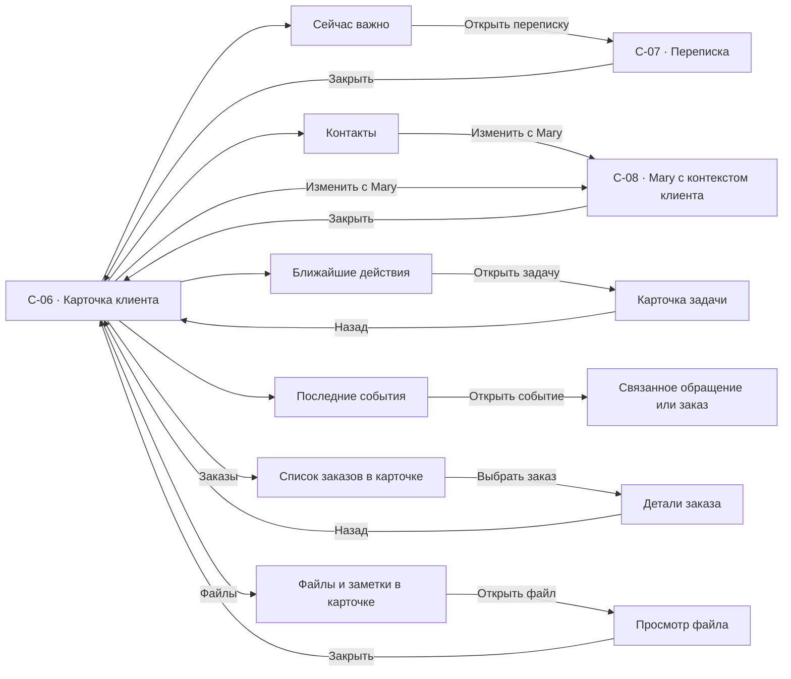
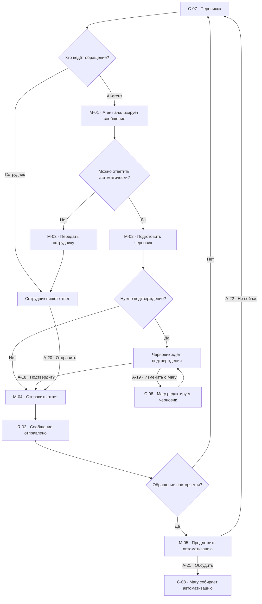
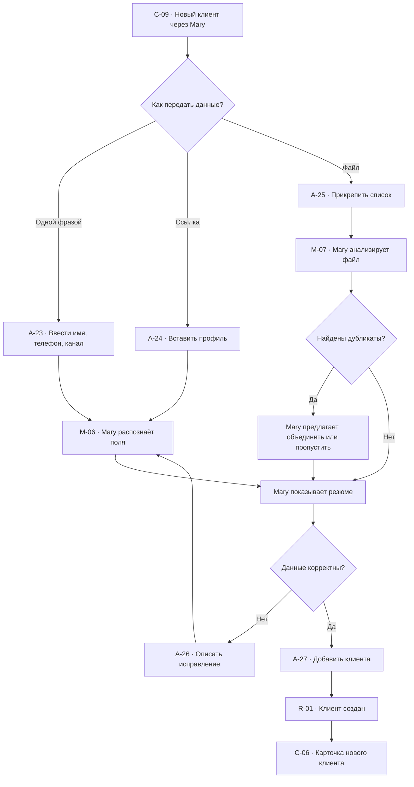
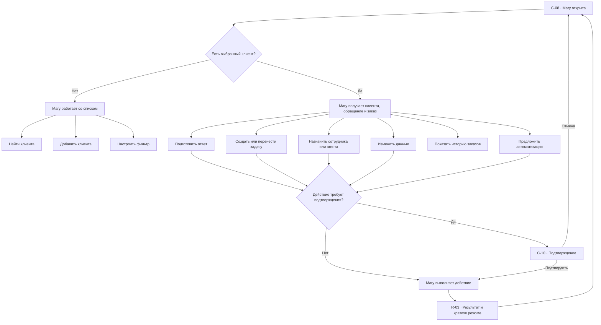
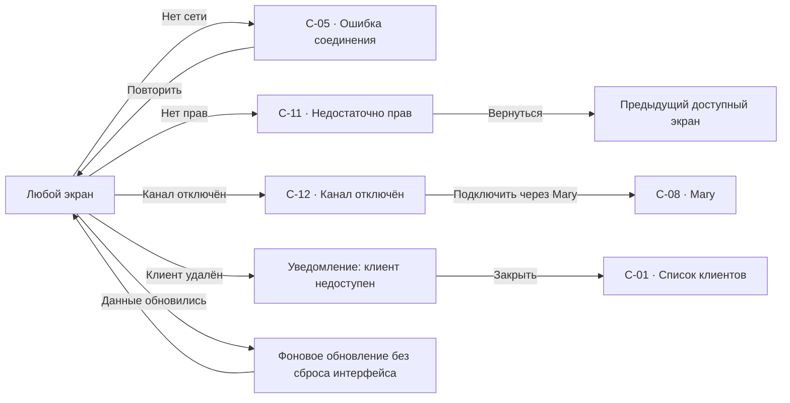

# Раздел «Клиенты»: user flow

## 1. Назначение карты

Карта связывает:

- все экраны раздела;
- действия пользователя;
- действия Mary и AI-агентов;
- системные решения;
- успешные, пустые и ошибочные состояния;
- возвраты без потери контекста.

## 2. Легенда

| Тип | Обозначение |
| --- | --- |
| Экран | `C-XX` |
| Действие пользователя | `A-XX` |
| Решение системы | ромб |
| Действие Mary или агента | `M-XX` |
| Результат | `R-XX` |

## 3. Список экранов

| ID | Экран | Слой |
| --- | --- | --- |
| `C-01` | Список клиентов | Базовый |
| `C-02` | Загрузка списка | Базовый |
| `C-03` | Клиентов пока нет | Базовый |
| `C-04` | Поиск без результатов | Базовый |
| `C-05` | Ошибка загрузки | Базовый |
| `C-06` | Карточка клиента справа | Контекстный |
| `C-07` | Переписка с клиентом | Рабочее модальное окно |
| `C-08` | Окно Mary | Плавающий ассистент |
| `C-09` | Добавление клиента через Mary | Плавающий ассистент |
| `C-10` | Подтверждение опасного действия | Подтверждение |
| `C-11` | Недостаточно прав | Системное состояние |
| `C-12` | Канал отключён | Системное состояние |

## 4. Главный user flow

## 5. Flow карточки клиента

### Правило вложенности

- `Заказы`, `Файлы`, задача и событие раскрываются внутри правой карточки.
- Они не создают отдельную страницу клиента.
- Переписка открывается поверх.
- Mary открывается отдельным плавающим окном.

## 6. Flow переписки и AI-агента

## 7. Flow добавления клиента

## 8. Flow действий через Mary

## 9. Системные состояния

## 10. Таблица основных переходов

| Откуда | Действие | Куда | Что сохраняется |
| --- | --- | --- | --- |
| `C-01` | Клик по строке | `C-06` | Поиск, фильтры, сортировка, scroll |
| `C-06` | Закрыть | `C-01` | Позиция выбранной строки |
| `C-06` | Открыть переписку | `C-07` | Карточка клиента под модальным окном |
| `C-07` | Закрыть | `C-06` | Черновик, позиция диалога |
| `C-01` | Спросить Mary | `C-08` | Состояние списка |
| `C-06` | Спросить Mary | `C-08` | Клиент, обращение, заказ |
| `C-08` | Закрыть | `C-01` или `C-06` | Предыдущий контекст |
| `C-01` | Добавить клиента | `C-09` | Поиск и фильтры |
| `C-09` | Клиент создан | `C-06` | Новый клиент выбран |
| `C-04` | Сбросить поиск | `C-01` | Остальные фильтры |
| `C-05` | Повторить | `C-02` | Поиск и фильтры |

## 11. Переходы и анимации

| Переход | Анимация |
| --- | --- |
| `C-01 → C-06` | Панель справа, `240 ms`, drawer easing |
| `C-06 → C-01` | Панель вправо, `180 ms` |
| `C-06 → C-07` | Opacity + scale `0.98 → 1`, `180 ms` |
| `C-07 → C-06` | Opacity + scale `1 → 0.98`, `140 ms` |
| `C-01/C-06 → C-08` мышью | Появление окна, `180–220 ms` |
| `C-01/C-06 → C-08` через `⌘M` | Без анимации |
| Строка default → hover | Фон и иконка, `120 ms` |

## 12. Приоритет реализации

### P0

- `C-01`, `C-02`, `C-04`, `C-05`;
- `C-06`, `C-07`, `C-08`, `C-09`;
- поиск, фильтры, карточка, переписка, Mary;
- AI-агент и передача сотруднику;
- доступность с клавиатуры.

### P1

- `C-03`, `C-10`, `C-11`, `C-12`;
- импорт файла и обработка дубликатов;
- заказы, файлы и задачи внутри карточки;
- фоновая синхронизация.

### P2

- сохранённые фильтры;
- массовые действия;
- расширенная история изменений;
- персонализация колонок.

## 13. Критерии завершённости flow

- каждый пользовательский action имеет понятный результат;
- у каждого окна есть явный способ закрытия и возврата;
- список не теряет поиск, фильтры, сортировку и позицию;
- нет отдельной страницы клиента;
- карточка, переписка и Mary не конфликтуют по слоям;
- AI-агент и сотрудник различимы без зависимости от цвета;
- опасные действия требуют подтверждения;
- loading, empty, no-results, offline и forbidden имеют выход;
- desktop, tablet и mobile сохраняют одинаковую логику слоёв.
