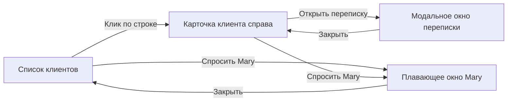

# Раздел «Клиенты»: UX-спецификация

## 1. Цель

Раздел помогает собственнику бизнеса и команде быстро:

- найти клиента;
- понять текущий контекст;
- увидеть, кто ведёт работу: сотрудник или AI-агент;
- открыть переписку;
- выполнить действие через Mary простыми словами.

Интерфейс не должен ощущаться как сложная CRM. Основой всегда остаётся список.
Отдельной страницы клиента нет.

## 2. Модель интерфейса

### Слои

1. **Базовый слой:** список клиентов.
2. **Контекстный слой:** боковая карточка выбранного клиента.
3. **Рабочий слой:** модальное окно переписки с клиентом.
4. **Ассистент:** плавающее окно Mary.

Карточка клиента может оставаться открытой под перепиской. Одновременно поверх
интерфейса показывается только одно рабочее окно: переписка или Mary.

## 3. Начальный экран

### Заголовок

- Раздел: `CRM`.
- Заголовок: `Клиенты`.
- Описание: `Вся история общения и работы с клиентами`.
- Основное действие: `Добавить клиента`.
- Дополнительное меню: кнопка `…`.

### Поиск и фильтры

- Поиск: `Имя, телефон или @username`.
- Ответственный: `Все ответственные`.
- Быстрые фильтры:
  - `Все`;
  - `Нужен ответ`;
  - `В работе`;
  - `Ведёт агент`.

Фильтры и основные кнопки имеют pill-форму. Поиск и селект имеют крупное
скругление, но не выглядят как капсулы.

### Список

| Колонка | Содержание |
| --- | --- |
| Клиент | Имя, канал, username или телефон |
| Текущий контекст | Последний важный вопрос, заказ или обращение |
| Кто ведёт | Сотрудник или AI-агент |
| Последний контакт | Относительная дата и время |
| Состояние | Что происходит сейчас |
| Действие | Иконка открытия переписки |

### Состояния исполнителя

- `Агент отвечает`;
- `Агент ждёт подтверждения`;
- `Агент передал сотруднику`;
- `В работе у сотрудника`;
- `Завершено агентом`;
- `Завершено сотрудником`.

Смысл не передаётся только цветом. Используются текст, иконка и начертание.

## 4. Поведение строки

### Default

- белый или прозрачный фон;
- тонкий нижний разделитель;
- все данные доступны без hover.

### Hover

- лёгкая серая подложка;
- курсор `pointer`;
- иконка переписки становится контрастнее.

### Focus

- видимая рамка `focus-visible`;
- `Enter` открывает карточку;
- `Space` не должен прокручивать страницу при активации строки.

### Selected

- тонкая тёмная линия слева;
- лёгкая серая подложка;
- строка остаётся видимой после открытия карточки.

## 5. Карточка клиента справа

### Открытие

- открывается после клика по строке;
- ширина desktop: `392–420 px`;
- список плавно сжимается, а не перекрывается;
- поиск, фильтры, сортировка, страница и scroll position сохраняются;
- URL может хранить состояние как `?client=58625`.

### Содержимое

#### Шапка

- инициалы или фото;
- имя;
- канал и username;
- состояние;
- время ожидания;
- ответственный;
- кнопка закрытия.

#### Сейчас важно

- одно главное обращение или следующий шаг;
- связанный заказ;
- краткое объяснение;
- действие `Открыть переписку`.

#### Контакты

- телефон;
- канал;
- username;
- менеджер.

#### Ближайшие действия

- максимум две открытые задачи;
- срок;
- ответственный.

#### Последние события

- максимум три события;
- действия клиента, агента и сотрудника находятся в одной ленте.

#### Нижние действия

- `Заказы`;
- `Файлы`;
- `Изменить с Mary`.

Редкие поля и редактирование не разворачиваются в длинную форму. Пользователь
описывает изменение Mary.

### Закрытие

- крестик;
- повторный клик по выбранной строке;
- `Escape`, если поверх не открыто другое окно;
- переход в другой раздел.

## 6. Переписка с клиентом

### Открытие

- кнопка `Открыть переписку` в карточке;
- иконка сообщения в строке;
- появляется модальным окном поверх списка и карточки;
- рекомендуемый размер desktop: `820 × 720 px`;
- фон затемняется не более чем на 20%.

### Содержимое

- имя клиента и канал;
- текущий ответственный;
- сообщения;
- вложения;
- внутренние события агента;
- черновик ответа;
- подтверждение перед отправкой;
- поле нового сообщения.

### Действия

- `Подтвердить и отправить`;
- `Изменить с Mary`;
- `Передать`;
- `Закрыть`.

Сообщения агента и служебные события визуально отличаются от сообщений клиента,
но остаются в общей хронологии.

## 7. Окно Mary

### Открытие

- кнопка `Спросить Mary`;
- сочетание `⌘M`;
- действие `Изменить с Mary`;
- контекст передаётся автоматически: раздел, выбранный клиент, обращение и заказ.

### Размещение

- модельное плавающее окно;
- размер desktop: около `450 × 640 px`;
- если карточка клиента открыта, Mary располагается слева от неё;
- карточка клиента не перекрывается;
- при открытом окне кнопка `Спросить Mary` скрыта.

### Возможности

- подготовить ответ;
- создать или перенести задачу;
- назначить сотрудника или агента;
- показать историю заказов;
- изменить контактные данные;
- предложить автоматизацию повторяющегося обращения.

### Клавиатура

- `⌘M` открывает и закрывает окно без анимации;
- `Escape` закрывает;
- фокус возвращается в элемент, который открыл Mary.

## 8. Добавление клиента

Основной путь проходит через Mary, а не через большую форму.

1. Пользователь нажимает `Добавить клиента`.
2. Открывается Mary с контекстом `Новый клиент`.
3. Пользователь пишет данные одной фразой, отправляет ссылку или файл.
4. Mary показывает компактное резюме.
5. Пользователь подтверждает создание.
6. Новый клиент появляется в списке, его карточка открывается справа.

## 9. Состояния экрана

### Данные

- загрузка;
- список загружен;
- обновление в фоне;
- ошибка загрузки;
- нет доступа.

### Список

- есть клиенты;
- новая компания без клиентов;
- поиск без результатов;
- фильтр без результатов;
- один клиент;
- длинные имена и usernames;
- большое количество страниц.

### Карточка

- закрыта;
- открывается;
- открыта;
- обновляется;
- клиент удалён или объединён;
- недостаточно прав;
- нет текущего обращения;
- несколько активных обращений.

### Переписка

- загрузка истории;
- история загружена;
- отправка сообщения;
- сообщение отправлено;
- ошибка отправки;
- переподключение канала;
- черновик агента;
- требуется подтверждение;
- обращение передано сотруднику.

### Mary

- закрыта;
- открыта без выбранного клиента;
- открыта с клиентом;
- выполняет действие;
- просит подтверждение;
- действие выполнено;
- действие завершилось ошибкой.

## 10. Пустые и ошибочные состояния

### Нет клиентов

- заголовок: `Здесь появятся ваши клиенты`;
- объяснение: Mary может собрать контакты из подключённых каналов;
- основное действие: `Подключить канал через Mary`;
- дополнительное: `Добавить клиентов из файла`.

### Ничего не найдено

- показывается поисковая фраза;
- действие `Сбросить поиск`;
- Mary предлагает найти клиента по описанию.

### Ошибка

- коротко объяснить проблему;
- действие `Повторить`;
- не очищать введённый поиск и выбранные фильтры.

## 11. Переходы и анимация

| Изменение | Поведение |
| --- | --- |
| Открытие карточки | `240 ms`, сдвиг справа, `cubic-bezier(0.32, 0.72, 0, 1)` |
| Закрытие карточки | `180 ms`, тот же пространственный путь |
| Открытие переписки | `180 ms`, opacity + scale `0.98 → 1` |
| Закрытие переписки | `140 ms`, opacity + scale `1 → 0.98` |
| Mary мышью | `180–220 ms`, появление из нижнего правого угла |
| Mary через `⌘M` | без анимации |
| Hover строки | `120 ms`, только фон и контраст иконки |

При `prefers-reduced-motion` остаётся только мгновенная смена состояния.

## 12. Адаптивность

### Desktop от `1200 px`

- список и карточка видны одновременно;
- переписка открывается модальным окном;
- Mary располагается слева от карточки.

### Tablet `768–1199 px`

- карточка перекрывает список;
- ширина карточки до `480 px`;
- Mary заменяет карточку, сохраняя контекст клиента.

### Mobile до `767 px`

- список занимает весь экран;
- карточка открывается как full-screen sheet;
- переписка и Mary занимают весь экран;
- системная кнопка назад возвращает на предыдущий слой.

## 13. Доступность

- строки доступны с клавиатуры;
- у иконок есть доступные названия;
- фокус не уходит за пределы модальной переписки;
- после закрытия фокус возвращается в исходную строку;
- статусы не зависят только от цвета;
- минимальная область нажатия `44 × 44 px`;
- контраст текста и границ соответствует WCAG AA.

## 14. Критерии готовности

- первый экран открывается без карточки клиента;
- клик по строке открывает карточку справа;
- список сохраняет своё состояние после закрытия карточки;
- переписка открывается поверх списка и карточки;
- Mary не перекрывает карточку клиента;
- сотрудник и AI-агент различимы без цветового кодирования;
- все основные действия доступны с клавиатуры;
- предусмотрены loading, empty, no-results и error;
- интерфейс работает на desktop, tablet и mobile;
- пользователь не видит технических настроек автоматизации.
