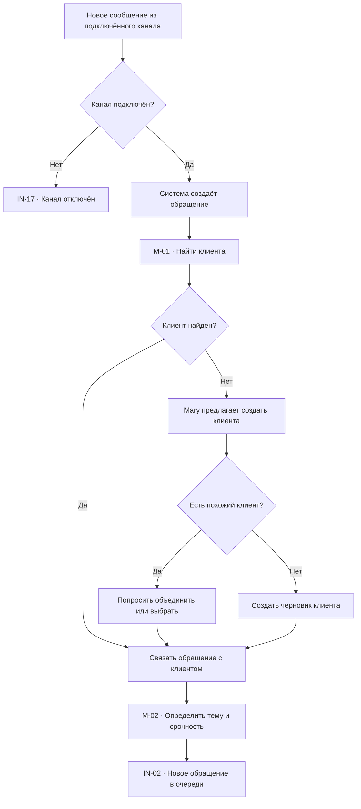
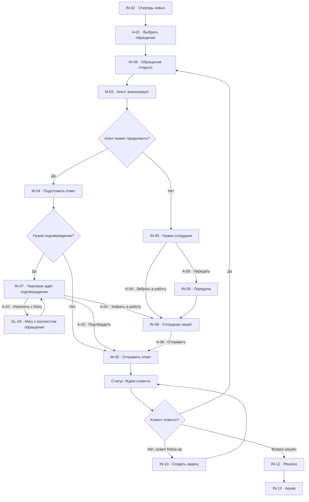
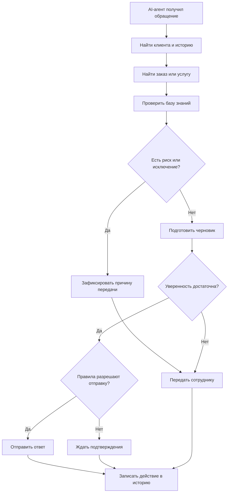
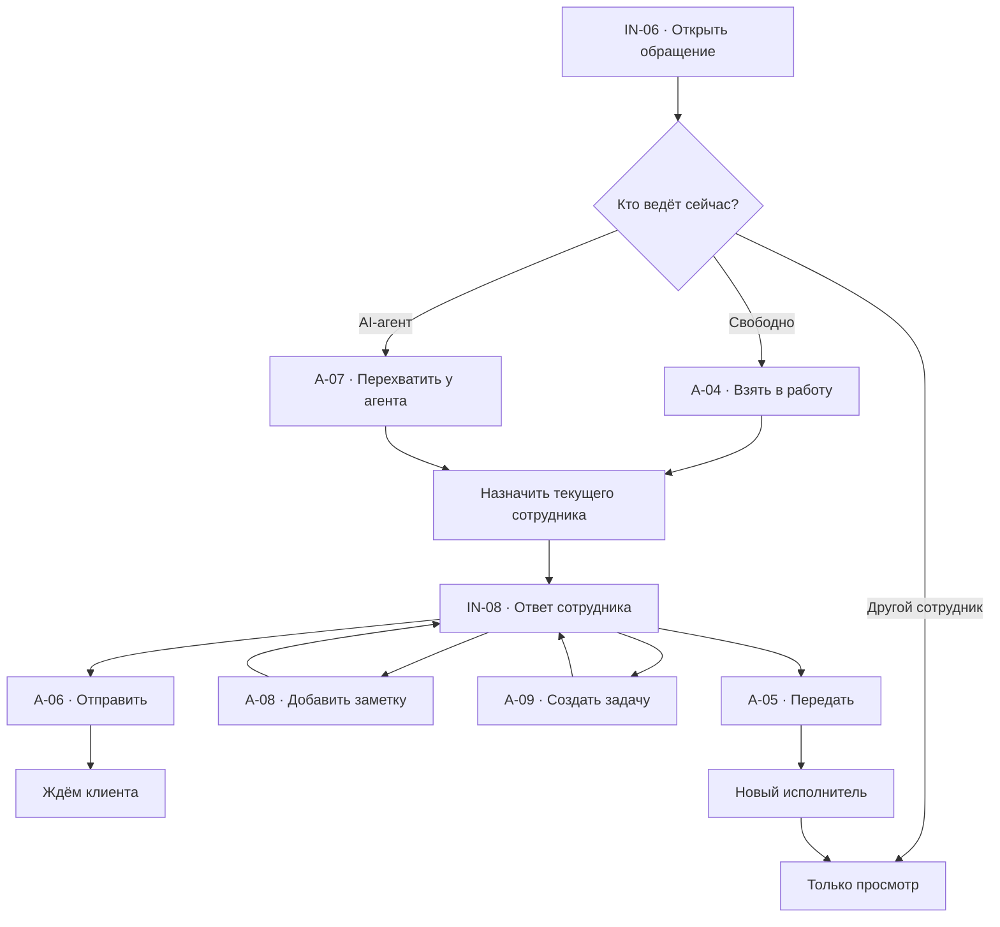
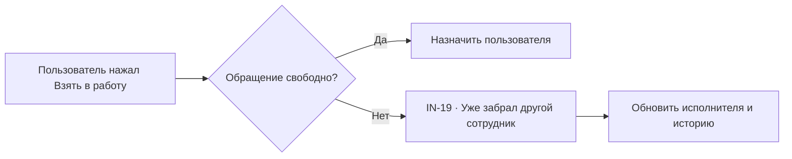
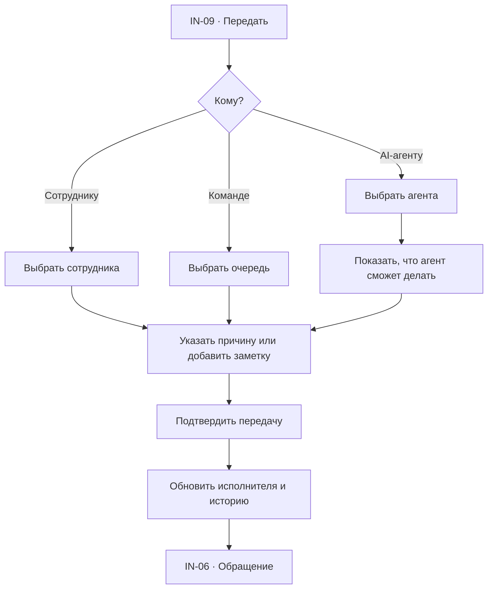
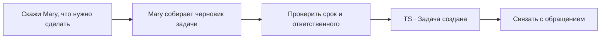
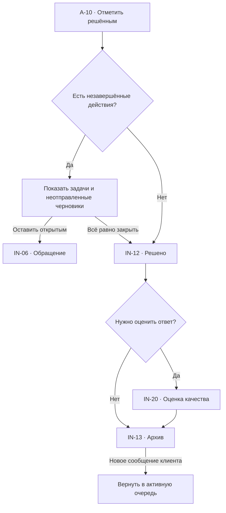
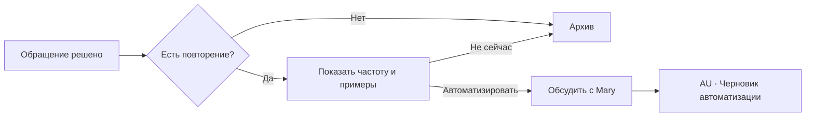

# Входящие и обращения: user flow

## 1. Роль раздела

`Входящие` — рабочее пространство, где AI-агенты и сотрудники вместе обрабатывают
сообщения клиентов.

Пользователь должен за несколько секунд понять:

- кто написал;
- с каким вопросом;
- сколько клиент ждёт;
- кто сейчас ведёт обращение;
- что уже сделал AI-агент;
- требуется ли подтверждение или участие человека;
- какое действие нужно выполнить дальше.

## 2. Основная модель

Desktop-интерфейс состоит из трёх зон:

1. очередь обращений слева;
2. активная переписка в центре;
3. контекст клиента и обращения справа.

Отдельная страница обращения не нужна. Выбор обращения обновляет центральную и
правую зоны, сохраняя очередь, фильтры и scroll position.

## 3. Список экранов

| ID | Экран или состояние |
| --- | --- |
| `IN-01` | Загрузка очереди |
| `IN-02` | Новые обращения |
| `IN-03` | Обращения в работе |
| `IN-04` | Ведёт AI-агент |
| `IN-05` | Нужен сотрудник |
| `IN-06` | Выбранное обращение |
| `IN-07` | Черновик агента ждёт подтверждения |
| `IN-08` | Сотрудник пишет ответ |
| `IN-09` | Передача обращения |
| `IN-10` | Создание задачи |
| `IN-11` | Карточка клиента |
| `IN-12` | Обращение решено |
| `IN-13` | Архив обращений |
| `IN-14` | Поиск без результатов |
| `IN-15` | Очередь пуста |
| `IN-16` | Ошибка загрузки |
| `IN-17` | Канал отключён |
| `IN-18` | Нет прав |
| `IN-19` | Конфликт: обращение уже забрал другой сотрудник |
| `IN-20` | Оценка качества ответа |

## 4. Статусы обращения

| Статус | Что означает | Кто действует дальше |
| --- | --- | --- |
| Новое | Обращение ещё не классифицировано | AI-агент |
| Агент анализирует | Mary ищет клиента, заказ и знания | AI-агент |
| Агент отвечает | Ответ можно подготовить автоматически | AI-агент |
| Ждёт подтверждения | Черновик готов, но не отправлен | Сотрудник |
| Нужен сотрудник | Агент не может безопасно продолжить | Сотрудник |
| В работе | Сотрудник принял обращение | Сотрудник |
| Ждём клиента | Ответ отправлен, нужен ответ клиента | Клиент |
| Запланировано действие | Создана задача или напоминание | Сотрудник или агент |
| Решено | Вопрос клиента закрыт | Система |
| В архиве | Обращение убрано из активной очереди | Система |

Статус не передаётся только цветом. Используются текст, иконка, исполнитель и
следующее действие.

## 5. Анатомия экрана

### Очередь

- вкладки или фильтры;
- поиск;
- клиент;
- канал;
- краткий preview;
- время ожидания;
- исполнитель;
- непрочитанные сообщения;
- SLA;
- состояние.

### Активная переписка

- клиент и канал;
- текущий исполнитель;
- история сообщений;
- вложения;
- внутренние события агента;
- заметки сотрудников;
- черновик ответа;
- composer.

### Правая контекстная панель

- клиент;
- заказ;
- текущее обращение;
- источник знаний;
- текущий исполнитель;
- SLA;
- рекомендации Mary;
- связанные задачи.

## 6. Вход нового обращения

## 7. Основной flow обработки

## 8. Flow AI-агента

### Причины передачи сотруднику

- жалоба или возврат денег;
- нет данных о заказе;
- противоречащие источники;
- клиент просит исключение из правил;
- низкая уверенность;
- негативная тональность или конфликт;
- требуется звонок;
- действие связано с оплатой;
- интеграция недоступна.

## 9. Flow сотрудника

## 10. Перехват и конфликт владения

### Правила

- в один момент у обращения один основной исполнитель;
- AI-агент может продолжать фоновый анализ после передачи, но не отправляет ответ;
- имя текущего исполнителя видно в очереди и шапке;
- перехват требует явного действия;
- передача записывается в историю.

### Конфликт

## 11. Черновик ответа

### Содержимое

- кто подготовил: агент или сотрудник;
- текст;
- использованные источники;
- уровень уверенности — только если он полезен сотруднику;
- что будет отправлено;
- статус `Не отправлено`;
- действия.

### Действия

- `Подтвердить и отправить`;
- `Изменить с Mary`;
- `Редактировать вручную`;
- `Передать`;
- `Отменить`.

После подтверждения кнопка заменяется результатом `Отправлено`, а не остаётся
активной.

## 12. Composer сотрудника

### Возможности

- текст;
- вложение;
- шаблон;
- голос;
- внутренняя заметка;
- сохранить черновик;
- вставить ответ Mary.

### Клавиатура

- `Enter` — отправить, если это настройка пользователя;
- безопасный default: `⌘Enter` — отправить;
- `Shift+Enter` — новая строка;
- `Escape` — закрыть меню или снять фокус, но не потерять черновик.

## 13. Передача обращения

Передача клиенту не видна как отдельное сообщение, если сотрудник не отправляет
уведомление.

## 14. Создание задачи

### Через интерфейс

1. Нажать `Задача`.
2. Mary предлагает название, срок и ответственного.
3. Пользователь проверяет.
4. Задача создаётся и связывается с клиентом, обращением и заказом.
5. В обращении появляется событие.

### Через Mary

## 15. Контекст клиента

Правая панель использует те же данные, что раздел `Клиенты`.

### Показываем

- имя и контакты;
- канал;
- ответственный;
- заказ;
- состояние оплаты и доставки;
- текущее обращение;
- открытые задачи;
- источник знаний;
- рекомендацию Mary.

### Действия

- открыть карточку клиента `CL-06`;
- открыть заказ внутри карточки;
- создать задачу `TS`;
- изменить данные с Mary;
- объединить дубликаты через подтверждение.

## 16. SLA и время ожидания

### В очереди

- время с последнего сообщения клиента;
- целевое время ответа;
- кто отвечает;
- следующий deadline.

### Состояния

- в норме;
- скоро истечёт;
- просрочено;
- пауза, пока ждём клиента;
- не применяется.

SLA не передаётся только цветом. Используются текст и иконка.

## 17. Решение и архив

## 18. Повторяющиеся обращения

Mary предлагает автоматизацию после решения, а не мешает активной переписке.

## 19. Поиск и фильтры

### Поиск

- имя;
- username;
- телефон;
- текст сообщения;
- номер заказа;
- ID обращения.

### Фильтры

- новые;
- ведёт агент;
- ждёт подтверждения;
- нужен сотрудник;
- в работе;
- ждём клиента;
- просроченные;
- канал;
- ответственный;
- тема;
- дата.

### Сохранение

- поиск и фильтры остаются после открытия обращения;
- возврат из другого раздела восстанавливает очередь;
- URL может хранить фильтр и `conversationId`.

## 20. Пустые и системные состояния

### `IN-15` Очередь пуста

- `Все обращения обработаны`;
- объяснение, что новые сообщения появятся автоматически;
- действие `Проверить подключения`;
- Mary может показать, что было решено сегодня.

### `IN-14` Ничего не найдено

- показать запрос;
- `Сбросить поиск`;
- сохранить остальные фильтры.

### `IN-16` Ошибка загрузки

- `Повторить`;
- не сбрасывать очередь и выбранное обращение;
- показать время последней синхронизации.

### `IN-17` Канал отключён

- назвать канал;
- объяснить, какие сообщения не поступают;
- `Подключить через Mary`;
- `Открыть интеграции`.

### `IN-18` Нет прав

- объяснить недоступное действие;
- показать безопасный вариант;
- запросить доступ у администратора.

## 21. Основные переходы

| Откуда | Действие | Куда | Контекст |
| --- | --- | --- | --- |
| `IN-02` | Выбрать обращение | `IN-06` | `conversationId` |
| `IN-06` | Открыть клиента | `CL-06` | `clientId` |
| `IN-06` | Создать задачу | `TS-06` | Клиент, обращение, заказ |
| `IN-06` | Изменить с Mary | `GL-03` | Обращение и клиент |
| `IN-07` | Подтвердить | `IN-08` или `IN-12` | Черновик |
| `IN-09` | Передать | `IN-06` | Новый исполнитель |
| `IN-10` | Открыть задачу | `TS-06` | `taskId` |
| `IN-12` | Автоматизировать | `AU-06` | Примеры обращений |
| `IN-06` | Открыть источник | `KB-06` | `sourceId` |
| `IN-13` | Новое сообщение | `IN-06` | Возобновлённое обращение |

## 22. Переходы и анимации

| Изменение | Поведение |
| --- | --- |
| Выбор обращения | Без анимации layout, контент меняется `120 ms` |
| Перехват | Мгновенное обновление исполнителя |
| Правая карточка | Постоянна на desktop, drawer на tablet |
| Передача | Modal `180 ms` |
| Создание задачи | Mary window или popover `180–220 ms` |
| Решение | Статус обновляется сразу, строка уходит после `160 ms` |
| Новое сообщение | Появляется без смещения прочитанной позиции |

При `prefers-reduced-motion` перемещения и scale отключаются.

## 23. Адаптивность

### Desktop

- очередь `340–400 px`;
- переписка занимает основную ширину;
- контекст `340–380 px`;
- панели можно сворачивать.

### Tablet

- очередь и переписка переключаются;
- контекст открывается drawer;
- composer остаётся видимым при клавиатуре.

### Mobile

- сначала очередь;
- обращение открывается full-screen;
- контекст — full-screen sheet;
- внутренние события можно свернуть;
- действие `Назад` возвращает в сохранённую позицию очереди.

## 24. Доступность

- очередь — семантический список;
- выбранное обращение отмечено через `aria-current`;
- непрочитанное не определяется только жирностью;
- сообщения читаются в хронологическом порядке;
- внутренние заметки имеют явную подпись;
- composer доступен с клавиатуры;
- modal передачи удерживает фокус;
- после закрытия фокус возвращается в исходное действие;
- время ожидания имеет текстовое описание.

## 25. Приоритет реализации

### P0

- `IN-01`, `IN-02`, `IN-03`, `IN-05`, `IN-06`, `IN-07`, `IN-08`;
- очередь, поиск, фильтры;
- AI-анализ и черновик;
- взять в работу, отправить, передать;
- контекст клиента;
- ошибки и disconnected channel.

### P1

- `IN-04`, `IN-09`, `IN-10`, `IN-12`, `IN-13`, `IN-19`;
- задачи;
- архив;
- SLA;
- оценка качества;
- предложение автоматизации.

### P2

- сохранённые очереди;
- массовые действия;
- сложные правила SLA;
- совместные заметки в реальном времени.

## 26. Критерии готовности

- новое сообщение появляется в правильной очереди;
- Mary находит или предлагает создать клиента;
- видно, кто ведёт обращение;
- AI-агент объясняет передачу сотруднику;
- черновик не отправляется без нужного подтверждения;
- перехват и передача не создают двух исполнителей;
- очередь сохраняет поиск, фильтры и позицию;
- обращение связано с клиентом, заказом и задачами;
- решённое обращение может вернуться из архива;
- все ошибки имеют безопасный выход;
- desktop, tablet, mobile и клавиатура поддерживают одинаковую логику.
