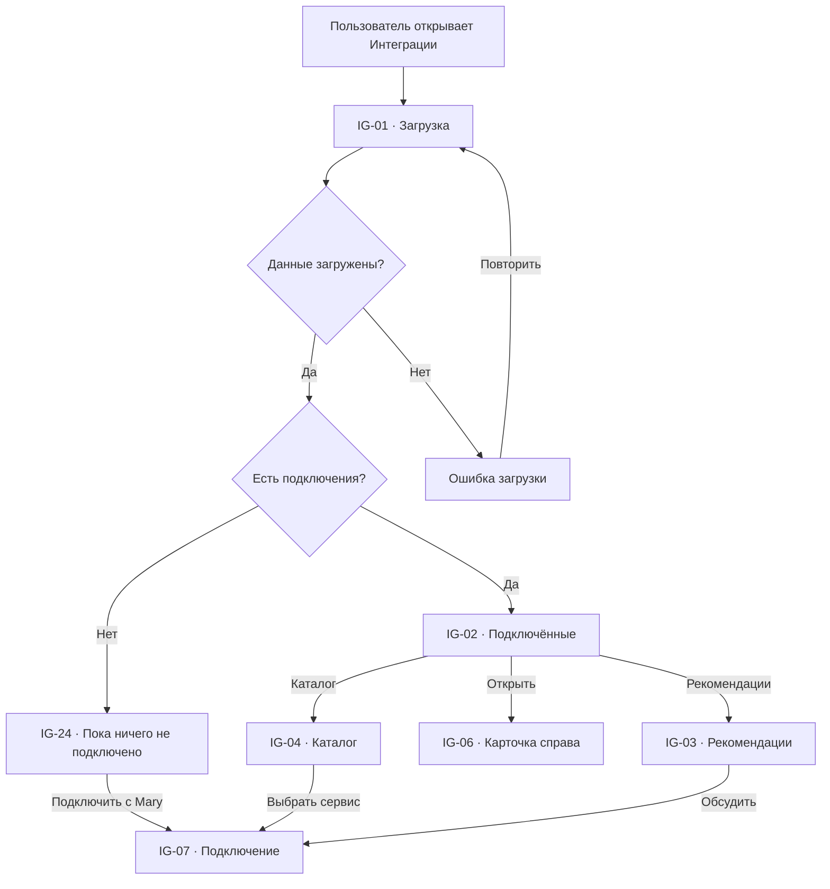
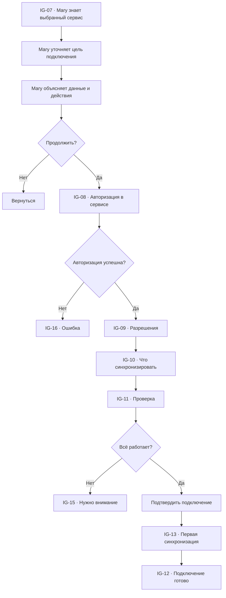
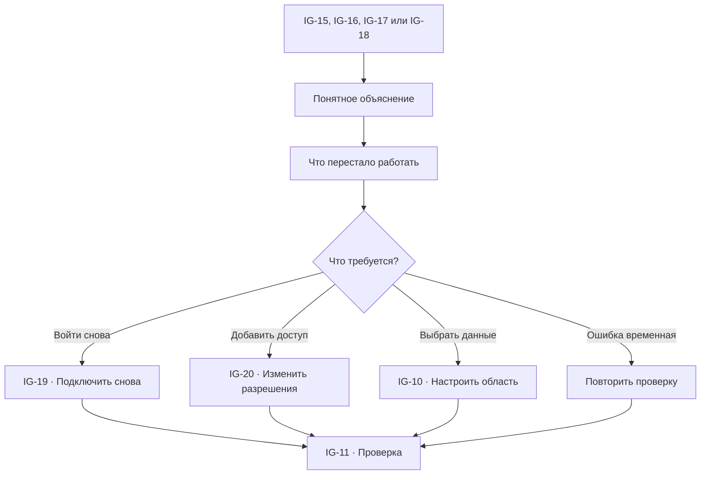

# Интеграции: user flow

## 1. Роль раздела

`Интеграции` соединяют Mary с каналами общения и рабочими сервисами бизнеса.

Пользователь должен понимать:

- что подключено;
- зачем это нужно Mary;
- какие данные будут доступны;
- что Mary сможет делать;
- где потребуется подтверждение;
- работает ли синхронизация;
- как безопасно отключить сервис.

Подключение и настройка происходят через Mary простыми словами. Технические поля
показываются только специалисту в отдельном расширенном режиме, если он явно
нужен.

## 2. Основная модель

Раздел состоит из:

1. подключённых сервисов;
2. рекомендаций;
3. каталога;
4. правой карточки интеграции;
5. диалога подключения с Mary.

Отдельной страницы интеграции нет. Выбранная карточка раскрывается справа.

## 3. Список экранов и состояний

| ID | Экран или состояние |
| --- | --- |
| `IG-01` | Загрузка интеграций |
| `IG-02` | Подключённые сервисы |
| `IG-03` | Рекомендуемые подключения |
| `IG-04` | Каталог интеграций |
| `IG-05` | Выбранная интеграция |
| `IG-06` | Карточка интеграции справа |
| `IG-07` | Подключение через Mary |
| `IG-08` | Внешняя авторизация |
| `IG-09` | Выбор разрешений |
| `IG-10` | Что синхронизировать |
| `IG-11` | Проверка подключения |
| `IG-12` | Подключение готово |
| `IG-13` | Первая синхронизация |
| `IG-14` | Интеграция работает |
| `IG-15` | Нужно внимание |
| `IG-16` | Ошибка подключения |
| `IG-17` | Доступ отозван |
| `IG-18` | Синхронизация задерживается |
| `IG-19` | Повторное подключение |
| `IG-20` | Изменение доступа |
| `IG-21` | Пауза интеграции |
| `IG-22` | Отключение интеграции |
| `IG-23` | Конфликт или дубликаты данных |
| `IG-24` | Интеграций пока нет |
| `IG-25` | Ничего не найдено |
| `IG-26` | Недостаточно прав |

## 4. Категории

- сообщения: Telegram, Instagram, WhatsApp, Email, веб-чат;
- CRM и заказы: Битрикс24, amoCRM;
- календарь: Google Calendar, Outlook;
- товары и склад: МойСклад;
- файлы и знания: Google Drive, OneDrive;
- платежи;
- формы и сайт;
- уведомления команды.

Категория объясняет пользу, но не перегружает каталог.

## 5. Статусы

| Статус | Значение | Действие |
| --- | --- | --- |
| Не подключено | Mary не имеет доступа | Подключить |
| Подключается | Идёт авторизация | Продолжить |
| Проверяется | Mary проверяет доступ | Подождать |
| Синхронизируется | Загружаются разрешённые данные | Открыть прогресс |
| Подключено | Сервис работает | Открыть |
| Нужно внимание | Нужен выбор или подтверждение | Исправить с Mary |
| Задержка | Данные обновляются медленнее | Проверить |
| Ошибка | Действия временно недоступны | Восстановить |
| Доступ отозван | Сервис больше не разрешает работу | Подключить снова |
| На паузе | Обмен данными остановлен | Возобновить |

## 6. Экран интеграций

### Верхняя часть

- `Интеграции`;
- пояснение;
- поиск;
- фильтры;
- состояние подключений;
- `Подключить с Mary`.

### Подключённые

Показывают:

- сервис;
- что получает Mary;
- что Mary может делать;
- статус;
- последнее обновление;
- затронутые разделы;
- `Открыть`.

### Рекомендации

Mary объясняет:

- какой процесс требует подключения;
- что сейчас приходится делать вручную;
- какие данные нужны;
- какая польза;
- какие разрешения понадобятся.

Основное действие:

`Обсудить с Mary`.

## 7. Главный flow

## 8. Карточка интеграции справа

### Основное

- сервис;
- статус;
- подключённый аккаунт или рабочее пространство;
- владелец подключения;
- дата подключения;
- последнее обновление.

### Mary использует

- доступные данные;
- разрешённые действия;
- связанные разделы;
- автоматизации;
- источники знаний.

### Состояние

- что синхронизируется;
- задержка;
- ошибки;
- ограничения;
- история важных изменений.

### Действия

- `Проверить`;
- `Изменить с Mary`;
- `Изменить доступ`;
- `Поставить на паузу`;
- `Подключить снова`;
- `Отключить`.

## 9. Подключение через Mary

## 10. Объяснение до авторизации

Mary показывает:

- зачем нужен сервис;
- какой аккаунт следует подключить;
- какие данные будут прочитаны;
- какие действия сможет выполнять Mary;
- что останется только на подтверждении;
- кто в команде получит доступ;
- как отключить сервис.

Основная кнопка:

`Перейти к подключению`.

Внешняя авторизация визуально отделена и открывается только на официальном
экране сервиса.

## 11. Разрешения

`IG-09` группирует разрешения по смыслу:

- читать сообщения;
- отвечать клиентам;
- видеть контакты;
- читать заказы;
- создавать события;
- обновлять задачи;
- читать файлы.

Для каждого разрешения:

- зачем оно нужно;
- где используется;
- можно ли продолжить без него;
- какое действие станет недоступно.

Mary запрашивает минимально необходимый доступ. Опасные права не включаются
молча.

## 12. Выбор данных

`IG-10` позволяет простыми вопросами определить:

- какие каналы;
- какие папки;
- какие календари;
- какие воронки;
- какие магазины или склады;
- с какой даты загрузить историю;
- кто увидит данные.

Вместо технического mapping Mary показывает понятное резюме:

> Клиенты из Telegram будут попадать во Входящие, а новые сообщения — в общий
> профиль клиента.

## 13. Проверка подключения

`IG-11` выполняет безопасную проверку:

- доступен ли аккаунт;
- читаются ли разрешённые данные;
- можно ли выполнить тестовое действие;
- нет ли дубликатов;
- совпадает ли часовой пояс;
- хватает ли прав.

Проверка не отправляет сообщение реальному клиенту и не меняет рабочие данные.

Для канала сообщений используется тестовый диалог или sandbox, если он доступен.

## 14. Первая синхронизация

`IG-13` показывает:

- этап;
- найденные объекты;
- обработанные объекты;
- пропущенные данные;
- дубликаты;
- пример результата;
- безопасную кнопку `Остановить`.

Пользователь может продолжить работу в платформе. Прогресс остаётся доступен в
карточке интеграции.

## 15. Конфликты и дубликаты

`IG-23` появляется, если:

- клиент уже существует;
- один контакт найден в нескольких каналах;
- разные сервисы содержат разные данные;
- календарь имеет одинаковые события;
- товар или заказ нельзя однозначно сопоставить.

Mary показывает:

- оба варианта;
- предлагаемое решение;
- влияние;
- сколько объектов затронуто.

Массовое объединение требует preview и подтверждения.

## 16. Работающая интеграция

`IG-14` показывает:

- `Подключено`;
- последнее успешное обновление;
- количество новых данных;
- активные процессы;
- проблемы за период;
- ожидаемое следующее обновление.

Mary может ответить:

- `Что приходит из этого сервиса?`;
- `Какие процессы зависят от него?`;
- `Почему данные не обновились?`;
- `Что случится, если отключить?`.

## 17. Ошибка и восстановление

Ошибка показывает:

- что уже не работает;
- что продолжает работать;
- затронуты ли клиенты;
- были ли выполнены реальные действия;
- безопасное следующее действие.

## 18. Пауза

`IG-21` останавливает новый обмен данными, но сохраняет:

- ранее загруженные данные;
- историю;
- настройки;
- связи.

Перед паузой показываются:

- активные автоматизации;
- каналы, которые перестанут получать сообщения;
- запланированные действия;
- предупреждение о новых данных.

## 19. Отключение

`IG-22` требует подтверждения и показывает:

- какие разделы затронуты;
- какие автоматизации остановятся;
- какие источники знаний потеряют обновление;
- что произойдёт с уже загруженными данными;
- как долго хранится история.

Доступ в стороннем сервисе отзывается, если это поддерживается.

Отключение не удаляет клиентов, задачи или историю обращений автоматически.

## 20. Каналы сообщений

Для Telegram, Instagram, Email, WhatsApp и веб-чата дополнительно показываются:

- входящие сообщения;
- возможность ответа;
- аккаунт или адрес;
- очередь;
- рабочие часы;
- правило передачи сотруднику;
- статус webhook только в расширенном режиме администратора.

Настройка ответа и маршрута происходит через Mary, а не через техническую форму.

## 21. Календарь и файлы

### Календарь

- выбранные календари;
- чтение занятости;
- создание событий;
- уведомления;
- часовой пояс.

### Файлы

- выбранные папки;
- типы документов;
- права доступа;
- синхронизируемые источники знаний;
- частота проверки изменений.

## 22. Поиск и фильтры

Поиск:

- название;
- назначение;
- категория;
- связанный процесс.

Фильтры:

- подключено;
- рекомендуется;
- нужно внимание;
- категория;
- используется Mary;
- владелец.

`IG-25` показывает активные условия и действие `Сбросить`.

## 23. Связь с другими разделами

| Откуда | Действие | Куда | Контекст |
| --- | --- | --- | --- |
| `IN-17` | Подключить канал | `IG-07` | Канал |
| `AU-14` | Подключить сервис | `IG-07` | Требуемый шаг |
| `CA-13` | Подключить календарь | `IG-07` | Провайдер |
| `KB-07` | Выбрать сервис | `IG-07` | Источник знаний |
| `IG-06` | Открыть знания | `KB-06` | `integrationId` |
| `IG-06` | Открыть процесс | `AU-06` | `automationId` |
| `IG-06` | Открыть обращения | `IN-02` | Канал |
| `AN-20` | Проверить источник | `IG-06` | `integrationId` |
| `IG-26` | Запросить доступ | `TM-06` | Владелец |
| Любой экран | Спросить Mary | `GL-03` | Интеграция и состояние |

## 24. Пустые и системные состояния

### `IG-24` Интеграций пока нет

- объяснение пользы;
- рекомендуемый первый канал;
- `Подключить с Mary`;
- каталог.

### `IG-16` Ошибка подключения

- этап;
- понятная причина;
- что не сохранено;
- `Попробовать снова`;
- `Выбрать другой аккаунт`;
- `Спросить Mary`.

### `IG-26` Недостаточно прав

- какое разрешение нужно;
- кто может подключить;
- `Запросить у администратора`.

## 25. Переходы и анимации

- интеграция → правая панель `180–240 ms`;
- подключение показывает этапы без технического stepper;
- внешняя авторизация возвращает в сохранённый контекст;
- первая синхронизация обновляет прогресс без скачка страницы;
- возврат сохраняет категорию, поиск и scroll position;
- при `prefers-reduced-motion` статусы меняются без анимации.

## 26. Адаптивность

### Desktop

- подключённые и рекомендации;
- каталог;
- карточка справа;
- Mary как плавающее окно.

### Tablet

- каталог одной колонкой;
- карточка как sheet;
- этапы подключения вертикально.

### Mobile

- подключённые идут первыми;
- каталог — список;
- карточка и Mary full-screen;
- внешняя авторизация возвращает в тот же этап.

## 27. Доступность и безопасность

- статус не определяется только цветом;
- разрешения описаны текстом;
- внешний экран авторизации обозначен;
- секреты и токены никогда не отображаются полностью;
- clipboard не используется для секретов без явного действия;
- карточка управляет фокусом;
- после возврата фокус сохраняется;
- ошибки связаны с конкретным этапом;
- отключение требует подтверждения последствий.

## 28. Приоритет реализации

### P0

- `IG-01`, `IG-02`, `IG-03`, `IG-04`, `IG-06`, `IG-07`;
- каталог и подключённые;
- карточка справа;
- подключение через Mary;
- авторизация и разрешения;
- проверка;
- первая синхронизация;
- ошибки и повторное подключение.

### P1

- конфликты и дубликаты;
- пауза;
- изменение доступа;
- рекомендации из процессов;
- история состояния.

### P2

- расширенный режим специалиста;
- массовое подключение;
- дополнительные провайдеры;
- собственные интеграции.

## 29. Критерии готовности

- пользователь понимает пользу до авторизации;
- Mary запрашивает минимально необходимый доступ;
- проверка не меняет реальные данные;
- подключение объясняет, что синхронизируется;
- ошибка показывает влияние на процессы и клиентов;
- отключение не удаляет связанные сущности;
- канал, календарь и знания используют одну интеграцию;
- технические настройки скрыты из базового режима;
- desktop, tablet, mobile и клавиатура поддерживают одинаковую логику.
