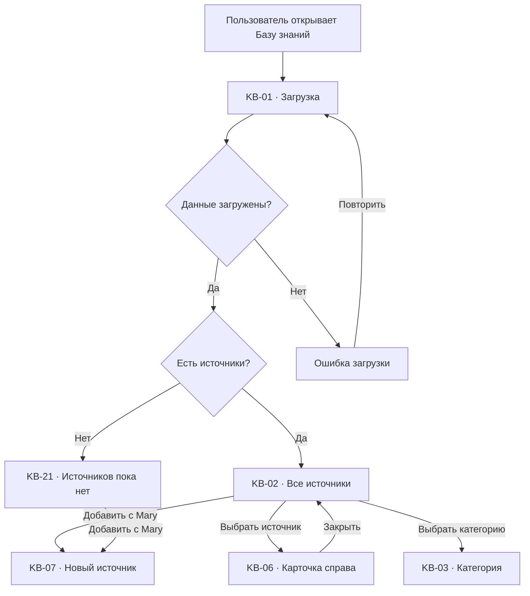
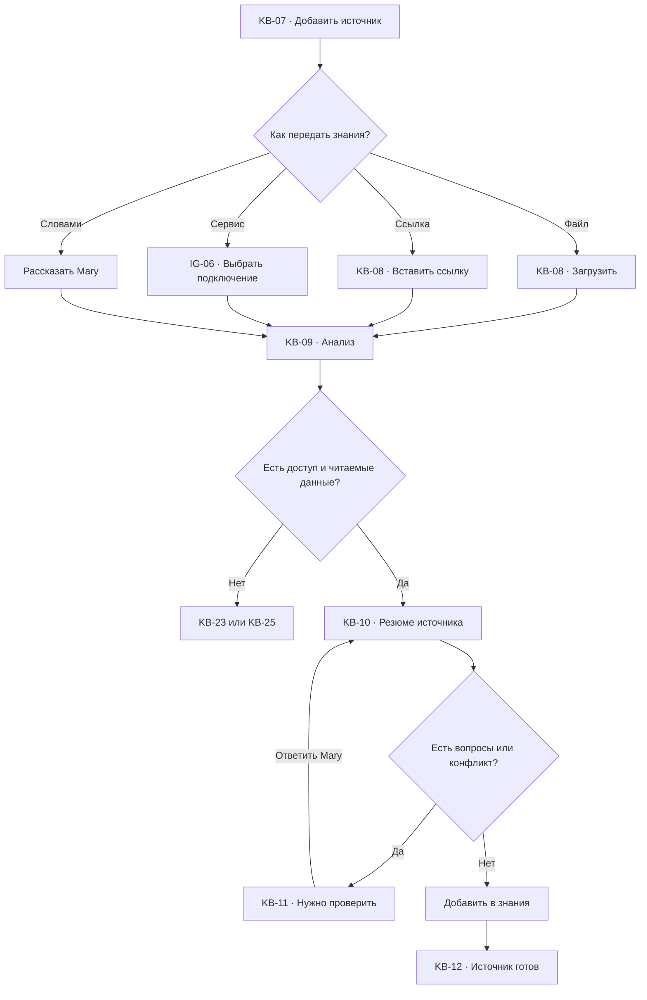
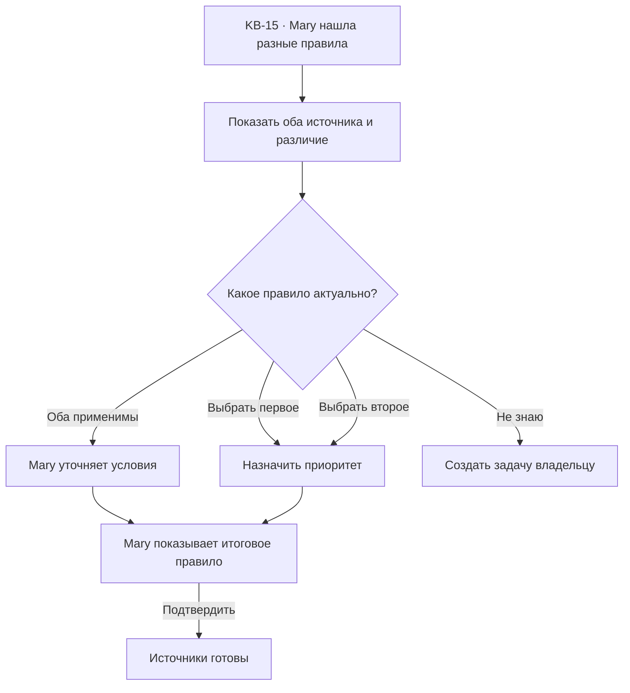
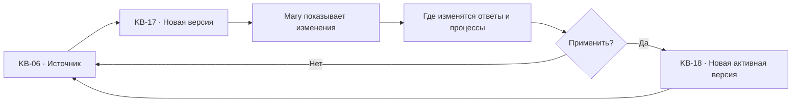

# База знаний: user flow

## 1. Роль раздела

`База знаний` содержит материалы, на которые Mary опирается в ответах, решениях и
автоматизациях.

Пользователь должен понимать:

- что знает Mary;
- откуда взята информация;
- насколько она актуальна;
- где этот источник используется;
- есть ли противоречия;
- что нужно обновить.

Пользователь не управляет фрагментами, embeddings или индексами. Mary сама
разбирает материалы и объясняет результат обычными словами.

## 2. Основная модель

Раздел состоит из:

1. состояния знаний;
2. списка источников;
3. правой карточки выбранного источника;
4. окна Mary для добавления, проверки и изменения.

Отдельной страницы источника нет. Выбор строки открывает правую панель и
сохраняет поиск, категорию, фильтры и позицию.

## 3. Список экранов и состояний

| ID | Экран или состояние |
| --- | --- |
| `KB-01` | Загрузка источников |
| `KB-02` | Все источники |
| `KB-03` | Категория знаний |
| `KB-04` | Состояние базы знаний |
| `KB-05` | Выбранный источник |
| `KB-06` | Карточка источника справа |
| `KB-07` | Добавление источника через Mary |
| `KB-08` | Загрузка файла или ссылки |
| `KB-09` | Mary анализирует источник |
| `KB-10` | Резюме нового источника |
| `KB-11` | Нужно проверить перед добавлением |
| `KB-12` | Источник готов |
| `KB-13` | Просмотр содержимого |
| `KB-14` | Проверка ответа Mary |
| `KB-15` | Противоречие источников |
| `KB-16` | Источник устарел |
| `KB-17` | Обновление источника |
| `KB-18` | История версий |
| `KB-19` | Источник используется |
| `KB-20` | Удаление или отключение |
| `KB-21` | Источников пока нет |
| `KB-22` | Поиск без результатов |
| `KB-23` | Ошибка обработки |
| `KB-24` | Недостаточно прав |
| `KB-25` | Нет доступа к связанному файлу |
| `KB-26` | Синхронизация источника |

## 4. Типы источников

- файл: PDF, DOCX, таблица, текст;
- ссылка на страницу;
- текст, продиктованный пользователем;
- папка или документ из подключённого сервиса;
- правила компании;
- описание продукта;
- шаблоны ответов;
- история подтверждённых решений.

История обращений не становится знанием автоматически. Mary может предложить
обобщить повторяющиеся решения, но пользователь подтверждает итоговое правило.

## 5. Статусы источника

| Статус | Значение | Действие |
| --- | --- | --- |
| Загружается | Файл или ссылка передаются | Подождать или отменить |
| Анализируется | Mary извлекает содержание | Открыть прогресс |
| Нужно проверить | Есть вопросы или риск | Проверить с Mary |
| Готов | Mary может использовать источник | Проверить ответ |
| Синхронизируется | Подключённый источник обновляется | Посмотреть состояние |
| Устарел | Материал давно не подтверждался | Обновить |
| Противоречие | Найдены разные правила | Разрешить с Mary |
| Ошибка | Источник не обработан | Исправить |
| Нет доступа | Внешний файл больше недоступен | Восстановить доступ |
| Отключён | Mary временно не использует источник | Включить |

## 6. Список источников

### Верхняя часть

- `База знаний`;
- пояснение;
- состояние знаний;
- поиск;
- фильтры;
- основное действие `Добавить с Mary`.

### Категории

- все;
- компания;
- продукты и услуги;
- правила;
- продажи;
- поддержка;
- доставка и оплата;
- архив.

Категории помогают обзору, но не создают сложную файловую систему.

### Строка источника

- название;
- краткое содержание;
- тип;
- категория;
- статус;
- дата обновления;
- владелец;
- где используется;
- действие `Открыть`.

Количество технических фрагментов не является главным показателем и скрывается
из базового списка.

## 7. Состояние знаний

`KB-04` показывает:

- сколько источников готово;
- сколько нужно проверить;
- какие устарели;
- есть ли противоречия;
- потерян ли доступ;
- когда знания последний раз проверялись.

Главный вывод формулируется как действие:

> Mary использует актуальные материалы. Два правила доставки нужно проверить.

Нажатие открывает отфильтрованный список проблемных источников.

## 8. Главный flow

## 9. Карточка источника справа

### Основное

- название;
- статус;
- краткое резюме;
- тип и расположение;
- владелец;
- дата обновления;
- доступность.

### Что поняла Mary

- основные темы;
- правила и ограничения;
- важные даты;
- продукты или услуги;
- условия, требующие подтверждения.

### Использование

- ответы клиентам;
- автоматизации;
- AI-агенты;
- шаблоны;
- связанные обращения.

### Действия

- `Проверить ответ Mary`;
- `Обновить с Mary`;
- `Открыть содержимое`;
- `Посмотреть использование`;
- `Отключить`;
- `Удалить`;
- `Открыть исходный файл`.

## 10. Добавление через Mary

## 11. Резюме перед добавлением

`KB-10` показывает:

- что это за материал;
- какие темы Mary нашла;
- какие правила будет использовать;
- какие разделы пропущены;
- какие данные могут быть чувствительными;
- где источник предлагается использовать;
- будет ли он обновляться автоматически.

Основные действия:

- `Добавить в знания`;
- `Исправить с Mary`;
- `Открыть содержимое`;
- `Отмена`.

Mary не начинает использовать источник до подтверждения.

## 12. Проверка ответа Mary

`KB-14` позволяет задать тестовый вопрос:

> Что мы предлагаем клиенту, если фотокнига пришла с дефектом?

Mary показывает:

- ответ;
- использованный источник;
- конкретное место в материале;
- дату источника;
- другие источники, если они влияют на ответ;
- уровень уверенности понятным текстом.

Действия:

- `Ответ верный`;
- `Нужно исправить`;
- `Показать источник`;
- `Добавить уточнение`.

Проверка не отправляет ответ клиенту и не изменяет автоматизацию.

## 13. Противоречие

До разрешения Mary:

- не скрывает противоречие;
- не выбирает правило молча;
- передаёт спорный случай сотруднику;
- показывает ограничение в черновике ответа.

## 14. Устаревший источник

`KB-16` появляется по сроку, изменению исходного файла или сигналам из работы.

Показываем:

- когда подтверждён;
- кто владелец;
- где используется;
- что могло измениться;
- последние ответы или процессы, зависящие от источника.

Действия:

- `Подтвердить актуальность`;
- `Обновить с Mary`;
- `Назначить проверку`;
- `Отключить до проверки`.

Сам факт возраста файла не означает, что содержание неверно.

## 15. Обновление и версии

Старая версия остаётся в истории. Активные запуски автоматизации заканчиваются
по тем правилам, с которыми начались.

## 16. Где используется источник

`KB-19` показывает:

- активные автоматизации;
- AI-агентов;
- типы обращений;
- сохранённые ответы;
- дату последнего использования;
- связанные проблемные случаи.

Перед отключением или удалением пользователь видит влияние на каждый объект.

## 17. Отключение и удаление

### Отключить

- Mary перестаёт использовать источник в новых действиях;
- содержимое и история сохраняются;
- связанные процессы получают предупреждение.

### Удалить

- исходные данные удаляются по политике доступа;
- история использования сохраняет безопасную ссылку на факт;
- действие требует подтверждения;
- если источник используется, сначала предлагается замена или отключение.

## 18. Синхронизируемый источник

`KB-26` показывает:

- сервис;
- путь или документ;
- частоту обновления;
- последнее успешное обновление;
- найденные изменения;
- статус доступа.

Существенные изменения правил не применяются молча: Mary показывает сравнение и
просит подтверждение.

## 19. Поиск и фильтры

Поиск работает по:

- названию;
- содержанию;
- теме;
- продукту;
- владельцу;
- связанному процессу.

Фильтры:

- категория;
- статус;
- тип;
- владелец;
- используется;
- обновлено;
- синхронизируется.

`KB-22` показывает активные условия и действия `Сбросить` и `Спросить Mary`.

## 20. Связь с другими разделами

| Откуда | Действие | Куда | Контекст |
| --- | --- | --- | --- |
| `IN-06` | Открыть источник ответа | `KB-06` | `sourceId`, фрагмент |
| `CH-06` | Добавить материал | `KB-07` | Файл, ссылка, резюме |
| `AU-08` | Добавить правило | `KB-07` | Процесс и блок |
| `KB-19` | Открыть процесс | `AU-06` | `automationId` |
| `KB-19` | Открыть обращение | `IN-06` | `conversationId` |
| `KB-26` | Открыть подключение | `IG-06` | `integrationId` |
| `KB-16` | Создать проверку | `TS-07` | Источник и владелец |
| `AN-15` | Показать доказательство | `KB-06` | `sourceId` |
| Любой экран | Спросить Mary | `GL-03` | Источник или набор |

## 21. Пустые и системные состояния

### `KB-21` Источников пока нет

- объяснение, зачем Mary нужны подтверждённые знания;
- примеры материалов;
- `Добавить с Mary`;
- `Подключить сервис`.

### `KB-23` Ошибка обработки

- какой материал не прочитан;
- что уже удалось получить;
- безопасная причина;
- `Попробовать снова`;
- `Передать другой формат`;
- `Спросить Mary`.

### `KB-24` Недостаточно прав

- какое содержимое скрыто;
- кто владелец;
- `Запросить доступ`.

### `KB-25` Нет доступа

- какой внешний файл недоступен;
- где он используется;
- `Восстановить доступ`;
- `Заменить источник`.

## 22. Переходы и анимации

- источник → правая панель `180–240 ms`;
- загрузка показывает реальный этап, а не неопределённый spinner;
- новое резюме появляется после анализа без скачка страницы;
- сравнение версий выделяет изменения, но не полагается только на цвет;
- возврат сохраняет категорию, поиск, фильтры и scroll position;
- при `prefers-reduced-motion` панели и статусы меняются без движения.

## 23. Адаптивность

### Desktop

- категории слева;
- список в центре;
- карточка справа;
- Mary как плавающее окно.

### Tablet

- категории превращаются в горизонтальные вкладки;
- карточка открывается как sheet;
- сравнение версий располагается вертикально.

### Mobile

- список по умолчанию;
- категории открываются через фильтр;
- карточка и содержимое full-screen;
- Mary full-screen;
- возврат сохраняет позицию.

## 24. Доступность

- список имеет семантические строки;
- статус не определяется только цветом;
- содержимое файла доступно как текст, если формат позволяет;
- сравнение версий озвучивает добавления и удаления;
- карточка управляет фокусом;
- после закрытия фокус возвращается к источнику;
- загрузка объявляет этапы;
- ошибки связаны с конкретным источником.

## 25. Приоритет реализации

### P0

- `KB-01`, `KB-02`, `KB-04`, `KB-06`, `KB-07`, `KB-09`, `KB-10`;
- список и категории;
- карточка справа;
- добавление через Mary;
- файл, ссылка и текст;
- проверка ответа;
- актуальность;
- loading, empty, no-results, error.

### P1

- противоречия;
- обновление и версии;
- использование;
- синхронизация;
- отключение.

### P2

- массовая проверка;
- расширенное сравнение;
- отраслевые шаблоны;
- автоматические предложения из подтверждённых решений.

## 26. Критерии готовности

- пользователь понимает, что знает Mary и откуда;
- источник не используется до подтверждения;
- Mary показывает использованное место в материале;
- противоречие не разрешается молча;
- обновление создаёт версию;
- отключение показывает влияние;
- внешний источник имеет понятное состояние доступа;
- переходы к ответу и автоматизации сохраняют контекст;
- desktop, tablet, mobile и клавиатура поддерживают одинаковую логику.
