# Mary: единая end-to-end карта платформы

> **Редактируемая карта в FigJam:** [Mary — полный пользовательский путь](https://www.figma.com/board/wsCfO0YGlrIzXCUcorgYSe?utm_source=other&utm_content=edit_in_figjam&oai_id=v1%2FtofhoCJfXpMG6Ai41eBz6zt1dCmrgr1I6bxTIMt5T0dhjaZWT3Mgsa&request_id=bfe1e5d0-d30e-402d-81a0-951fe055a2d0)
>
> На доске связаны первый запуск, обращения и клиенты, задачи и календарь,
> автоматизации, аналитика и цикл постоянного улучшения через Mary.

## 1. Цель документа

Этот файл соединяет все разделы Mary в одну продуктовую систему.

Подробные состояния каждого раздела находятся в самостоятельных UX-картах, а
здесь зафиксированы:

- общая навигация;
- единые сущности;
- роль Mary;
- переходы между разделами;
- сквозные бизнес-сценарии;
- глобальные состояния;
- правила подтверждений;
- сохранение контекста;
- границы первого релиза.

## 2. Продуктовая идея

Mary помогает собственнику бизнеса управлять работой обычными словами.

Пользователю не нужно:

- разбираться в CRM;
- проектировать workflow;
- настраивать AI-агентов;
- понимать интеграции;
- заполнять длинные административные формы;
- искать данные по разным разделам.

Пользователь объясняет задачу Mary, проверяет её понимание и подтверждает важное
действие. Остальные разделы показывают результат и контекст.

## 3. Главное обещание

Платформа должна провести пользователя по цепочке:

`сообщение клиента → понимание контекста → безопасное действие → результат →
повторяемый процесс → улучшение бизнеса`.

Mary не является отдельным чат-ботом рядом с CRM. Mary — основной способ:

- понять ситуацию;
- найти данные;
- подготовить решение;
- создать или изменить сущность;
- собрать автоматизацию;
- объяснить результат;
- восстановиться после ошибки.

## 4. Карта разделов

| Раздел | Роль | Подробная карта |
| --- | --- | --- |
| Чат с Mary | Длительное исследование и создание решений | [CHAT_USER_FLOW.md](CHAT_USER_FLOW.md) |
| Входящие | Совместная работа AI-агентов и сотрудников с обращениями | [INBOX_USER_FLOW.md](INBOX_USER_FLOW.md) |
| Клиенты | Единый контекст клиента | [CLIENTS_USER_FLOW.md](CLIENTS_USER_FLOW.md) |
| Задачи | Действия команды, связанные с клиентами | [TASKS_USER_FLOW.md](TASKS_USER_FLOW.md) |
| Календарь | Те же задачи и события во времени | [CALENDAR_USER_FLOW.md](CALENDAR_USER_FLOW.md) |
| Аналитика | Что происходит, где нужна помощь, что улучшить | [ANALYTICS_USER_FLOW.md](ANALYTICS_USER_FLOW.md) |
| Автоматизации | Повторяющиеся процессы Mary | [AUTOMATIONS_USER_FLOW.md](AUTOMATIONS_USER_FLOW.md) |
| База знаний | Проверяемые источники ответов и решений | [KNOWLEDGE_BASE_USER_FLOW.md](KNOWLEDGE_BASE_USER_FLOW.md) |
| Интеграции | Каналы и сервисы, через которые работает Mary | [INTEGRATIONS_USER_FLOW.md](INTEGRATIONS_USER_FLOW.md) |
| Команда | Люди, AI-агенты, нагрузка и ответственность | [TEAM_USER_FLOW.md](TEAM_USER_FLOW.md) |
| Настройки | Действующие правила компании и Mary | [SETTINGS_USER_FLOW.md](SETTINGS_USER_FLOW.md) |

## 5. Навигационная модель

### Основное меню

- `Главная` — краткое состояние работы и точки внимания;
- `Чат`;
- `Входящие`;
- `Автоматизации`;
- `CRM`;
- `База знаний`;
- `Интеграции`;
- `Команда`;
- `Настройки`.

### Группа CRM

- клиенты;
- задачи;
- календарь;
- аналитика.

Группа может сворачиваться. Активный вложенный раздел остаётся понятен даже при
свёрнутой группе.

### Глобальное действие

`Спросить Mary` доступно на каждой операционной странице.

Оно не дублирует полноэкранный чат:

- полноэкранный чат — длительная работа;
- глобальное окно — короткое контекстное действие поверх текущей страницы.

## 6. Единая оболочка

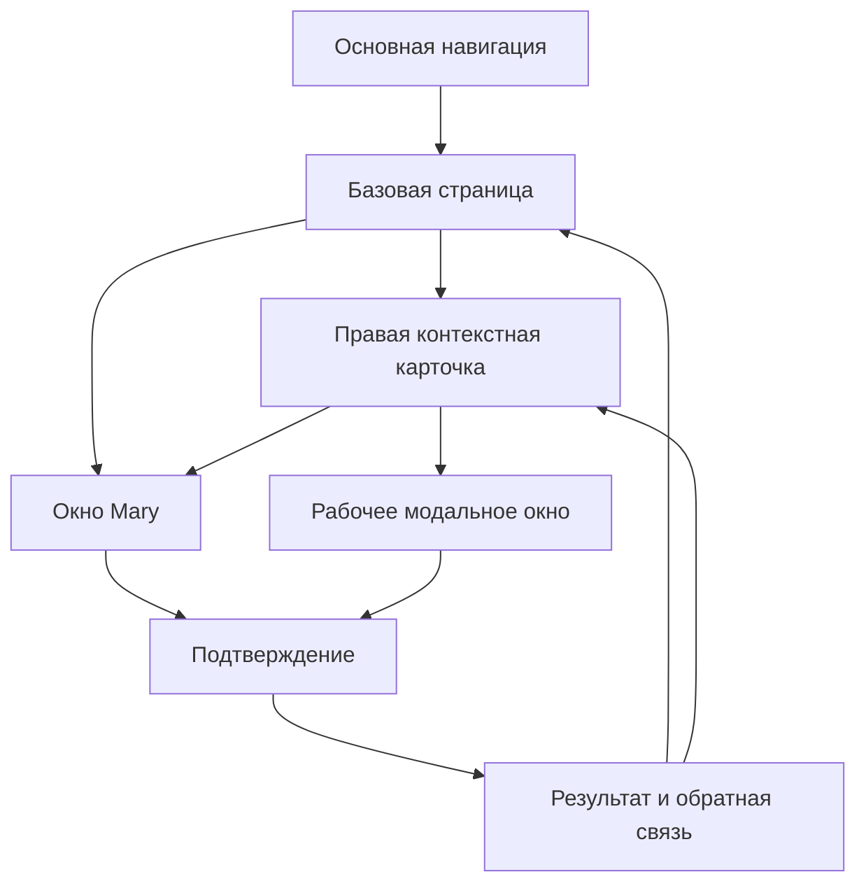

### Правила слоёв

- базовая страница не исчезает при открытии контекста;
- одновременно открыто только одно рабочее окно: Mary или modal;
- правая карточка может оставаться под Mary;
- Mary не перекрывает ключевой контекст;
- закрытие возвращает фокус в исходное действие;
- Back возвращает предыдущий слой, а не сразу другой раздел;
- прямой переход по ссылке восстанавливает сущность и подходящий раздел.

## 7. Единые сущности

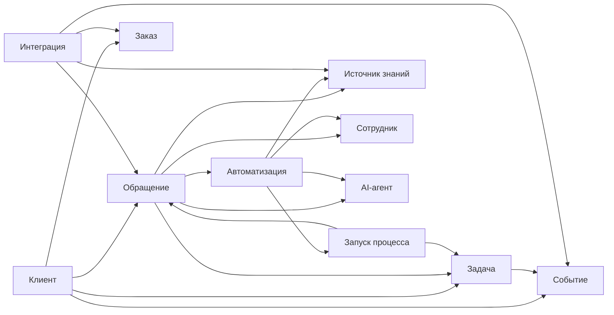

### Правила сущностей

- календарь не создаёт копию задачи;
- карточка клиента не создаёт отдельную страницу;
- обращение хранит единого текущего исполнителя;
- автоматизация хранит версии и запуски отдельно;
- источник знаний хранит версии и использование;
- сотрудник и AI-агент различаются, но используют общую модель ответственности;
- удаление связи не удаляет сущность автоматически.

## 8. Контекст при переходах

| Сущность | Минимальный контекст |
| --- | --- |
| Клиент | `clientId` |
| Обращение | `conversationId`, `clientId` |
| Заказ | `orderId`, `clientId` |
| Задача | `taskId`, связанные entity IDs |
| Событие | `eventId`, `taskId` при наличии |
| Автоматизация | `automationId`, `versionId` |
| Запуск | `runId`, `automationId` |
| Источник | `sourceId`, `versionId`, фрагмент |
| Участник | `memberId` или `agentId` |
| Интеграция | `integrationId` |

Период, поиск, фильтры, сортировка, масштаб схемы и scroll position относятся к
состоянию представления и восстанавливаются при возврате.

## 9. Режимы Mary

### Полноэкранный чат

Используется для:

- знакомства с бизнесом;
- исследования;
- анализа файлов и ссылок;
- создания сложного решения;
- сборки процесса;
- подготовки отчёта.

### Контекстное окно

Используется для:

- изменить выбранного клиента;
- подготовить ответ;
- создать задачу;
- перенести событие;
- изменить блок процесса;
- объяснить показатель;
- обновить источник;
- подключить сервис;
- изменить роль;
- изменить правило.

### Контекст окна

В заголовке всегда видно, о чём разговор:

- `Mary · Клиент Даниела`;
- `Mary · Обращение №58625`;
- `Mary · Задача «Проверить возврат»`;
- `Mary · Шаг «Есть свободные окна?»`;
- `Mary · Показатель «Первый ответ»`;
- `Mary · Источник «Возвраты и дефекты»`.

## 10. Универсальный flow действия через Mary

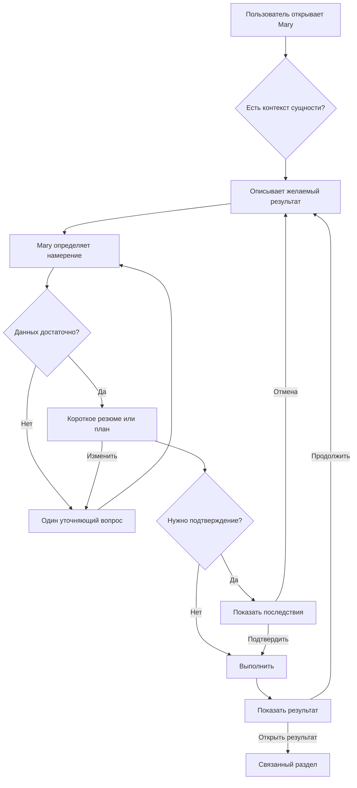

## 11. Большой user flow всей платформы

Это единая схема от первого входа до постоянного цикла улучшения бизнеса.

### Как читать

- прямоугольники с префиксами `CH`, `IN`, `CL` и другими — экраны платформы;
- ромбы — решения системы или пользователя;
- Mary находится между намерением пользователя и изменением данных;
- опасное действие всегда проходит через подтверждение;
- результат возвращается в исходную сущность и аналитику.

```mermaid
flowchart TB
    ENTRY(["Пользователь входит в Mary"])
    NAV["Единая навигация"]
    GLOBAL_MARY["GL-02 / GL-03 · Спросить Mary"]

    ENTRY --> NAV
    NAV --> GLOBAL_MARY

    subgraph ONBOARDING["Первый запуск и основа"]
        direction LR
        CH_START["CH-01 · Первый экран"]
        BUSINESS["CH-02 · Рассказать о бизнесе"]
        BUSINESS_SOURCE{"Как передать контекст?"}
        BUSINESS_LINK["Ссылка"]
        BUSINESS_FILE["Файл"]
        BUSINESS_TEXT["Описание словами"]
        CH_SUMMARY["CH-06 · Mary показывает резюме"]
        ST_PROFILE["ST-03 · Профиль компании"]
        IG_CONNECT["IG-07 · Подключить первый канал"]
        KB_ADD["KB-07 · Добавить знания"]
        TM_ADD["TM-07 · Добавить сотрудника"]
        FIRST_READY["Платформа готова к первому результату"]

        CH_START --> BUSINESS
        BUSINESS --> BUSINESS_SOURCE
        BUSINESS_SOURCE --> BUSINESS_LINK
        BUSINESS_SOURCE --> BUSINESS_FILE
        BUSINESS_SOURCE --> BUSINESS_TEXT
        BUSINESS_LINK --> CH_SUMMARY
        BUSINESS_FILE --> CH_SUMMARY
        BUSINESS_TEXT --> CH_SUMMARY
        CH_SUMMARY --> ST_PROFILE
        ST_PROFILE --> IG_CONNECT
        ST_PROFILE --> KB_ADD
        ST_PROFILE --> TM_ADD
        IG_CONNECT --> FIRST_READY
        KB_ADD --> FIRST_READY
        TM_ADD --> FIRST_READY
    end

    GLOBAL_MARY --> CH_START

    subgraph INCOMING["Сообщение клиента и обработка"]
        direction TB
        MESSAGE["Новое сообщение клиента"]
        CHANNEL_OK{"Канал работает?"}
        IG_RECOVER["IG-16 / IG-19 · Восстановить подключение"]
        IN_QUEUE["IN-02 · Новое во Входящих"]
        AI_START["AI-агент начинает анализ"]
        CL_MATCH{"Клиент найден?"}
        CL_EXISTING["CL-06 · Открыть карточку клиента"]
        CL_CREATE["CL-09 · Создать клиента через Mary"]
        ORDER_FIND["Найти заказ и историю"]
        KB_LOOKUP["KB-06 · Проверить знания"]
        KNOWLEDGE_OK{"Знания актуальны и не противоречат?"}
        KB_FIX["KB-15 / KB-17 · Уточнить или обновить"]
        SAFE{"Mary может безопасно продолжить?"}
        IN_DRAFT["IN-07 · Черновик ответа"]
        IN_HANDOFF["IN-05 · Нужен сотрудник"]
        TM_ROUTE["TM-14 / TM-15 · Найти доступного сотрудника"]
        IN_HUMAN["IN-08 · Сотрудник продолжает"]
        APPROVAL{"Требуется подтверждение?"}
        GL_CONFIRM["GL-05 · Показать последствия"]
        SEND["Ответ отправлен"]
        WAIT_CLIENT["Ждём клиента"]
        CLIENT_REPLY{"Клиент ответил?"}
        RESOLVED["IN-12 · Обращение решено"]

        MESSAGE --> CHANNEL_OK
        CHANNEL_OK -->|Нет| IG_RECOVER
        IG_RECOVER --> CHANNEL_OK
        CHANNEL_OK -->|Да| IN_QUEUE
        IN_QUEUE --> AI_START
        AI_START --> CL_MATCH
        CL_MATCH -->|Да| CL_EXISTING
        CL_MATCH -->|Нет| CL_CREATE
        CL_CREATE --> CL_EXISTING
        CL_EXISTING --> ORDER_FIND
        ORDER_FIND --> KB_LOOKUP
        KB_LOOKUP --> KNOWLEDGE_OK
        KNOWLEDGE_OK -->|Нет| KB_FIX
        KB_FIX --> KB_LOOKUP
        KNOWLEDGE_OK -->|Да| SAFE
        SAFE -->|Да| IN_DRAFT
        SAFE -->|Нет| IN_HANDOFF
        IN_HANDOFF --> TM_ROUTE
        TM_ROUTE --> IN_HUMAN
        IN_DRAFT --> APPROVAL
        IN_HUMAN --> APPROVAL
        APPROVAL -->|Да| GL_CONFIRM
        APPROVAL -->|Нет| SEND
        GL_CONFIRM -->|"Подтвердить"| SEND
        GL_CONFIRM -->|"Изменить"| IN_DRAFT
        SEND --> WAIT_CLIENT
        WAIT_CLIENT --> CLIENT_REPLY
        CLIENT_REPLY -->|Да| IN_QUEUE
        CLIENT_REPLY -->|Нет, вопрос закрыт| RESOLVED
    end

    FIRST_READY --> MESSAGE

    subgraph TASKS_CALENDAR["Задачи и календарь"]
        direction LR
        NEED_TASK{"Нужно дополнительное действие?"}
        TS_CREATE["TS-07 · Создать задачу с Mary"]
        TS_PREVIEW["TS-09 · Проверить задачу"]
        TS_CARD["TS-06 · Карточка задачи"]
        HAS_DATE{"Есть срок?"}
        CA_EVENT["CA-06 · То же действие в календаре"]
        TS_WORK["TS-02 · В работе"]
        TASK_BLOCKED{"Возникла проблема?"}
        TM_TRANSFER["TM-15 · Передать работу"]
        TS_RESULT["TS-12 · Зафиксировать результат"]
        UPDATE_CONTEXT["Обновить обращение, клиента или процесс"]

        NEED_TASK -->|Да| TS_CREATE
        TS_CREATE --> TS_PREVIEW
        TS_PREVIEW --> TS_CARD
        TS_CARD --> HAS_DATE
        HAS_DATE -->|Да| CA_EVENT
        HAS_DATE -->|Нет| TS_WORK
        CA_EVENT --> TS_WORK
        TS_WORK --> TASK_BLOCKED
        TASK_BLOCKED -->|Да| TM_TRANSFER
        TM_TRANSFER --> TS_WORK
        TASK_BLOCKED -->|Нет| TS_RESULT
        TS_RESULT --> UPDATE_CONTEXT
    end

    RESOLVED --> NEED_TASK
    NEED_TASK -->|Нет| PATTERN_CHECK
    UPDATE_CONTEXT --> PATTERN_CHECK

    subgraph AUTOMATION["Повторение и автоматизация"]
        direction TB
        PATTERN_CHECK{"Похожая работа повторяется?"}
        AU_RECOMMEND["AU-04 · Рекомендация Mary"]
        DISCUSS_AUTO{"Обсудить автоматизацию?"}
        AU_CHAT["AU-09 · Mary собирает процесс"]
        AU_DRAFT["AU-10 · Черновик схемы"]
        AU_NODE["AU-07 / AU-08 · Изменить выбранный блок"]
        AU_TEST["AU-11 / AU-12 · Проверить на примере"]
        TEST_OK{"Проверка успешна?"}
        TEST_REASON{"Что мешает?"}
        TEST_KB["KB-07 · Добавить или исправить знания"]
        TEST_IG["IG-07 · Подключить сервис"]
        TEST_TM["TM-19 · Уточнить роль AI-агента"]
        TEST_ST["ST-11 · Изменить правило"]
        AU_LAUNCH["AU-15 · Подтвердить запуск"]
        AU_ACTIVE["AU-16 · Процесс активен"]
        AU_RUN["AU-19 · Новый запуск"]
        RUN_OK{"Запуск завершён?"}
        RUN_HANDOFF["IN-05 / TS-07 · Передать человеку"]
        AU_PAUSE["AU-17 / AU-20 · Пауза или ошибка"]

        PATTERN_CHECK -->|Нет| OPERATIONS_DONE["Работа завершена"]
        PATTERN_CHECK -->|Да| AU_RECOMMEND
        AU_RECOMMEND --> DISCUSS_AUTO
        DISCUSS_AUTO -->|Нет| OPERATIONS_DONE
        DISCUSS_AUTO -->|Да| AU_CHAT
        AU_CHAT --> AU_DRAFT
        AU_DRAFT --> AU_NODE
        AU_NODE --> AU_TEST
        AU_TEST --> TEST_OK
        TEST_OK -->|Нет| TEST_REASON
        TEST_REASON -->|Не хватает знаний| TEST_KB
        TEST_REASON -->|Нет подключения| TEST_IG
        TEST_REASON -->|Неясна ответственность| TEST_TM
        TEST_REASON -->|Конфликт правил| TEST_ST
        TEST_KB --> AU_DRAFT
        TEST_IG --> AU_DRAFT
        TEST_TM --> AU_DRAFT
        TEST_ST --> AU_DRAFT
        TEST_OK -->|Да| AU_LAUNCH
        AU_LAUNCH --> AU_ACTIVE
        AU_ACTIVE --> AU_RUN
        AU_RUN --> RUN_OK
        RUN_OK -->|Да| OPERATIONS_DONE
        RUN_OK -->|Нужен сотрудник| RUN_HANDOFF
        RUN_OK -->|Ошибка| AU_PAUSE
        RUN_HANDOFF --> OPERATIONS_DONE
        AU_PAUSE --> AU_CHAT
    end

    subgraph IMPROVEMENT["Аналитика и постоянное улучшение"]
        direction TB
        AN_COLLECT["AN-02 · Результаты работы"]
        AN_ATTENTION["AN-04 · Требует внимания"]
        AN_DETAIL["AN-05 · Открыть исходные случаи"]
        AN_MARY["AN-15 · Спросить Mary, почему"]
        IMPROVE{"Что нужно улучшить?"}
        IMPROVE_TASK["TS-07 · Создать задачу"]
        IMPROVE_AUTO["AU-09 · Изменить или создать процесс"]
        IMPROVE_KB["KB-07 · Обновить знания"]
        IMPROVE_TEAM["TM-15 · Перераспределить работу"]
        IMPROVE_IG["IG-19 · Восстановить данные"]
        IMPROVE_ST["ST-11 · Изменить правило компании"]
        ST_PREVIEW["ST-13 · Показать влияние"]
        ST_SAVE["ST-15 · Подтвердить новое правило"]
        NEW_CYCLE["Новый рабочий цикл"]

        AN_COLLECT --> AN_ATTENTION
        AN_ATTENTION --> AN_DETAIL
        AN_DETAIL --> AN_MARY
        AN_MARY --> IMPROVE
        IMPROVE -->|"Нужно действие"| IMPROVE_TASK
        IMPROVE -->|"Процесс повторяется"| IMPROVE_AUTO
        IMPROVE -->|"Ответы неверны"| IMPROVE_KB
        IMPROVE -->|"Не хватает ресурсов"| IMPROVE_TEAM
        IMPROVE -->|"Нет данных"| IMPROVE_IG
        IMPROVE -->|"Нужно общее правило"| IMPROVE_ST
        IMPROVE_ST --> ST_PREVIEW
        ST_PREVIEW --> ST_SAVE
        IMPROVE_TASK --> NEW_CYCLE
        IMPROVE_AUTO --> NEW_CYCLE
        IMPROVE_KB --> NEW_CYCLE
        IMPROVE_TEAM --> NEW_CYCLE
        IMPROVE_IG --> NEW_CYCLE
        ST_SAVE --> NEW_CYCLE
    end

    OPERATIONS_DONE --> AN_COLLECT
    NEW_CYCLE --> MESSAGE

    NAV --> IN_QUEUE
    NAV --> CL_EXISTING
    NAV --> TS_CARD
    NAV --> CA_EVENT
    NAV --> AU_ACTIVE
    NAV --> AN_COLLECT
    NAV --> KB_ADD
    NAV --> IG_CONNECT
    NAV --> TM_ADD
    NAV --> ST_PROFILE

    GLOBAL_MARY --> BUSINESS
    GLOBAL_MARY --> IN_DRAFT
    GLOBAL_MARY --> CL_EXISTING
    GLOBAL_MARY --> TS_CREATE
    GLOBAL_MARY --> CA_EVENT
    GLOBAL_MARY --> AU_CHAT
    GLOBAL_MARY --> AN_MARY
    GLOBAL_MARY --> KB_ADD
    GLOBAL_MARY --> IG_CONNECT
    GLOBAL_MARY --> TM_ADD
    GLOBAL_MARY --> IMPROVE_ST
```

### Главная логика большого flow

1. Пользователь передаёт Mary контекст бизнеса.
2. Интеграции дают данные, база знаний — подтверждённые правила.
3. Сообщение попадает во Входящие.
4. AI-агент находит клиента, заказ и знания.
5. Mary готовит действие или безопасно передаёт работу сотруднику.
6. Дополнительное действие становится задачей и сроком в календаре.
7. Повторяющаяся работа превращается в проверяемую автоматизацию.
8. Результаты попадают в аналитику.
9. Аналитика приводит к задаче, процессу, знанию, интеграции, команде или
   настройке.
10. Изменение запускает новый рабочий цикл.

## 12. Первый запуск и первая ценность

Цель — не настроить всю систему, а быстро получить первый полезный результат.

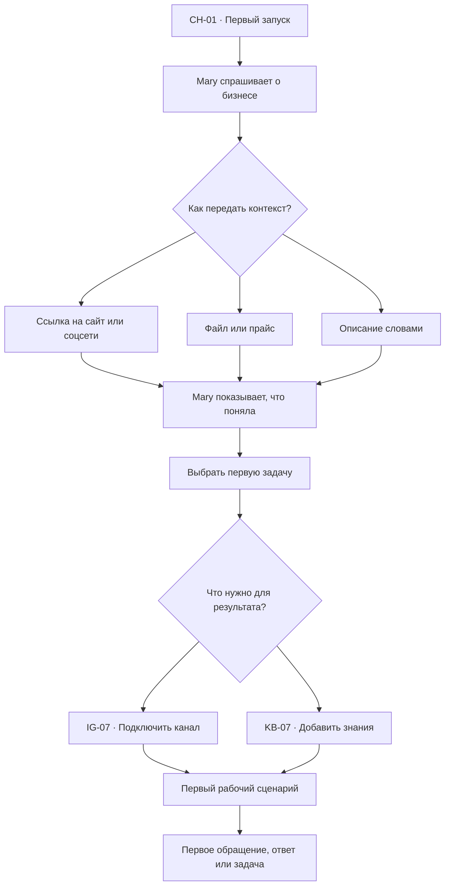

### Правила

- не требовать заполнить все настройки;
- объяснить пользу каждого подключения;
- запросить минимальные права;
- показывать прогресс по результатам, а не по числу полей;
- разрешить вернуться к настройке позже.

## 13. Основной сценарий: входящее обращение

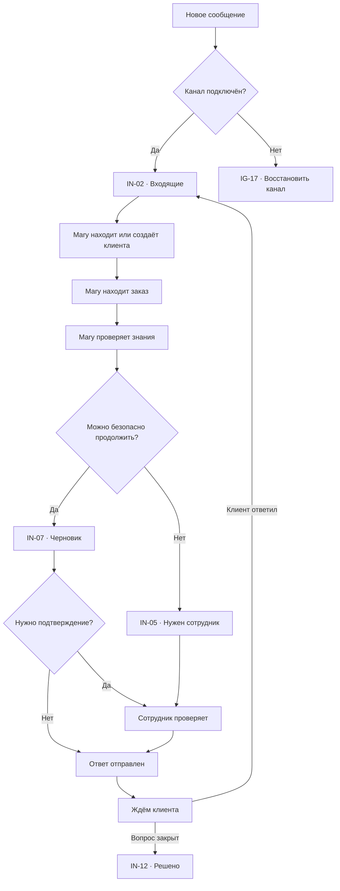

### Результат

- история сохранена в клиенте;
- участие Mary и сотрудника различимо;
- источники ответа доступны;
- задача создаётся только при необходимости;
- обращение попадает в аналитику.

## 14. Передача AI-агент → сотрудник

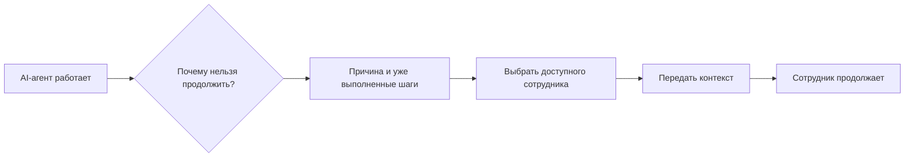

Причины:

- низкая уверенность;
- противоречивые знания;
- опасное действие;
- отключённая интеграция;
- клиент просит человека;
- правило компании;
- исключение из процесса.

Сотрудник получает:

- сообщение клиента;
- резюме;
- найденные данные;
- использованные источники;
- подготовленный черновик;
- причину передачи;
- безопасное следующее действие.

## 15. Задача и календарь

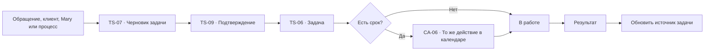

### Правила

- задача и календарное событие не дублируются;
- изменение срока обновляет оба представления;
- завершение фиксирует результат;
- передача сотруднику фиксируется в истории;
- просрочка создаёт сигнал, а не новую задачу автоматически.

## 16. Повторение → автоматизация

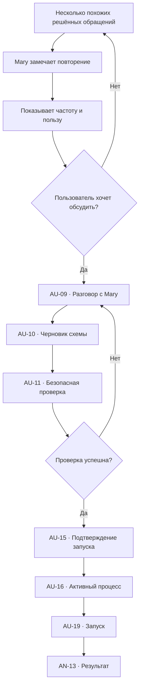

### Проверить

- использует тестовый или read-only пример;
- показывает путь по схеме;
- не отправляет сообщение;
- не создаёт реальные сущности;
- не изменяет заказ;
- выявляет права, знания и подключения.

### Запустить

- показывает область работы;
- объясняет автоматические действия;
- показывает точки подтверждения;
- называет сотрудника для передачи;
- не обрабатывает старые случаи без явного выбора.

## 17. Обновление знаний

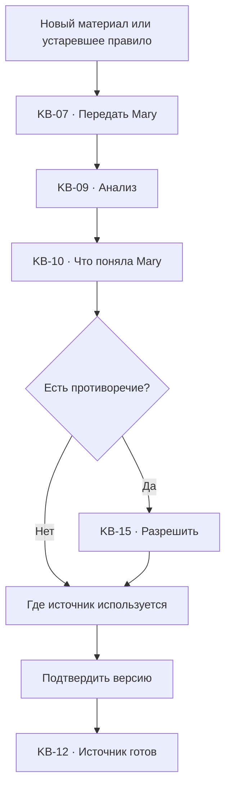

Материально изменённый источник не влияет на ответы и процессы до
подтверждения.

## 18. Подключение сервиса

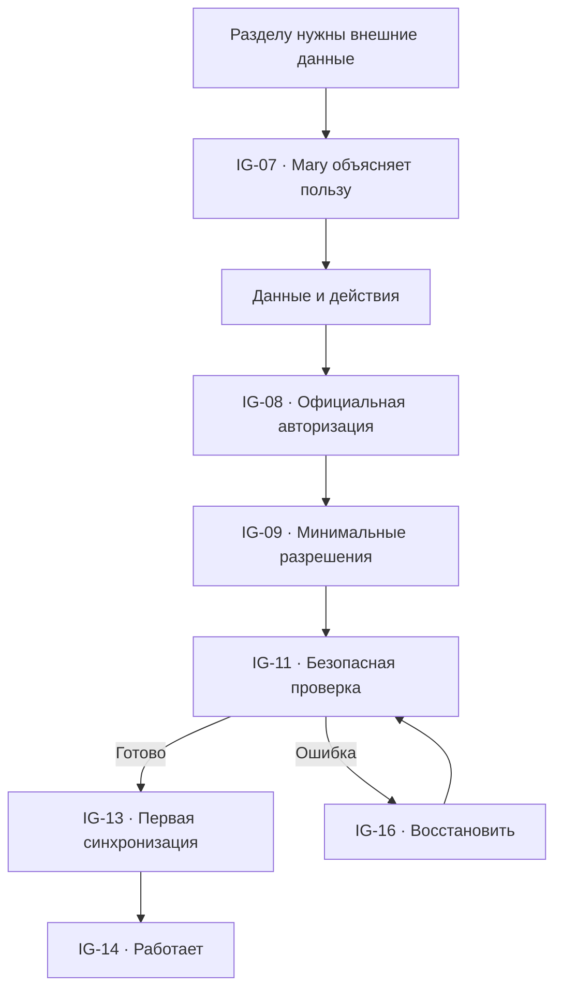

## 19. Сбой интеграции

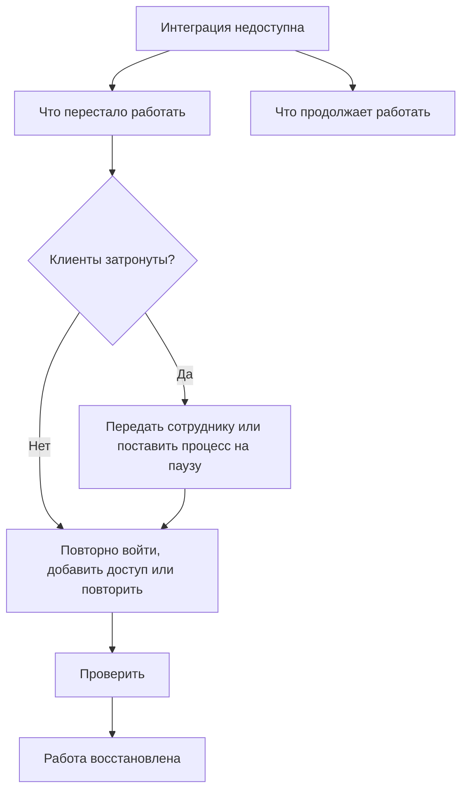

Ошибка не скрывается внутри технического журнала. Она появляется:

- в интеграции;
- в затронутом обращении или процессе;
- в `Требует внимания`;
- у ответственного сотрудника.

## 20. Команда и AI-агенты

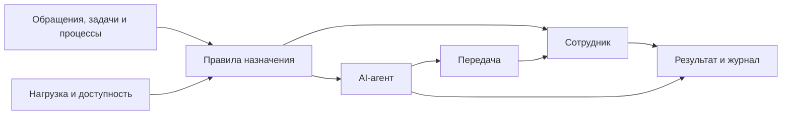

### Общая модель ответственности

- зона работы;
- доступность;
- нагрузка;
- разрешённые действия;
- знания;
- качество;
- правила передачи;
- журнал.

AI-агент и человек всегда различимы.

## 21. Аналитика → улучшение

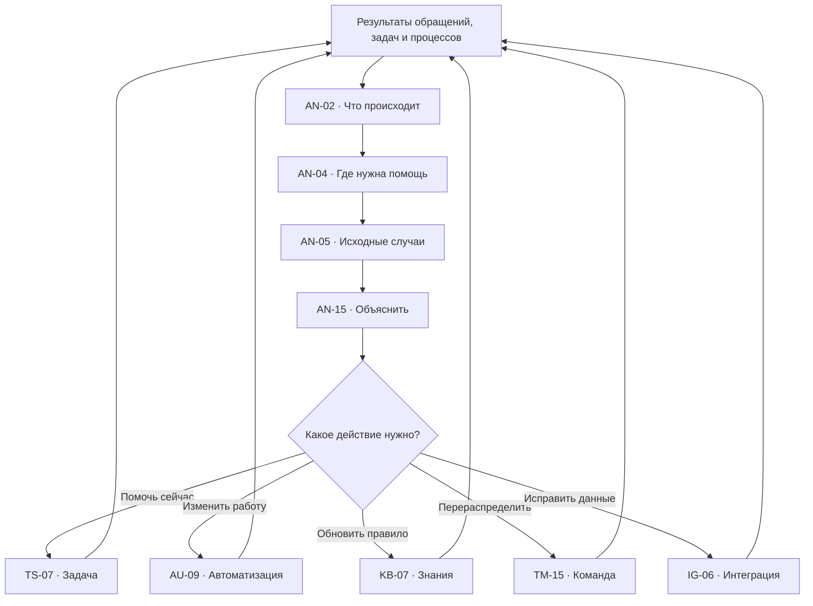

Это замкнутый цикл улучшения, а не одноразовый отчёт.

## 22. Настройка правила → влияние на систему

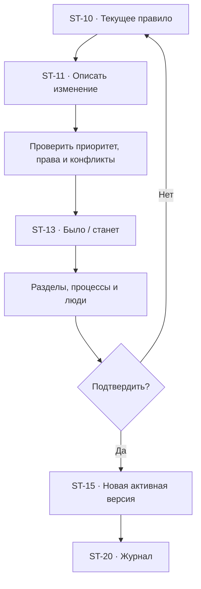

## 23. Подтверждения и безопасность

### Всегда подтверждать

- возврат денег;
- изменение заказа;
- удаление;
- массовую отправку;
- изменение доступа;
- подключение интеграции;
- запуск опасного процесса;
- публикацию нового правила;
- массовую передачу работы.

### Можно разрешить правилом

- типовой ответ;
- безопасное обновление клиента;
- создание задачи;
- создание события;
- назначение сотрудника;
- follow-up без финансового действия.

### Не требует подтверждения

- чтение разрешённых данных;
- поиск;
- анализ;
- подготовка черновика;
- безопасная проверка;
- объяснение показателя.

### Подтверждение показывает

- что произойдёт;
- с какими сущностями;
- кто будет уведомлён;
- можно ли отменить;
- какие реальные данные изменятся.

## 24. Иерархия правил

1. закон и безопасность;
2. правило компании;
3. правило автоматизации;
4. правило канала или команды;
5. разовое подтверждённое действие.

Mary:

- называет действующее правило;
- показывает конфликт;
- не создаёт скрытое исключение;
- выбирает безопасный вариант при неопределённости;
- передаёт сотруднику, если решение невозможно.

## 25. Глобальные состояния

| ID | Состояние | Поведение |
| --- | --- | --- |
| `GL-01` | Mary закрыта | Страница работает самостоятельно |
| `GL-02` | Mary без контекста | Общий вопрос |
| `GL-03` | Mary с контекстом | Передана сущность и представление |
| `GL-04` | Действие выполняется | Этапы и возможность остановки |
| `GL-05` | Нужно подтверждение | Последствия и действия |
| `GL-06` | Выполнено | Результат и переход |
| `GL-07` | Ошибка | Что выполнено и безопасный выход |
| `GL-08` | Нет соединения | Черновик сохраняется |
| `GL-09` | Недостаточно прав | Показать владельца и запрос |
| `GL-10` | Интеграция отключена | Восстановить или продолжить безопасно |

## 26. Ошибки

Каждая ошибка отвечает:

1. Что не получилось?
2. На каком шаге?
3. Что уже произошло?
4. Какие реальные данные затронуты?
5. Что продолжает работать?
6. Что безопасно сделать дальше?

Нельзя:

- показывать только технический код;
- бесконечно повторять опасное действие;
- скрывать частично выполненное действие;
- терять введённый текст;
- отправлять пользователя в другой раздел без контекста.

## 27. Уведомления и точки внимания

### Срочные

- клиент долго ждёт;
- опасное действие ждёт подтверждения;
- AI-агент передал критичный случай;
- интеграция остановила клиентский канал;
- автоматизация выполнила действие частично.

### Рабочие

- новая задача;
- передача обращения;
- приглашение;
- комментарий;
- событие.

### Информационные

- источник устарел;
- рекомендация автоматизации;
- готов регулярный обзор;
- синхронизация завершена.

Похожие уведомления объединяются. Уведомление ведёт к сущности, а не просто к
разделу.

## 28. Возврат и сохранение состояния

При переходе сохраняются:

- раздел;
- вкладка;
- поиск;
- фильтры;
- сортировка;
- выбранная строка;
- scroll position;
- дата календаря;
- масштаб и позиция схемы;
- открытая правая панель;
- черновик Mary.

### Пример

`Аналитика → обращение → клиент → назад` возвращает:

- к тому же показателю;
- с тем же периодом;
- с теми же фильтрами;
- с открытой детализацией.

## 29. URL и глубокие ссылки

Примерная логическая структура:

- `/chat/:conversationId`;
- `/inbox?conversation=:id`;
- `/clients?client=:id`;
- `/tasks?task=:id`;
- `/calendar?date=:date&event=:id`;
- `/automations/:automationId?run=:runId`;
- `/analytics?view=:view&period=:period`;
- `/knowledge?source=:id`;
- `/integrations?integration=:id`;
- `/team?member=:id`;
- `/settings?rule=:id`.

URL не обязан отражать каждый визуальный слой, но должен восстанавливать
значимую сущность.

## 30. Desktop, tablet и mobile

### Desktop

- постоянная навигация;
- базовая страница;
- правая карточка;
- плавающее окно Mary;
- рабочий modal поверх.

### Tablet

- компактная навигация;
- карточка как sheet;
- Mary занимает часть экрана;
- плотные таблицы превращаются в списки при необходимости.

### Mobile

- один основной слой;
- навигация открывается отдельно;
- карточки и Mary full-screen;
- повестка вместо сложной календарной сетки;
- список шагов как альтернатива canvas;
- Back последовательно закрывает слои;
- контекст и черновики сохраняются.

## 31. Доступность

- все основные действия доступны с клавиатуры;
- focus-visible обязателен;
- статус не определяется только цветом;
- AI-агент и человек различимы;
- графики имеют таблицу и текстовое резюме;
- canvas имеет список шагов;
- drag-and-drop имеет кнопочную альтернативу;
- modal и drawer управляют фокусом;
- screen reader получает результат асинхронного действия;
- `prefers-reduced-motion` отключает необязательное движение.

## 32. Аудит и история

Для значимых действий сохраняются:

- кто инициировал;
- кто подтвердил;
- Mary, AI-агент или сотрудник;
- входной контекст;
- использованные знания;
- версия процесса или правила;
- затронутые сущности;
- результат;
- ошибка;
- время.

История доступна только по правам и не раскрывает скрытые данные.

## 33. MVP

### P0: первая рабочая ценность

- полноэкранный чат и контекстная Mary;
- входящие и совместная работа;
- список клиентов и правая карточка;
- задачи и календарные сроки;
- библиотека автоматизаций и схема;
- безопасная проверка и запуск;
- базовые знания;
- каналы сообщений;
- люди и AI-агенты;
- read-first настройки;
- action-first аналитика;
- loading, empty, error, permissions;
- desktop и mobile core flow.

### P1: управляемость

- версии процессов и знаний;
- история запусков;
- перераспределение команды;
- сравнение аналитики;
- сохранённые обзоры;
- внешние календари;
- расширенные уведомления;
- журнал настроек.

### P2: масштабирование

- несколько подразделений;
- расширенный режим специалиста;
- дополнительные интеграции;
- совместное редактирование;
- отраслевые шаблоны;
- сложные политики хранения.

## 34. End-to-end acceptance criteria

- пользователь получает первую ценность без полной настройки платформы;
- Mary доступна в полноэкранном и контекстном режимах;
- каждая рабочая сущность связана с источником и результатом;
- клиент, обращение, задача и событие не дублируют данные;
- AI-агент объясняет передачу человеку;
- знания подтверждаемы и имеют источник;
- интеграция запрашивает минимальные права;
- проверка не выполняет реальные действия;
- опасные действия имеют preview и подтверждение;
- настройки изменяются через Mary с показом влияния;
- аналитика ведёт к исходным случаям и действиям;
- ошибки показывают частично выполненные шаги;
- возврат сохраняет представление и контекст;
- desktop, tablet, mobile и клавиатура поддерживают одну бизнес-логику;
- журнал различает пользователя, сотрудника, Mary и AI-агента;
- ни один основной flow не заканчивается тупиком.
