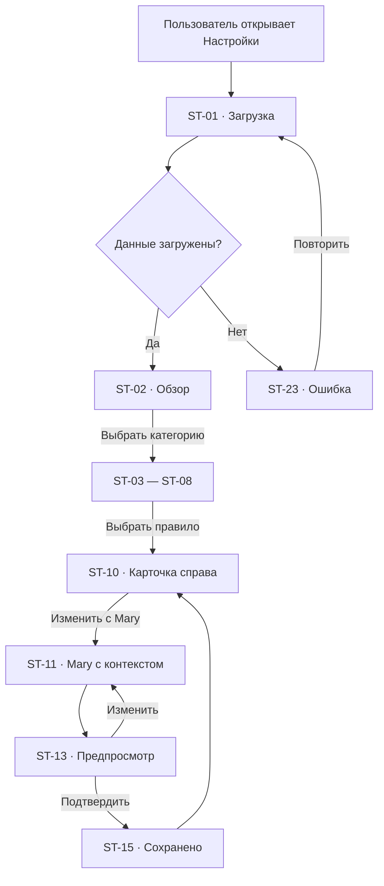
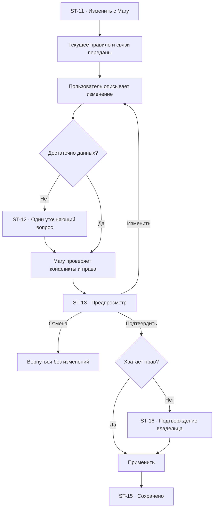

# Настройки: user flow

## 1. Роль раздела

`Настройки` показывают действующие правила компании и Mary.

Это не большая административная форма. Пользователь:

1. открывает понятное резюме;
2. выбирает правило;
3. описывает изменение Mary;
4. видит последствия;
5. подтверждает.

Любое содержательное изменение происходит через Mary. Прямые элементы
используются только для навигации, просмотра и безопасных локальных предпочтений
конкретного пользователя.

## 2. Основная модель

Разделы:

- компания;
- Mary;
- подтверждения;
- уведомления;
- безопасность и доступ;
- данные и конфиденциальность;
- журнал изменений.

Выбор настройки открывает правую карточку. Mary открывается с контекстом
конкретного правила.

## 3. Список экранов и состояний

| ID | Экран или состояние |
| --- | --- |
| `ST-01` | Загрузка настроек |
| `ST-02` | Обзор настроек |
| `ST-03` | Профиль компании |
| `ST-04` | Правила работы Mary |
| `ST-05` | Подтверждения действий |
| `ST-06` | Уведомления |
| `ST-07` | Безопасность и доступ |
| `ST-08` | Данные и конфиденциальность |
| `ST-09` | Выбранная настройка |
| `ST-10` | Карточка настройки справа |
| `ST-11` | Изменение через Mary |
| `ST-12` | Mary уточняет |
| `ST-13` | Предпросмотр изменения |
| `ST-14` | Подтверждение изменения |
| `ST-15` | Настройка сохранена |
| `ST-16` | Требуется подтверждение владельца |
| `ST-17` | Конфликт правил |
| `ST-18` | Некорректное правило |
| `ST-19` | Настройка изменилась другим пользователем |
| `ST-20` | Журнал изменений |
| `ST-21` | Опасное действие |
| `ST-22` | Сброс настройки |
| `ST-23` | Ошибка загрузки или сохранения |
| `ST-24` | Недостаточно прав |
| `ST-25` | Настройки ещё не завершены |

## 4. Иерархия правил

Когда правила различаются, действует порядок:

1. закон, безопасность и обязательные ограничения;
2. правило компании;
3. правило конкретного процесса;
4. правило канала или команды;
5. разовое подтверждённое действие.

Mary показывает, какое правило имеет приоритет и почему.

Пример:

> В процессе разрешена автоматическая отправка, но правило компании требует
> подтверждать ответы с возвратом денег. Поэтому этот ответ останется черновиком.

## 5. Обзор

`ST-02` показывает категории и краткое состояние:

- заполнен ли профиль компании;
- как Mary общается;
- какие действия требуют подтверждения;
- куда приходят уведомления;
- включены ли защитные меры;
- как хранятся данные;
- есть ли настройки, требующие внимания.

Основное действие:

`Настроить с Mary`.

Не показываем десятки переключателей на одном экране.

## 6. Главный flow

## 7. Карточка настройки справа

Показывает:

- название;
- текущее правило обычными словами;
- на кого и что влияет;
- откуда взялось;
- кто изменил;
- когда изменено;
- приоритет;
- связанные процессы;
- возможные исключения.

Действия:

- `Изменить с Mary`;
- `Показать использование`;
- `Открыть историю`;
- `Вернуть предыдущее`;
- `Сбросить`.

## 8. Профиль компании

`ST-03` содержит:

- название;
- описание бизнеса;
- продукты и услуги;
- адреса;
- рабочие часы;
- часовой пояс;
- языки;
- контакты;
- юридически важные данные;
- стиль обращения к клиентам.

Изменение через Mary:

> Мы теперь работаем по субботам до 18:00 и принимаем заказы на месте до 17:30.

Mary показывает, где это повлияет:

- ответы;
- календарь;
- автоматизации;
- база знаний;
- уведомления.

## 9. Правила Mary

`ST-04` показывает:

- тон общения;
- длину ответов;
- язык;
- когда задавать уточнение;
- когда передавать сотруднику;
- какие знания использовать;
- какие действия Mary может выполнять;
- как обозначать предположение;
- что никогда не делать.

Технический system prompt не показывается в базовом режиме.

## 10. Подтверждения

`ST-05` группирует действия:

### Всегда подтверждать

- возврат денег;
- изменение заказа;
- удаление данных;
- массовая отправка;
- изменение доступа;
- подключение внешнего сервиса;
- публикация нового правила;
- запуск процесса с опасным действием.

### Можно разрешить по правилу

- отправка типового ответа;
- создание задачи;
- создание события;
- назначение сотрудника;
- обновление безопасного поля клиента.

### Не требует подтверждения

- чтение разрешённых данных;
- поиск;
- анализ;
- подготовка черновика;
- безопасная проверка.

## 11. Уведомления

`ST-06` показывает:

- личные;
- командные;
- клиент ждёт;
- нужна помощь сотрудника;
- ошибка автоматизации;
- отключена интеграция;
- задача просрочена;
- источник знаний устарел;
- событие календаря.

Для каждого правила:

- получатель;
- канал;
- время;
- срочность;
- объединение похожих уведомлений.

Локальное отключение звука можно сделать напрямую. Изменение командного правила
идёт через Mary.

## 12. Безопасность и доступ

`ST-07` показывает:

- двухфакторную защиту;
- активные сессии;
- роли;
- чувствительные действия;
- владельцев интеграций;
- ограничения по данным;
- журнал безопасности;
- срок действия доступа.

Прямые безопасные действия:

- завершить собственную сессию;
- включить двухфакторную защиту;
- скачать собственные коды восстановления.

Изменение командного доступа идёт через Mary и подтверждение владельца.

## 13. Данные и конфиденциальность

`ST-08` показывает:

- какие данные хранятся;
- источники;
- сроки хранения;
- экспорт;
- удаление;
- использование в AI;
- регионы хранения, если применимо;
- связанные интеграции;
- кто имеет доступ.

Опасные действия:

- удалить данные клиента;
- сократить срок хранения;
- удалить историю;
- отключить журнал;
- массово экспортировать данные.

Они открывают `ST-21` с последствиями и подтверждением.

## 14. Изменение через Mary

## 15. Предпросмотр изменения

`ST-13` показывает:

- было;
- станет;
- кого затронет;
- какие разделы изменятся;
- какие процессы требуют повторной проверки;
- какие уведомления будут отправлены;
- когда правило начнёт действовать;
- можно ли отменить.

Изменения не кодируются только цветом.

## 16. Конфликт правил

`ST-17` показывает:

- оба правила;
- область каждого;
- приоритет;
- реальные примеры;
- предлагаемое решение Mary.

Действия:

- изменить общее правило;
- создать явное исключение;
- оставить безопасный вариант;
- отменить.

Mary не создаёт скрытое исключение.

## 17. Некорректное правило

`ST-18` появляется, если правило:

- невозможно выполнить;
- противоречит безопасности;
- требует отключённой интеграции;
- не имеет ответственного;
- не определяет важное исключение;
- создаёт бесконечный цикл;
- нарушает более приоритетное правило.

Mary объясняет проблему и предлагает рабочую формулировку.

## 18. Изменение другим пользователем

`ST-19` показывает:

- кто изменил;
- когда;
- старое и новое значение;
- влияет ли это на текущий черновик.

Действия:

- принять новую версию;
- объединить с Mary;
- отменить свой черновик.

Настройка не перезаписывается молча.

## 19. Журнал изменений

`ST-20` содержит:

- настройку;
- старое и новое значение;
- автора;
- подтверждающего;
- дату;
- причину;
- затронутые объекты;
- возможность восстановить как новый черновик.

Фильтры:

- категория;
- автор;
- период;
- опасное действие;
- результат.

## 20. Сброс

`ST-22` не всегда означает заводское значение.

Mary показывает:

- какое значение будет использоваться после сброса;
- унаследованное правило;
- затронутые процессы;
- можно ли восстановить.

Сброс требует подтверждения, если влияет на команду или клиентов.

## 21. Первичная настройка

`ST-25` показывает незавершённые основы:

- профиль компании;
- рабочие часы;
- стиль Mary;
- подтверждения;
- первый канал;
- первый источник знаний;
- роли команды.

Mary ведёт пользователя по одному вопросу за раз и позволяет вернуться позже.

## 22. Связь с другими разделами

| Откуда | Действие | Куда | Контекст |
| --- | --- | --- | --- |
| `ST-04` | Открыть знания | `KB-02` | Правила Mary |
| `ST-05` | Открыть процесс | `AU-06` | Исключение процесса |
| `ST-06` | Открыть канал | `IG-06` | Канал уведомлений |
| `ST-07` | Открыть участника | `TM-06` | `memberId` |
| `ST-08` | Открыть интеграцию | `IG-06` | Источник данных |
| `AU-15` | Открыть подтверждения | `ST-05` | Опасное действие |
| `IN-07` | Открыть правило ответа | `ST-05` | Тип обращения |
| `ST-20` | Открыть объект | Связанный раздел | Entity ID |
| Любой экран | Спросить Mary | `GL-03` | Настройка и влияние |

## 23. Пустые и системные состояния

### `ST-23` Ошибка

- какая категория не загрузилась или не сохранилась;
- текущая активная версия;
- черновик не теряется;
- `Повторить`;
- `Скопировать описание изменения`.

### `ST-24` Недостаточно прав

- доступно чтение текущего правила;
- объяснение, кто может изменить;
- `Запросить подтверждение`.

### `ST-25` Не завершено

- прогресс без искусственного процента;
- следующий понятный вопрос;
- `Продолжить с Mary`;
- `Вернуться позже`.

## 24. Переходы и анимации

- категория → содержимое без полной перезагрузки;
- правило → правая панель `180–240 ms`;
- Mary открывается с названием правила;
- предпросмотр сохраняет видимым исходное значение;
- сохранение подтверждается текстом и записью в журнале;
- возврат сохраняет категорию и scroll position;
- при `prefers-reduced-motion` панели меняются без движения.

## 25. Адаптивность

### Desktop

- категории слева;
- резюме в центре;
- карточка справа;
- Mary как плавающее окно.

### Tablet

- категории горизонтальными вкладками;
- карточка как sheet;
- сравнение вертикально.

### Mobile

- категории списком;
- карточка full-screen;
- Mary full-screen;
- опасное подтверждение full-screen;
- возврат сохраняет категорию.

## 26. Доступность и безопасность

- настройки читаются без открытия Mary;
- текущее значение имеет текстовую подпись;
- изменения доступны с клавиатуры;
- карточка управляет фокусом;
- опасные действия имеют явное название;
- подтверждение не строится только на цвете;
- журнал доступен как таблица;
- секреты и персональные данные скрыты;
- после ошибки активное правило остаётся понятным.

## 27. Приоритет реализации

### P0

- `ST-01`, `ST-02`, `ST-03`, `ST-04`, `ST-05`, `ST-06`, `ST-07`;
- обзор вместо большой формы;
- карточка справа;
- изменение через Mary;
- предпросмотр влияния;
- подтверждение и журнал;
- профиль, Mary, подтверждения, уведомления, безопасность;
- error и permissions.

### P1

- данные и конфиденциальность;
- конфликты;
- восстановление;
- первичная настройка;
- подтверждение владельца.

### P2

- расширенные политики;
- несколько подразделений;
- отраслевые настройки;
- локальные шаблоны правил.

## 28. Критерии готовности

- настройки понятны в режиме чтения;
- нет большой технической формы;
- изменение начинается через Mary;
- предпросмотр показывает влияние;
- опасное изменение требует подтверждения;
- конфликт правил не скрывается;
- активная версия сохраняется при ошибке;
- журнал фиксирует автора и подтверждение;
- права ограничивают изменение, а не понимание;
- desktop, tablet, mobile и клавиатура поддерживают одинаковую логику.
