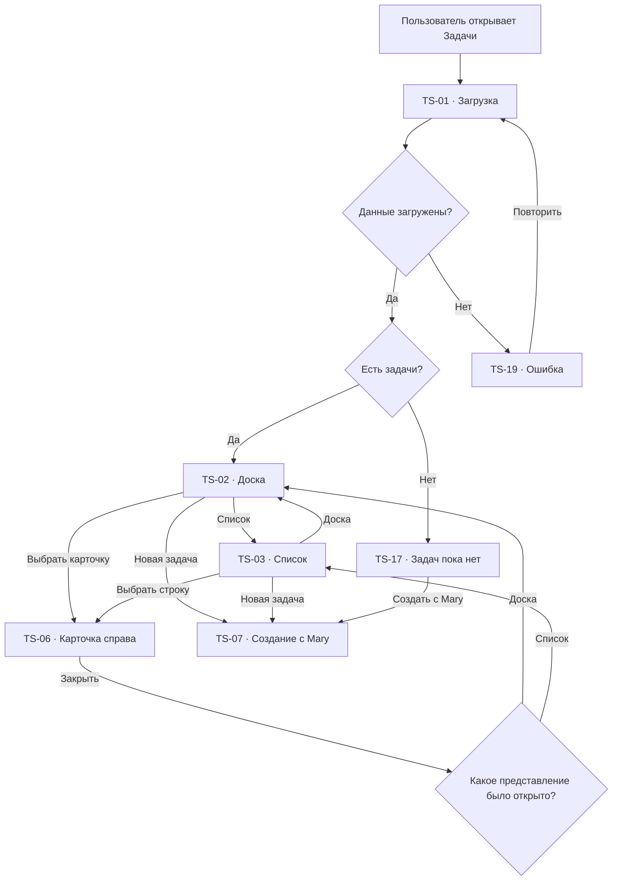
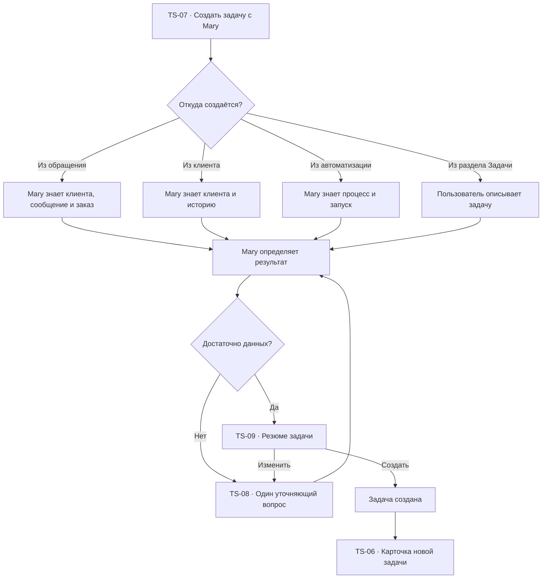
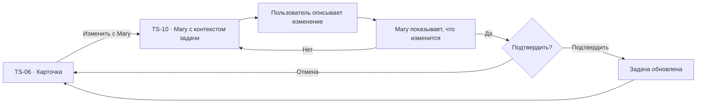
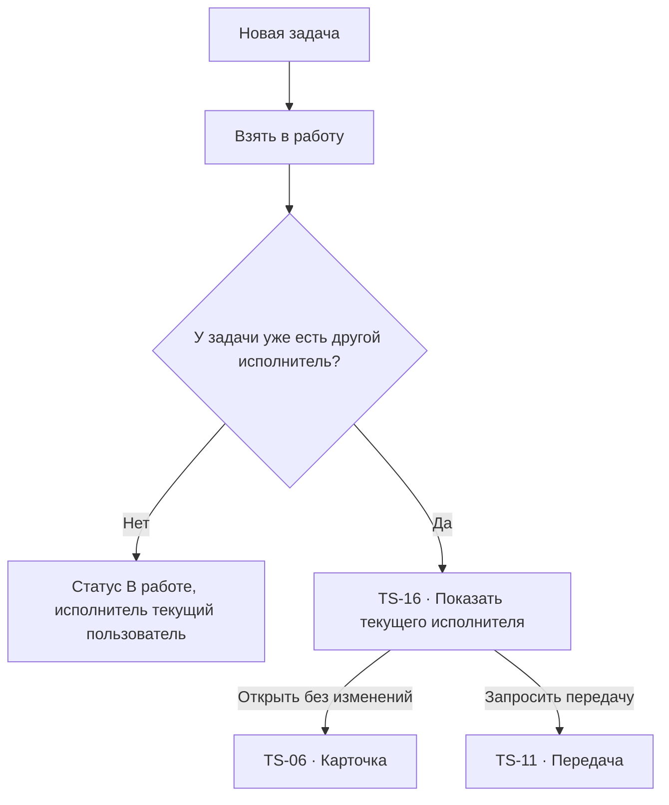
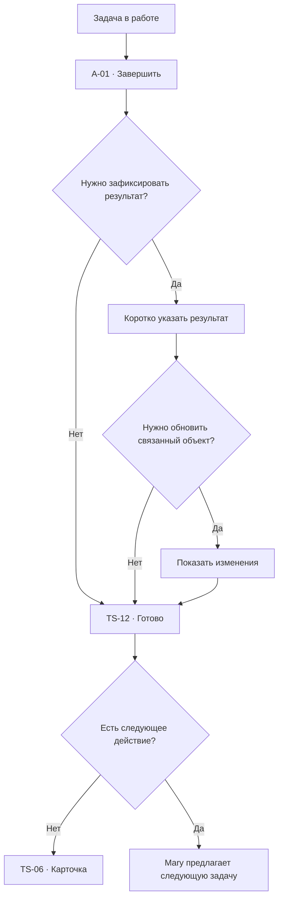
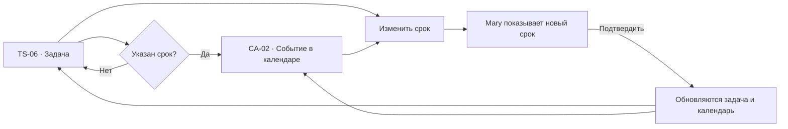

# Задачи: user flow

## 1. Роль раздела

`Задачи` — единое рабочее пространство для действий, которые появились из:

- обращения клиента;
- карточки клиента или заказа;
- решения сотрудника;
- рекомендации Mary;
- автоматизации;
- календарного события.

Задача не существует отдельно от контекста. Пользователь всегда может понять,
почему она появилась, кому относится и какой результат нужен.

## 2. Основная модель

Раздел имеет два представления:

1. `Доска` — работа по состояниям.
2. `Список` — поиск, сортировка и плотный просмотр.

Отдельной страницы задачи нет. Нажатие на карточку или строку открывает правую
контекстную панель, сохраняя представление, фильтры, поиск и позицию.

Создание и содержательное изменение задачи происходят через Mary. Быстрые
безопасные действия доступны напрямую:

- взять в работу;
- завершить;
- вернуть в работу;
- открыть клиента;
- открыть обращение;
- добавить комментарий.

## 3. Список экранов и состояний

| ID | Экран или состояние |
| --- | --- |
| `TS-01` | Загрузка задач |
| `TS-02` | Доска задач |
| `TS-03` | Список задач |
| `TS-04` | Поиск и фильтры |
| `TS-05` | Выбранная карточка |
| `TS-06` | Карточка задачи справа |
| `TS-07` | Создание задачи через Mary |
| `TS-08` | Mary уточняет задачу |
| `TS-09` | Подтверждение новой задачи |
| `TS-10` | Изменение задачи через Mary |
| `TS-11` | Передача другому сотруднику |
| `TS-12` | Завершение задачи |
| `TS-13` | Возврат задачи в работу |
| `TS-14` | Комментарии и история |
| `TS-15` | Просроченная задача |
| `TS-16` | Конфликт изменения |
| `TS-17` | Задач пока нет |
| `TS-18` | Ничего не найдено |
| `TS-19` | Ошибка загрузки |
| `TS-20` | Недостаточно прав |
| `TS-21` | Связанный объект удалён или недоступен |
| `TS-22` | Архив задач |

## 4. Статусы

| Статус | Значение | Основное действие |
| --- | --- | --- |
| Новая | Никто ещё не начал работу | Взять в работу |
| В работе | Есть ответственный и действие выполняется | Завершить |
| Ждём клиента | Нужен ответ или материал от клиента | Открыть обращение |
| Ждём сотрудника | Нужен результат другого участника | Напомнить |
| Для руководителя | Требуется решение или подтверждение | Принять решение |
| Готово | Результат зафиксирован | Открыть результат |
| Отменена | Действие больше не требуется | Вернуть в работу |
| Просрочена | Срок прошёл, задача не завершена | Разобраться с Mary |
| В архиве | Скрыта из активной работы | Восстановить |

Статус не кодируется только цветом. На карточке всегда есть текст и следующее
действие.

## 5. Доска задач

### Колонки

По умолчанию:

- `Новые`;
- `В работе`;
- `Ждём`;
- `Для руководителя`;
- `Готово`.

Mary может предложить другое представление, но не создаёт новые статусы без
подтверждения пользователя.

### Карточка

Показывает только необходимое:

- название результата;
- клиент;
- источник задачи;
- срок;
- ответственный;
- статус;
- признак просрочки;
- следующее действие.

Не показываем длинное описание, все комментарии и служебную историю прямо на
доске.

### Перемещение

- drag-and-drop доступен как ускорение;
- те же действия доступны кнопками и с клавиатуры;
- перемещение в `Готово` открывает короткое подтверждение результата;
- перемещение в `Для руководителя` просит указать, какое решение требуется;
- при изменении ответственного Mary показывает, кому уйдёт задача.

## 6. Список задач

Колонки:

- задача;
- клиент;
- источник;
- ответственный;
- срок;
- статус;
- последнее изменение.

Список поддерживает:

- сортировку;
- выбор нескольких задач;
- сохранённые фильтры;
- быстрый переход к карточке;
- экспорт только при наличии прав.

Массовые действия не включаются в первый релиз, кроме безопасного
архивирования завершённых задач.

## 7. Главный flow

## 8. Карточка задачи справа

### Верхняя часть

- название;
- статус;
- срок;
- ответственный;
- основное действие;
- меню `…`;
- закрытие.

### Контекст

- клиент;
- обращение;
- заказ;
- автоматизация;
- кто и почему создал задачу;
- ожидаемый результат.

### Работа

- краткое описание;
- чек-лист, если он нужен;
- файлы;
- комментарии;
- история;
- напоминание;
- связанное событие календаря.

### Действия

- `Взять в работу`;
- `Завершить`;
- `Открыть обращение`;
- `Открыть клиента`;
- `Изменить с Mary`;
- `Передать`;
- `Отменить`;
- `Архивировать`.

Из карточки не открывается отдельная страница. Связанные детали раскрываются
внутри панели или поверх неё.

## 9. Создание задачи через Mary

### Что уточняет Mary

- что нужно получить;
- к какому сроку;
- кто отвечает;
- нужен ли руководитель;
- с чем связана задача;
- что считать завершением;
- кому напомнить.

Mary не заставляет пользователя заполнять длинную форму. Если часть данных
известна из контекста, она уже включена в резюме.

## 10. Подтверждение новой задачи

`TS-09` показывает:

- название;
- ожидаемый результат;
- клиента и обращение;
- срок;
- ответственного;
- напоминание;
- что произойдёт после создания.

Основная кнопка:

`Создать задачу`.

Вторичная:

`Изменить с Mary`.

Если ответственный недоступен или перегружен, Mary объясняет это до создания и
предлагает альтернативу.

## 11. Изменение через Mary

Примеры:

- `Перенеси на завтра`;
- `Передай Веронике`;
- `Добавь, что нужно проверить оплату`;
- `Напомни мне за час`;
- `Свяжи с обращением Даниелы`;
- `Раздели на две задачи`.

## 12. Взять в работу

Два сотрудника не могут одновременно стать единственным ответственным.

## 13. Передача задачи

`TS-11` открывается как компактное модальное окно или диалог с Mary.

Показываем:

- текущего ответственного;
- нового ответственного;
- его текущую нагрузку;
- срок;
- причину передачи;
- незавершённые действия.

После подтверждения:

- ответственный меняется;
- новый сотрудник получает уведомление;
- в истории фиксируется причина;
- задача остаётся открыта в той же карточке.

## 14. Завершение

Если задача создана автоматизацией, результат возвращается в соответствующий
запуск процесса.

## 15. Возврат в работу

Для готовой задачи доступно `Вернуть в работу`.

Mary уточняет:

- почему результат нужно пересмотреть;
- кому вернуть;
- какой новый срок;
- нужно ли уведомить клиента.

Старый результат сохраняется в истории, а не перезаписывается.

## 16. Просрочка

`TS-15` показывает:

- насколько задача просрочена;
- кто отвечает;
- ожидает ли клиент;
- какое обращение или заказ затронут;
- было ли отправлено напоминание;
- что рекомендует Mary.

Основные действия:

- `Перенести с Mary`;
- `Передать`;
- `Открыть обращение`;
- `Завершить`.

Mary может предложить новое распределение, но не передаёт задачу автоматически
без правила или подтверждения.

## 17. Комментарии и история

### Комментарии

- текст;
- упоминания;
- файлы;
- внутренние заметки;
- комментарий Mary с явной подписью.

### История

- создание;
- изменение срока;
- смена статуса;
- смена ответственного;
- напоминания;
- связанные действия;
- завершение и возврат.

Системная история не смешивается с обсуждением команды.

## 18. Поиск и фильтры

### Поиск

Ищет по:

- названию;
- клиенту;
- заказу;
- обращению;
- ответственному;
- тексту описания.

### Фильтры

- мои задачи;
- команда;
- статус;
- срок;
- просроченные;
- клиент;
- источник;
- автоматизация;
- нужен руководитель.

Фильтры синхронизированы между доской и списком.

## 19. Связь с календарём

Календарь не создаёт копию задачи. Он показывает ту же сущность по дате.

## 20. Связь с другими разделами

| Откуда | Действие | Куда | Контекст |
| --- | --- | --- | --- |
| `IN-06` | Создать задачу | `TS-07` | Обращение, клиент, заказ |
| `CL-06` | Создать задачу | `TS-07` | Клиент |
| `AU-19` | Открыть задачу | `TS-06` | `taskId` |
| `CH-07` | Подтвердить создание | `TS-06` | Черновик Mary |
| `TS-06` | Открыть клиента | `CL-06` | `clientId` |
| `TS-06` | Открыть обращение | `IN-06` | `conversationId` |
| `TS-06` | Открыть срок | `CA-06` | `taskId`, дата |
| `TS-11` | Выбрать сотрудника | `TM-06` | Ответственный и нагрузка |
| Любой экран | Спросить Mary | `GL-03` | Задача и связи |

## 21. Пустые и системные состояния

### `TS-17` Задач пока нет

- `У команды пока нет активных задач`;
- кратко объяснить, откуда появляются задачи;
- `Создать с Mary`;
- `Открыть обращения`.

### `TS-18` Ничего не найдено

- активные условия;
- `Сбросить фильтры`;
- `Спросить Mary`.

### `TS-19` Ошибка загрузки

- `Не удалось загрузить задачи`;
- `Повторить`;
- сохранение выбранного представления.

### `TS-20` Недостаточно прав

- какое действие недоступно;
- кто может подтвердить;
- `Запросить доступ`.

### `TS-21` Связанный объект недоступен

- что именно недоступно;
- задача остаётся читаемой;
- `Спросить Mary`;
- `Удалить связь` только с подтверждением.

## 22. Архив

В архив попадают:

- завершённые задачи после заданного периода;
- отменённые задачи;
- задачи, архивированные вручную.

Архив сохраняет:

- результат;
- историю;
- комментарии;
- связи.

Восстановление создаёт активное продолжение с записью в истории.

## 23. Переходы и анимации

- выбор задачи → панель справа `180–240 ms`;
- смена колонки → короткое перемещение с фиксацией новой позиции;
- завершение → статус меняется до перемещения карточки;
- Mary открывается рядом с карточкой и не скрывает основной контекст;
- toast содержит действие `Отменить`, если операция обратима;
- возврат сохраняет представление, фильтры, сортировку и scroll position;
- при `prefers-reduced-motion` карточка меняет позицию без анимации.

## 24. Адаптивность

### Desktop

- доска с горизонтальным scroll;
- список без отдельной страницы;
- карточка справа;
- Mary как плавающее окно.

### Tablet

- доска по две колонки;
- карточка как sheet;
- список приоритетнее для плотной работы.

### Mobile

- по умолчанию список по статусам;
- карточка открывается full-screen;
- доска доступна как горизонтальные группы;
- Mary открывается full-screen;
- возврат сохраняет позицию.

## 25. Доступность

- доска имеет эквивалентный список;
- карточки доступны с клавиатуры;
- перемещение возможно без drag-and-drop;
- статус и просрочка озвучиваются текстом;
- панель имеет корректный заголовок;
- modal передачи удерживает фокус;
- после закрытия фокус возвращается к карточке;
- комментарии имеют автора и время;
- ошибки связаны с конкретным действием.

## 26. Приоритет реализации

### P0

- `TS-01`, `TS-02`, `TS-03`, `TS-06`, `TS-07`, `TS-09`;
- доска и список;
- карточка справа;
- создание и изменение через Mary;
- взять в работу;
- завершить;
- клиент, обращение и календарь;
- loading, empty, no-results, error.

### P1

- передача;
- комментарии;
- история;
- возврат в работу;
- архив;
- конфликт изменения.

### P2

- массовые действия;
- сохранённые представления;
- расширенные зависимости;
- повторяющиеся задачи.

## 27. Критерии готовности

- у каждой задачи понятен источник и ожидаемый результат;
- отдельной страницы задачи нет;
- доска и список показывают одну сущность;
- создание и содержательное изменение происходят через Mary;
- безопасные действия доступны напрямую;
- два сотрудника не становятся единственным ответственным одновременно;
- завершение фиксирует результат;
- изменение срока синхронно отражается в календаре;
- переходы к клиенту и обращению сохраняют контекст;
- все состояния доступны на desktop, tablet, mobile и с клавиатуры.
