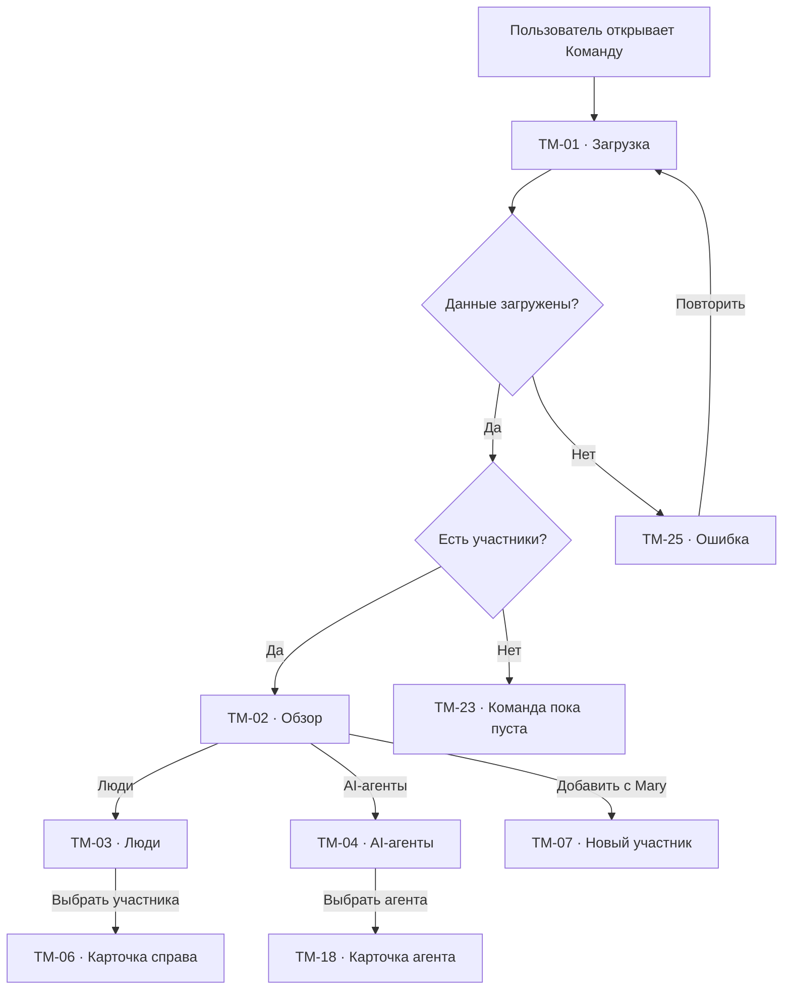
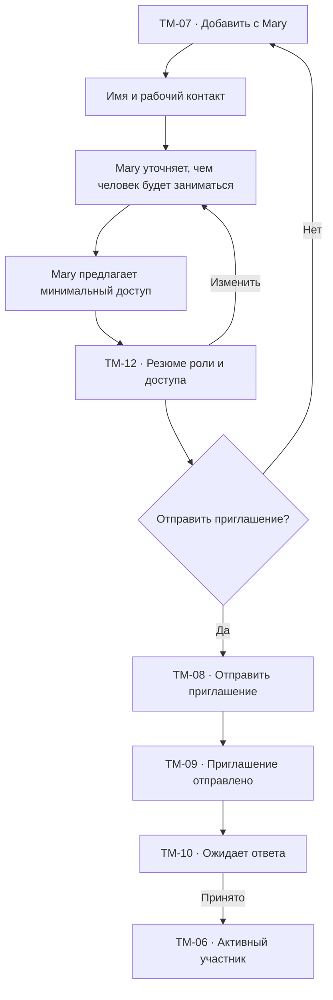
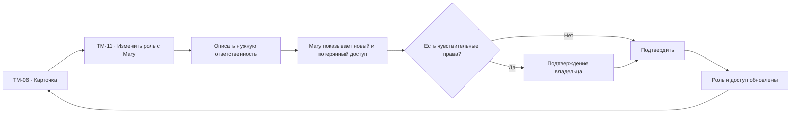
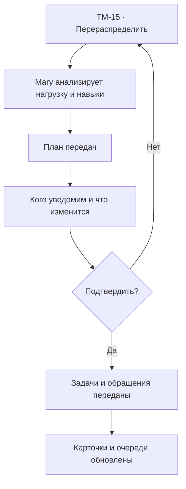
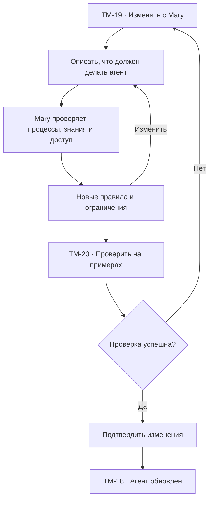

# Команда: user flow

## 1. Роль раздела

`Команда` показывает, кто участвует в работе:

- сотрудники;
- руководители;
- администраторы;
- AI-агенты Mary.

Раздел помогает понять:

- кто доступен;
- кто чем занимается;
- у кого какая нагрузка;
- когда AI-агент передаёт работу человеку;
- где нужны доступ или помощь;
- кто отвечает за конкретный процесс.

## 2. Основная модель

Раздел имеет два связанных представления:

1. `Люди`;
2. `AI-агенты`.

У них разные карточки и права, но единая логика ответственности:

- зона работы;
- текущая нагрузка;
- доступность;
- качество;
- правила передачи;
- связанные обращения, задачи и процессы.

Нажатие на участника открывает правую карточку. Отдельной страницы участника нет.

## 3. Список экранов и состояний

| ID | Экран или состояние |
| --- | --- |
| `TM-01` | Загрузка команды |
| `TM-02` | Обзор команды |
| `TM-03` | Люди |
| `TM-04` | AI-агенты |
| `TM-05` | Выбранный участник |
| `TM-06` | Карточка участника справа |
| `TM-07` | Добавление сотрудника через Mary |
| `TM-08` | Приглашение сотрудника |
| `TM-09` | Приглашение отправлено |
| `TM-10` | Приглашение ожидает ответа |
| `TM-11` | Настройка роли через Mary |
| `TM-12` | Подтверждение доступа |
| `TM-13` | Рабочее расписание и доступность |
| `TM-14` | Нагрузка участника |
| `TM-15` | Перераспределение работы |
| `TM-16` | Передача дел при отсутствии |
| `TM-17` | Отключение сотрудника |
| `TM-18` | Карточка AI-агента |
| `TM-19` | Настройка AI-агента через Mary |
| `TM-20` | Проверка AI-агента |
| `TM-21` | Пауза AI-агента |
| `TM-22` | Журнал действий |
| `TM-23` | Команда пока пуста |
| `TM-24` | Ничего не найдено |
| `TM-25` | Ошибка загрузки |
| `TM-26` | Недостаточно прав |
| `TM-27` | Конфликт изменения |

## 4. Статусы людей

| Статус | Значение |
| --- | --- |
| Онлайн | Сейчас работает в платформе |
| Доступен | Может получить новую работу |
| Занят | Работает, но нагрузка высокая |
| Не беспокоить | Новая работа не назначается автоматически |
| Не в сети | Сейчас не в платформе |
| Отсутствует | Отпуск, болезнь или другой период |
| Приглашён | Доступ ещё не активирован |
| Отключён | Вход запрещён, история сохранена |

Онлайн-статус не равен доступности. Сотрудник может быть онлайн, но занят.

## 5. Статусы AI-агентов

| Статус | Значение |
| --- | --- |
| Активен | Обрабатывает новые случаи |
| Проверяется | Работает только на тестовых примерах |
| Нужна помощь | Есть ошибка, конфликт знаний или доступа |
| На паузе | Не принимает новые случаи |
| Ограничен | Работает только с частью каналов или процессов |
| Отключён | Не участвует в работе |

## 6. Обзор команды

### Верхняя часть

- заголовок;
- короткий вывод Mary;
- поиск;
- фильтры;
- `Добавить с Mary`.

### Краткий вывод

Пример:

> Сейчас доступны три сотрудника и два AI-агента. В очереди восемь обращений;
> Ярославе нужна помощь с нагрузкой.

### Требует внимания

- перегруженный сотрудник;
- нет ответственного на смене;
- AI-агент часто передаёт одну тему;
- сотрудник отсутствует, но у него остались задачи;
- приглашение не принято;
- доступ скоро истекает;
- качество требует проверки при достаточном числе случаев.

## 7. Список людей

Строка показывает:

- имя;
- роль;
- доступность;
- рабочие часы;
- активные обращения;
- задачи;
- нагрузку;
- качество только при достаточном числе случаев;
- следующее действие.

Не показываем публичный рейтинг сотрудников.

Фильтры:

- роль;
- доступность;
- команда;
- канал;
- нагрузка;
- есть активные обращения;
- приглашение;
- доступ.

## 8. Список AI-агентов

Карточка или строка показывает:

- понятное имя и назначение;
- что агент делает;
- где работает;
- статус;
- обработанные случаи;
- долю передач сотруднику;
- качество;
- последний важный сигнал.

Примеры:

- `Агент записи клиентов`;
- `Агент поддержки`;
- `Агент контроля оплаты`.

Техническая модель и prompt скрыты из базового режима.

## 9. Главный flow

## 10. Карточка сотрудника справа

### Основное

- имя;
- роль;
- доступность;
- контакт;
- рабочее расписание;
- основное действие;
- меню `…`.

### Работа

- активные обращения;
- задачи;
- процессы;
- каналы;
- текущая нагрузка;
- переданные случаи.

### Доступ

- разрешённые разделы;
- чувствительные данные;
- административные действия;
- владелец доступа;
- последнее изменение.

### История

- важные изменения;
- передачи;
- подтверждения;
- события безопасности.

### Действия

- `Изменить с Mary`;
- `Открыть обращения`;
- `Открыть задачи`;
- `Перераспределить`;
- `Запланировать отсутствие`;
- `Изменить доступ`;
- `Отключить`.

## 11. Добавление сотрудника

Mary не копирует полный доступ администратора по умолчанию.

## 12. Роли и доступ

Базовые роли:

- владелец;
- администратор;
- руководитель;
- менеджер;
- наблюдатель.

Роль — стартовый набор. Конкретный доступ может быть уже или шире только после
явного подтверждения.

`TM-12` показывает:

- какие разделы доступны;
- какие действия разрешены;
- какие данные видны;
- что человек сможет подтверждать;
- какие изменения требуют владельца.

## 13. Изменение роли через Mary

## 14. Расписание и доступность

`TM-13` показывает:

- рабочие дни;
- часы;
- часовой пояс;
- перерывы;
- отсутствие;
- правило назначения вне смены;
- кто подменяет.

Изменение происходит через Mary:

> Вероника в отпуске с 3 по 10 августа. Передавай срочные обращения Ярославе.

Mary показывает затронутые задачи, обращения и процессы до подтверждения.

## 15. Нагрузка

`TM-14` показывает:

- активные обращения;
- ожидающих клиентов;
- задачи на сегодня;
- просроченные;
- сложные случаи;
- долю участия AI-агентов;
- доступное рабочее время.

Нагрузка не определяется одним количеством. Mary учитывает сложность и срочность,
если эти данные доступны.

## 16. Перераспределение

Mary не передаёт активный диалог без учёта текущего ответа и уведомления нового
исполнителя.

## 17. Передача дел при отсутствии

`TM-16` группирует:

- новые обращения;
- обращения в работе;
- задачи;
- подтверждения;
- автоматизации, где участник назначен;
- события календаря.

Пользователь выбирает:

- передать всё;
- завершить начатое, передав только новое;
- назначить разных подменяющих;
- поставить процессы на паузу.

## 18. Отключение сотрудника

Перед `TM-17` Mary показывает:

- активную работу;
- незавершённые задачи;
- доступы;
- принадлежащие интеграции;
- источники знаний;
- сохранённые обзоры;
- кому передать ответственность.

Отключение:

- блокирует вход;
- завершает активные сессии;
- сохраняет историю и авторство;
- не удаляет обращения, задачи и комментарии.

## 19. Карточка AI-агента

`TM-18` показывает:

- назначение;
- активные каналы;
- процессы;
- используемые знания;
- разрешённые действия;
- обязательные подтверждения;
- правила передачи человеку;
- качество;
- причины последних передач;
- ошибки.

Действия:

- `Проверить на примере`;
- `Изменить с Mary`;
- `Открыть процесс`;
- `Открыть знания`;
- `Поставить на паузу`.

## 20. Настройка AI-агента

Пользователь не редактирует prompt или модель в базовом режиме.

## 21. Проверка AI-агента

`TM-20` использует:

- тестовый текст;
- выбранное обращение read-only;
- примеры Mary;
- безопасный набор данных.

Показывает:

- что агент понял;
- какие знания использовал;
- что предложил сделать;
- где передал сотруднику;
- что потребовало бы подтверждения.

Проверка не отправляет реальные сообщения и не изменяет данные.

## 22. Журнал действий

`TM-22` показывает отдельно:

- действия человека;
- действия AI-агента;
- подтверждения;
- изменения доступа;
- передачи;
- ошибки.

Фильтры:

- участник;
- сущность;
- тип действия;
- период;
- результат.

Журнал доступен только по соответствующим правам.

## 23. Связь с другими разделами

| Откуда | Действие | Куда | Контекст |
| --- | --- | --- | --- |
| `IN-09` | Передать сотруднику | `TM-06` | Обращение |
| `TS-11` | Выбрать ответственного | `TM-06` | Задача |
| `AU-08` | Назначить шаг | `TM-06` или `TM-18` | Блок процесса |
| `AN-11` | Открыть сотрудника | `TM-06` | Период и метрики |
| `TM-06` | Открыть обращения | `IN-03` | `memberId` |
| `TM-06` | Открыть задачи | `TS-03` | `memberId` |
| `TM-18` | Открыть процесс | `AU-06` | `automationId` |
| `TM-18` | Открыть знания | `KB-06` | `sourceId` |
| `IG-26` | Запросить владельца | `TM-06` | Интеграция |
| Любой экран | Спросить Mary | `GL-03` | Участник и работа |

## 24. Пустые и системные состояния

### `TM-23` Команда пока пуста

- владелец остаётся видимым;
- `Добавить с Mary`;
- объяснение разницы между сотрудником и AI-агентом.

### `TM-24` Ничего не найдено

- активные условия;
- `Сбросить`;
- `Спросить Mary`.

### `TM-25` Ошибка загрузки

- доступные данные остаются видимыми;
- `Повторить`.

### `TM-26` Недостаточно прав

- скрыть чувствительные детали;
- объяснить ограничение;
- `Запросить доступ`.

### `TM-27` Конфликт изменения

- кто изменил;
- что изменилось;
- `Принять обновление`;
- `Повторить с Mary`.

## 25. Переходы и анимации

- участник → правая панель `180–240 ms`;
- вкладки людей и AI-агентов сохраняют поиск;
- изменение статуса не перемещает строку до подтверждения;
- Mary открывается рядом с карточкой;
- возврат сохраняет вкладку, фильтры и scroll position;
- при `prefers-reduced-motion` панель появляется без движения.

## 26. Адаптивность

### Desktop

- обзор и таблица;
- карточка справа;
- Mary как плавающее окно.

### Tablet

- компактный список;
- карточка как sheet;
- метрики участника располагаются вертикально.

### Mobile

- люди и AI-агенты отдельными вкладками;
- карточка full-screen;
- Mary full-screen;
- таблица заменяется списком.

## 27. Доступность и безопасность

- статус не определяется только цветом;
- AI-агент и человек различимы текстом и иконкой;
- таблица имеет заголовки;
- карточка управляет фокусом;
- роль и доступ озвучиваются;
- опасные изменения требуют подтверждения;
- журнал не раскрывает скрытые данные;
- после отключения активные сессии завершаются.

## 28. Приоритет реализации

### P0

- `TM-01`, `TM-02`, `TM-03`, `TM-04`, `TM-06`, `TM-18`;
- люди и AI-агенты;
- карточка справа;
- добавление через Mary;
- роли и минимальный доступ;
- нагрузка;
- проверка AI-агента;
- empty, no-results, error.

### P1

- расписание;
- отсутствие;
- перераспределение;
- журнал;
- отключение;
- конфликты изменений.

### P2

- группы;
- навыки;
- расширенные политики смен;
- планирование нагрузки.

## 29. Критерии готовности

- люди и AI-агенты различимы;
- у каждого понятны зона работы и нагрузка;
- команда не превращается в рейтинг;
- добавление выдаёт минимальный доступ;
- изменение роли показывает последствия;
- отсутствие предлагает передачу дел;
- AI-агент проверяется без реальных действий;
- отключение сохраняет историю и сущности;
- переходы к работе участника сохраняют контекст;
- desktop, tablet, mobile и клавиатура поддерживают одинаковую логику.
