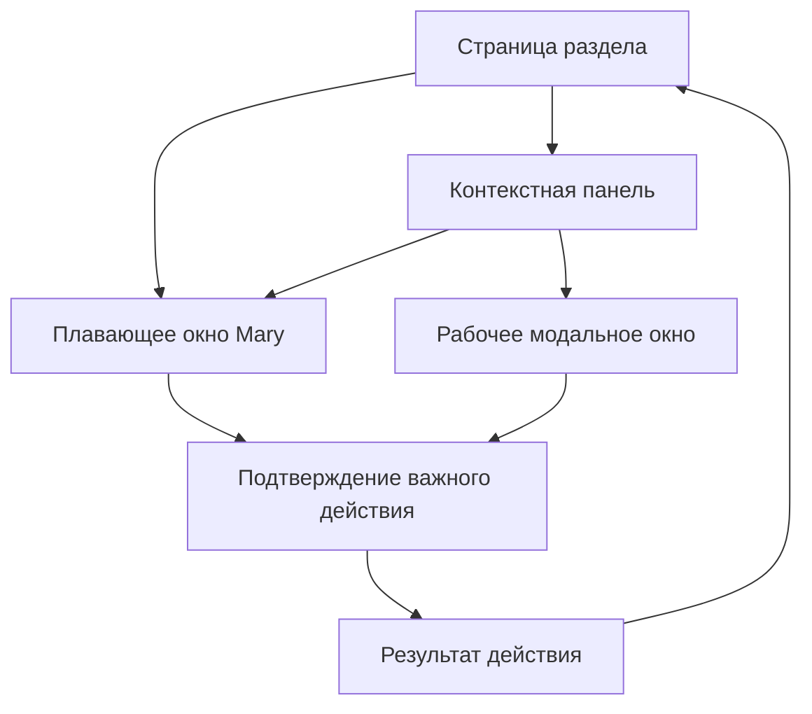
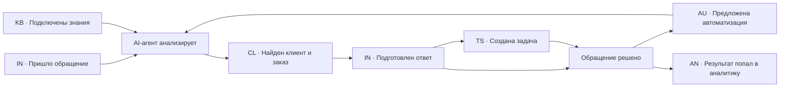

# Mary: индекс user flow

## 1. Цель

Каждый раздел платформы получает самостоятельную UX-карту. После согласования
разделы объединяются в один сквозной flow:

`обращение → клиент → ответ → задача → автоматизация → результат → аналитика`.

## 2. Единый состав документа

Для каждого раздела фиксируем:

1. цель пользователя;
2. список экранов и состояний;
3. основной happy path;
4. альтернативные действия;
5. действия Mary и AI-агентов;
6. пустые, загрузочные и ошибочные состояния;
7. переходы в другие разделы;
8. анимации и правила возврата;
9. адаптивность и доступность;
10. критерии готовности.

## 3. Префиксы экранов

| Префикс | Раздел |
| --- | --- |
| `CH-XX` | Чат с Mary |
| `IN-XX` | Входящие и обращения |
| `CL-XX` | Клиенты |
| `AU-XX` | Автоматизации |
| `TS-XX` | Задачи |
| `CA-XX` | Календарь |
| `AN-XX` | Аналитика |
| `KB-XX` | База знаний |
| `IG-XX` | Интеграции |
| `TM-XX` | Команда |
| `ST-XX` | Настройки |
| `GL-XX` | Глобальные окна и состояния |

## 4. Общие сущности

Переходы между разделами связываются не страницами, а сущностями:

| Сущность | Что хранит |
| --- | --- |
| Клиент | Контакты, каналы, ответственный, история |
| Обращение | Сообщения, состояние, исполнитель, SLA |
| Заказ | Номер, состав, оплата, доставка, проблема |
| Задача | Действие, срок, ответственный, связь с клиентом |
| Автоматизация | Триггер, шаги, агент, сотрудник, результат |
| Источник знаний | Документ, ссылка, правила использования |
| Сотрудник | Роль, доступ, нагрузка, качество |
| AI-агент | Зона ответственности, ограничения, эскалация |

## 5. Карта разделов

| Раздел | Файл | Статус |
| --- | --- | --- |
| Клиенты | [CLIENTS_USER_FLOW.md](CLIENTS_USER_FLOW.md) | Готов |
| Чат с Mary | [CHAT_USER_FLOW.md](CHAT_USER_FLOW.md) | Готов |
| Входящие и обращения | [INBOX_USER_FLOW.md](INBOX_USER_FLOW.md) | Готов |
| Автоматизации | [AUTOMATIONS_USER_FLOW.md](AUTOMATIONS_USER_FLOW.md) | Готов |
| Задачи | [TASKS_USER_FLOW.md](TASKS_USER_FLOW.md) | Готов |
| Календарь | [CALENDAR_USER_FLOW.md](CALENDAR_USER_FLOW.md) | Готов |
| Аналитика | [ANALYTICS_USER_FLOW.md](ANALYTICS_USER_FLOW.md) | Готов |
| База знаний | [KNOWLEDGE_BASE_USER_FLOW.md](KNOWLEDGE_BASE_USER_FLOW.md) | Готов |
| Интеграции | [INTEGRATIONS_USER_FLOW.md](INTEGRATIONS_USER_FLOW.md) | Готов |
| Команда | [TEAM_USER_FLOW.md](TEAM_USER_FLOW.md) | Готов |
| Настройки | [SETTINGS_USER_FLOW.md](SETTINGS_USER_FLOW.md) | Готов |
| Общий flow | [MARY_END_TO_END_USER_FLOW.md](MARY_END_TO_END_USER_FLOW.md) | Готов |

## 6. Глобальные слои

### Правила

- Mary доступна из каждого раздела.
- Одновременно открыто только одно рабочее окно: Mary или модальное окно.
- Контекстная панель может оставаться под рабочим окном.
- Закрытие возвращает пользователя к предыдущему слою и восстанавливает фокус.
- Переход между разделами сохраняет ID связанной сущности.

## 7. Глобальные состояния

| ID | Состояние |
| --- | --- |
| `GL-01` | Mary закрыта |
| `GL-02` | Mary открыта без контекста |
| `GL-03` | Mary открыта с контекстом сущности |
| `GL-04` | Mary выполняет действие |
| `GL-05` | Mary просит подтверждение |
| `GL-06` | Действие выполнено |
| `GL-07` | Действие завершилось ошибкой |
| `GL-08` | Нет соединения |
| `GL-09` | Недостаточно прав |
| `GL-10` | Интеграция отключена |

## 8. Общий сквозной сценарий

Полная карта переходов находится в
[MARY_END_TO_END_USER_FLOW.md](MARY_END_TO_END_USER_FLOW.md).

## 9. Порядок проработки

1. Чат с Mary.
2. Входящие и обращения.
3. Автоматизации.
4. Задачи.
5. Календарь.
6. Аналитика.
7. База знаний.
8. Интеграции.
9. Команда.
10. Настройки.
11. Общая end-to-end карта.

## 10. Definition of done

Раздел считается готовым к объединению, если:

- все экраны получили ID;
- каждое действие имеет результат и обратный переход;
- действия Mary и AI-агента отражены отдельно;
- описаны loading, empty, no-results, error и permissions;
- зафиксированы входящие и исходящие переходы;
- определено, какая сущность переносит контекст;
- нет тупиковых экранов;
- учтены desktop, tablet, mobile и клавиатура.
